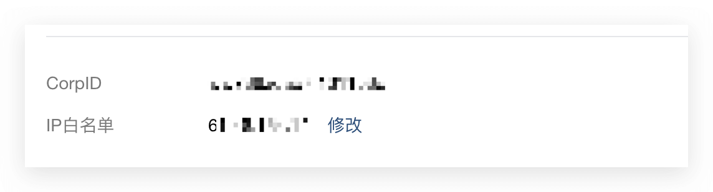
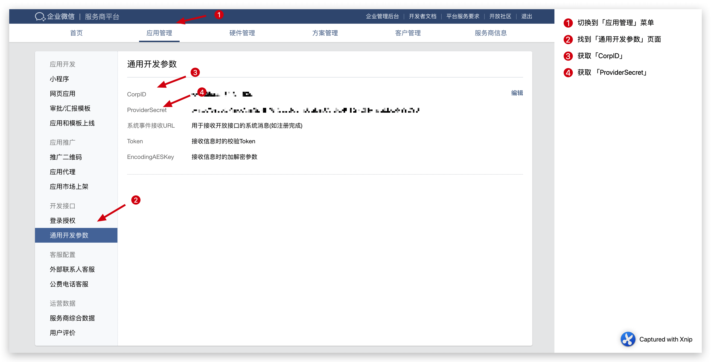
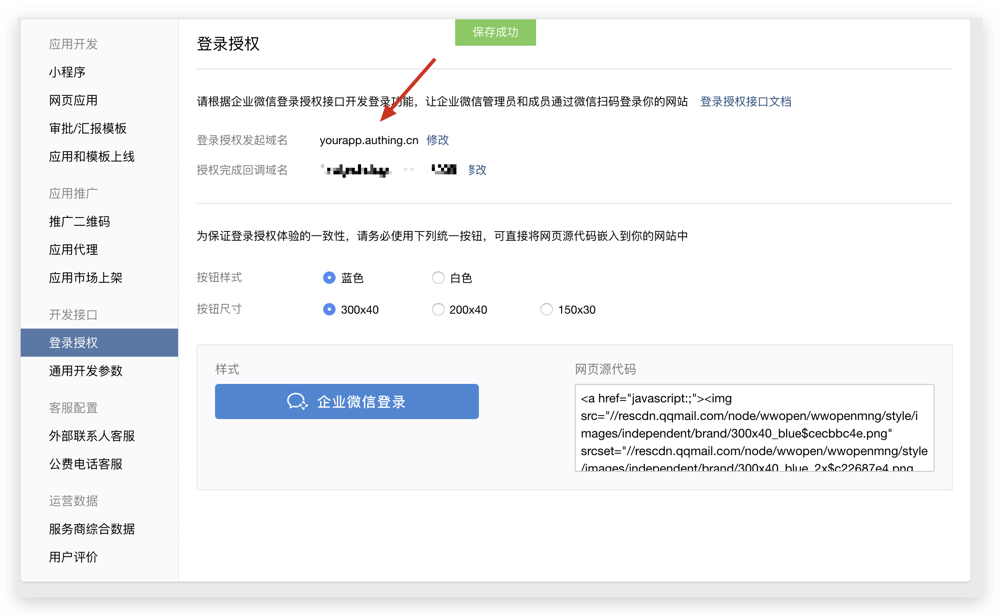

<IntegrationDetailCard title="Get configuration parameters on the enterprise WeChat service provider platform">

### Add IP whitelist

Please add the following IPs to the whitelist:

```js
52.80.250.250 , 140.179.19.50
```

You can configure it on the [Service Provider Information - Basic Information](https://open.work.weixin.qq.com/wwopen/developer#/profile/basic) page.



### Get the basic configuration of the service provider

You need to provide CorpID and ProviderSecret, which can be obtained from the [Application Management - General Development Parameters](https://open.work.weixin.qq.com/wwopen/developer#/sass/power/inter) page:



Then fill in the form prompted above.

### Add login authorization initiation domain name

If you want to use Guard login, please add your second-level domain name in {{$localeConfig.brandName}} to the login authorization initiation domain name list:



</IntegrationDetailCard>
