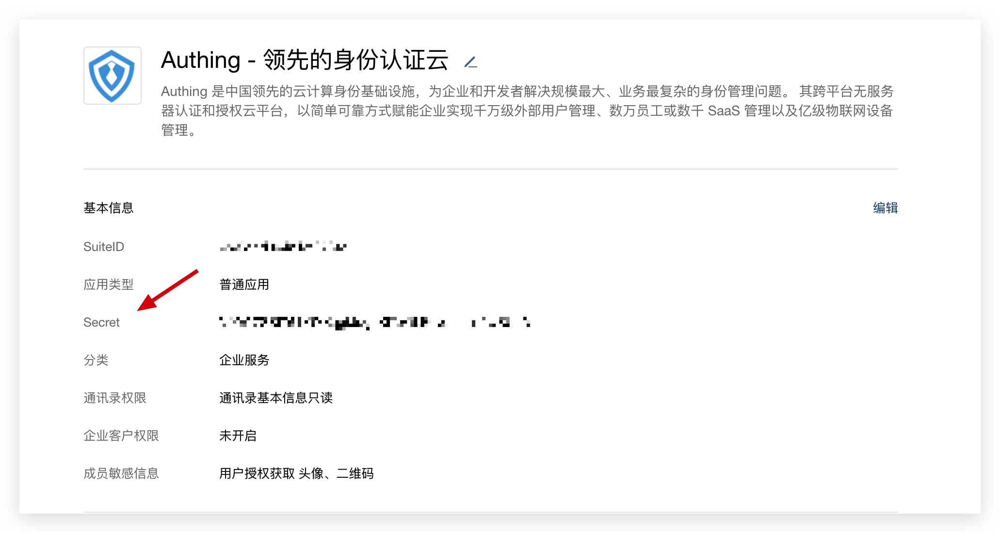
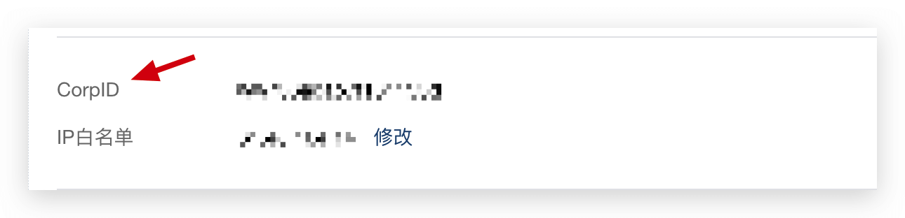
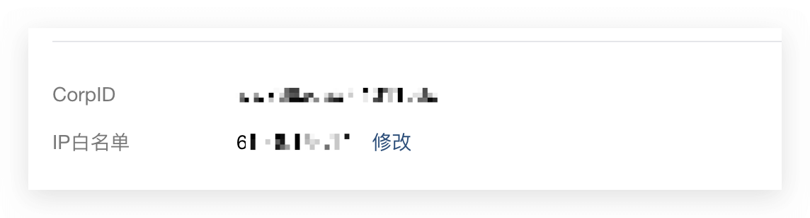
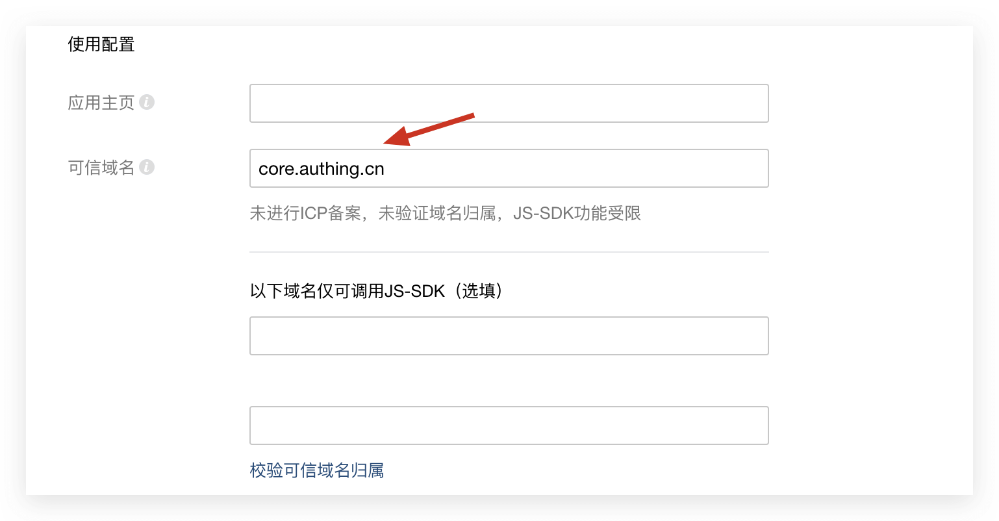
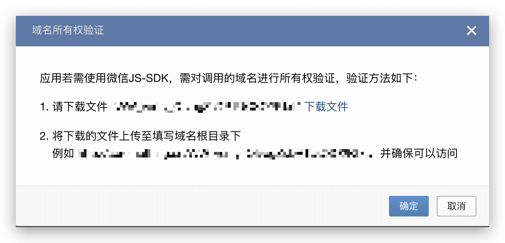
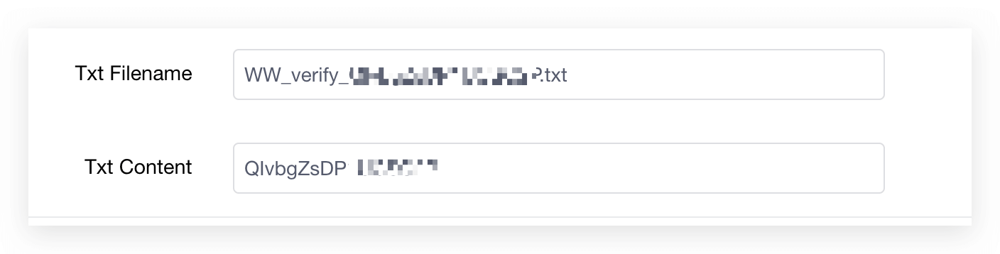
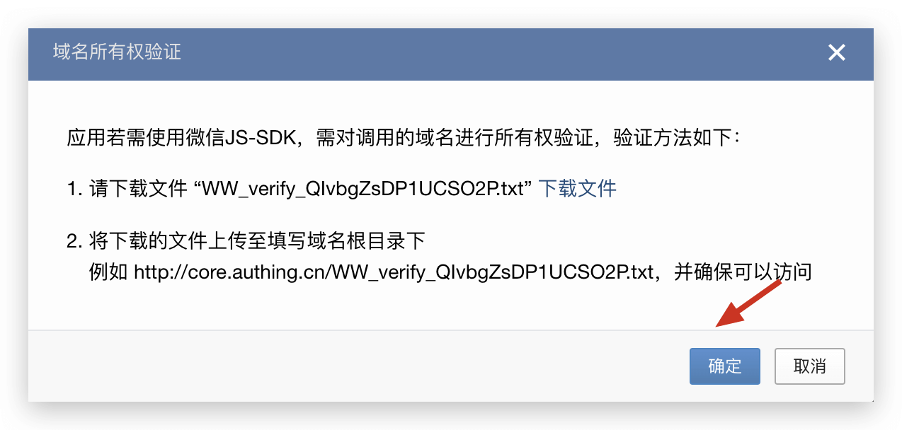
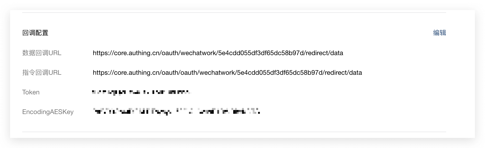
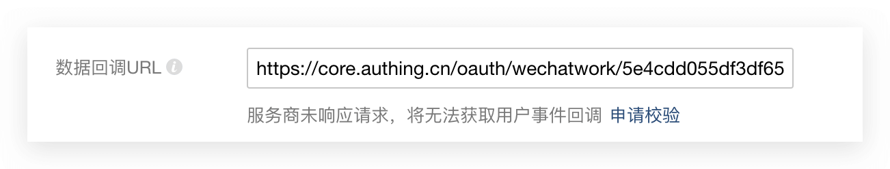

<IntegrationDetailCard title="Create a web application on the WeChat service provider platform">

### Get WeChat application configuration

You need to provide the application's SuiteID, application's Secret, and WeChat enterprise's CorpID:

Get SuiteID and Secret: You can get them at [Application Management - Web Application - Application Details](https://open.work.weixin.qq.com/wwopen/developer#/sass/apps/list).



Get CorpID: You can get it at [Service Provider Information - Basic Information](https://open.work.weixin.qq.com/wwopen/developer#/profile/basic)



Please fill in these three data in the form mentioned above.

### Add IP whitelist

Please add the following IPs to the whitelist:

```js
52.80.250.250 , 140.179.19.50
```

You can configure it on the [Service Provider Information - Basic Information](https://open.work.weixin.qq.com/wwopen/developer#/profile/basic) page.



### Configure trusted domain names

Set `core.genauth.ai` as a trusted domain name.



Click "Verify Trusted Domain Name Ownership". In the pop-up modal, you need to download a Txt file:



Fill in the **Txt file name** and **Txt file content** in the form shown above.

- Txt Filename usually starts with WW_verify\_, **please remember to keep the .txt file suffix**!

- Txt Content: File content, usually a 10-20 character random string.



Click the "OK" button:



You should see that the trusted domain name verification is successful:

::: hint-info
If you encounter any problems, you can contact us here: [https://forum.genauth.ai/](https://forum.genauth.ai/)
:::

### Configure WeChat Enterprise callback link

Total of two callback links are configured:



- Data callback URL. The link format is:

```
https://core.genauth.ai/oauth/wechatwork/:userPoolId/redirect/data
```

Assuming your user pool ID is 5e4cdd055df3df65dc58b97d, the data callback link is:

```
https://core.genauth.ai/oauth/wechatwork/5e4cdd055df3df65dc58b97d/redirect/data
```

- Instruction callback URL. The link format is:

```
https://core.genauth.ai/oauth/wechatwork/:userPoolId/redirect/command
```

Assuming your user pool ID is 5e4cdd055df3df65dc58b97d, the command callback link is:

```
https://core.genauth.ai/oauth/wechatwork/5e4cdd055df3df65dc58b97d/redirect/command
```

Please fill in the Token and EncodingAESKey in the form mentioned above, and then click Apply for verification:



You should be able to get a success prompt.

</IntegrationDetailCard>
