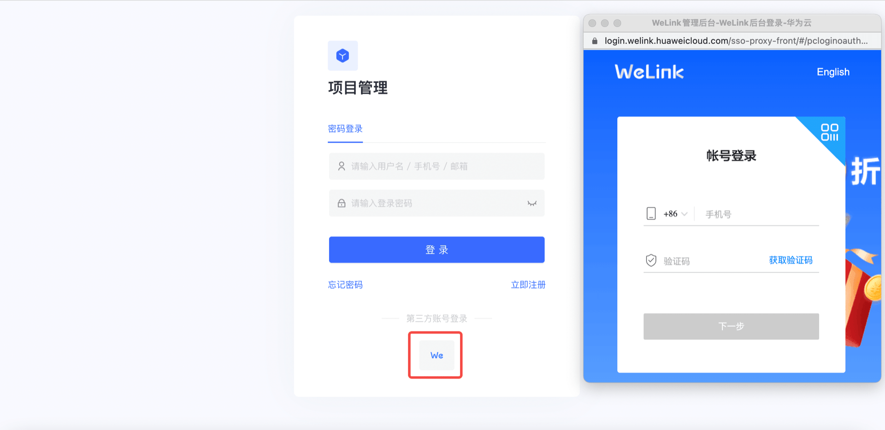
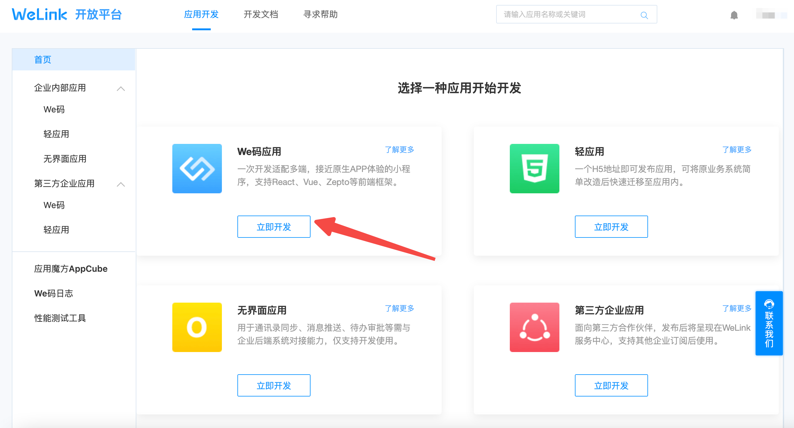
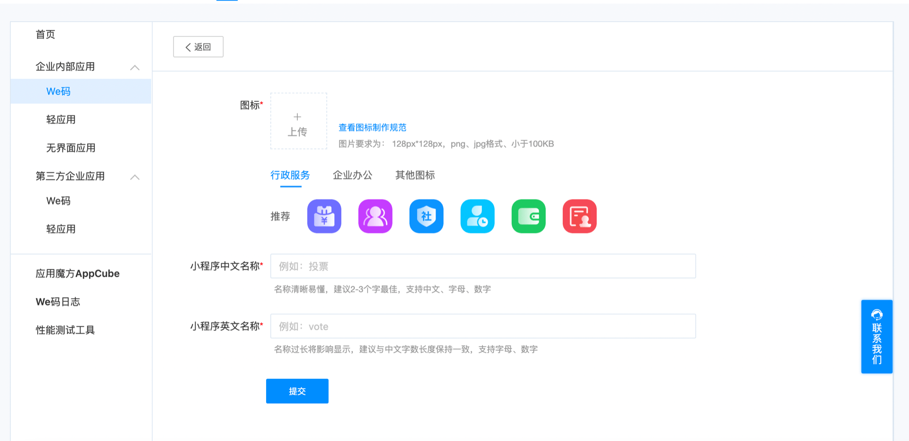
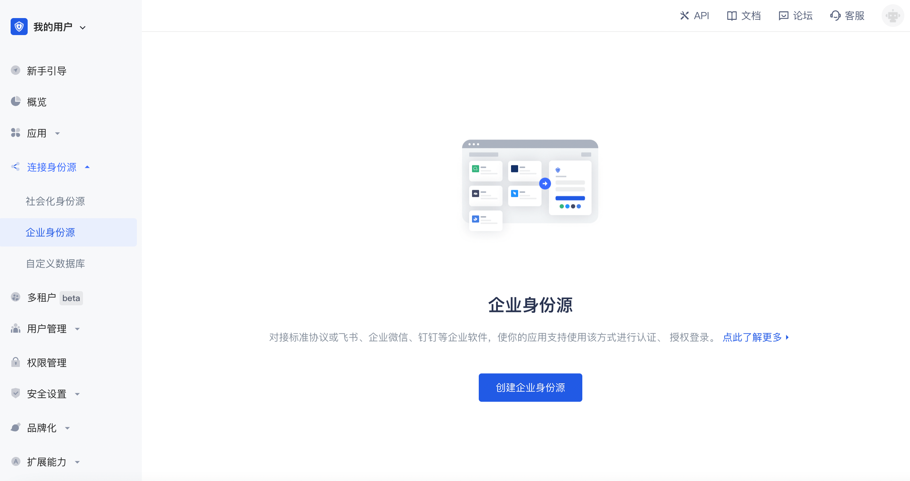
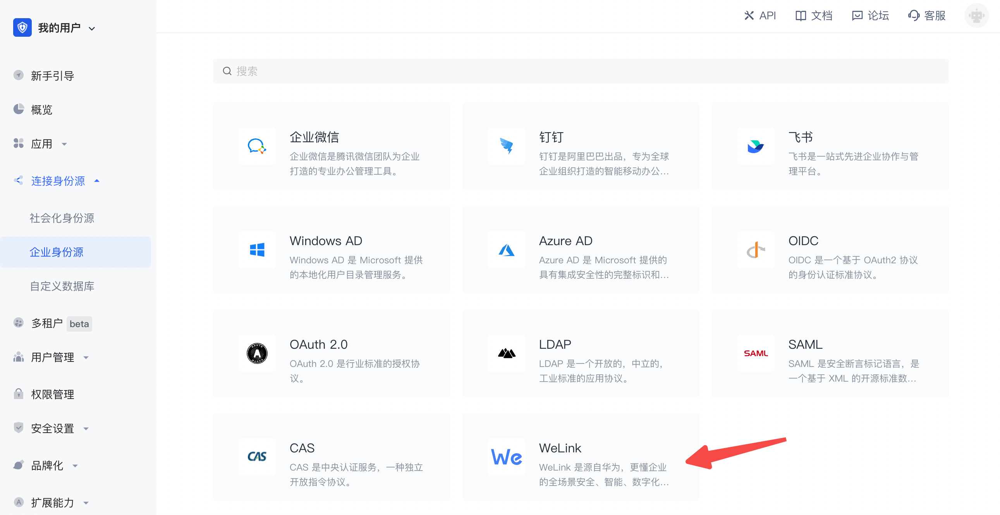
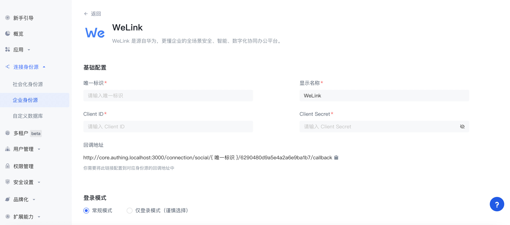
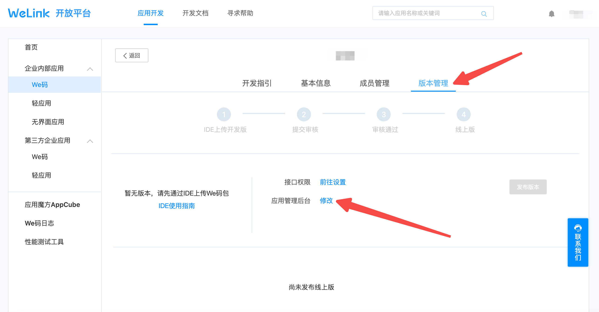
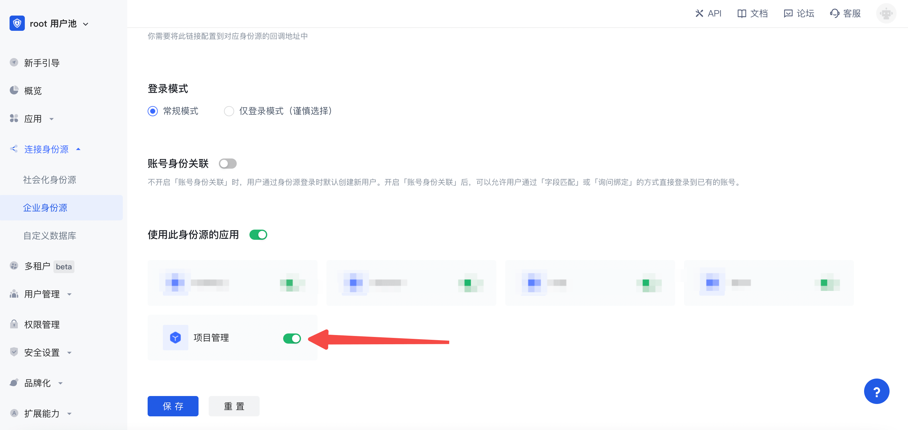
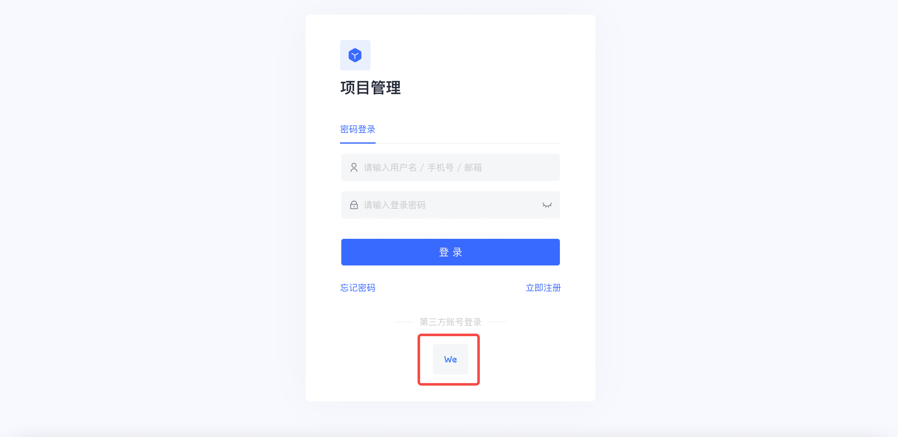

# WeLink Enterprise Identity Source Login

<LastUpdated/>

## Scenario Introduction

- **Overview**: WeLink Enterprise Identity Source Login is a user who uses WeLink as the identity source to securely log in to a third-party application or website. Configure and enable WeLink Enterprise Identity Source Login in GenAuth to quickly obtain basic open information of WeLink through GenAuth and help users realize password-free login.
- **Application Scenario**: PC Website
- **Terminal User Preview**:

## Notes

- If you have not opened a WeLink Open Platform account, please go to [WeLink Open Platform](https://open.welink.huaweicloud.com/wecode-site/index.html#/home) to register a developer account.
- If you have not opened a GenAuth console account, please go to [GenAuth console](https://www.genauth.ai/) to register a developer account;

## Step 1: Create a WeLink application

Go to [WeLink backend](https://open.welink.huaweicloud.com/wecode-site/index.html#/wecode/guide/guide) to create a We code application.

Fill in the basic information of the application

Then click **Submit**.

## Step 2: Configure WeLink in the GenAuth console

2.1 Please click the "Create Enterprise Identity Source" button on the "Enterprise Identity Source" page of the GenAuth console to enter the "Select Enterprise Identity Source" page.

2.2 Please go to the "Enterprise Identity Source" - "Select Enterprise Identity Source" page of the GenAuth console, click the "WeLink" identity source button to enter the "WeLink Login Mode" page.

2.3 Please go to the "Enterprise Identity Source" - "WeLink" page of the GenAuth console to configure the relevant field information.

| Number | Field/Function               | Description                                                                                                                                                                                                                                                                                         |
| ------ | ---------------------------- | --------------------------------------------------------------------------------------------------------------------------------------------------------------------------------------------------------------------------------------------------------------------------------------------------- |
| 2.3.1  | Unique ID                    | a. The unique ID consists of lowercase letters, numbers, and -, and its length is less than 32 bits. b. This is the unique ID of this connection and cannot be modified after setting.                                                                                                              |
| 2.3.2  | Display Name                 | This name will be displayed on the button of the terminal user's login interface.                                                                                                                                                                                                                   |
| 2.3.3  | Client ID                    | Client ID, which needs to be obtained on the WeLink open platform.                                                                                                                                                                                                                                  |
| 2.3.4  | Client Secret                | Client Secret, which needs to be obtained on the WeLink open platform                                                                                                                                                                                                                               |
| 2.3.5  | Callback Address             | WeLink valid OAuth redirect URI. This URL needs to be configured on the WeLink open platform.                                                                                                                                                                                                       |
| 2.3.6  | Login Mode                   | After turning on "Login Only Mode", you can only log in to existing accounts, and cannot create new accounts. Please choose carefully.                                                                                                                                                              |
| 2.3.7  | Account Identity Association | When "Account Identity Association" is not turned on, a new user is created by default when a user logs in through an identity source. After turning on "Account Identity Association", users can be allowed to log in directly to an existing account through "Field Matching" or "Query Binding". |

After the configuration is completed, click the "Create" or "Save" button to complete the creation.

After creating the WeLink identity source on the GenAuth console, you need to configure the callback address to the **Application Management Backend** of the WeLink application on the WeLink open platform.

## Step 3: Development Access

- **Recommended Development Access Method**: Use Hosted Login Page

- **Pros and Cons**: Simple operation and maintenance, GenAuth is responsible for operation and maintenance. Each user pool has an independent secondary domain name; if you need to embed it into your application, you need to log in using the pop-up mode, that is: after clicking the login button, a window will pop up with the login page hosted by GenAuth, or redirect the browser to the login page hosted by GenAuth.

- **Detailed access method**:

  3.1 Create an application in the GenAuth console. For details, see: [How to create an application in GenAuth](/guides/app-new/create-app/create-app.md)

  3.2 On the created WeLink identity source connection details page, open and associate an application created in the GenAuth console

3.3 Experience WeLink third-party login on the login page

