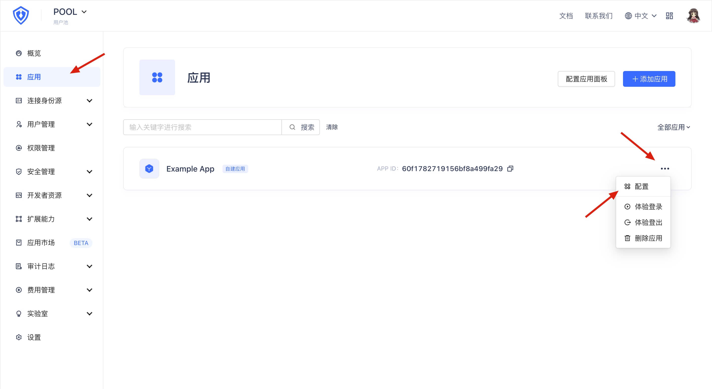
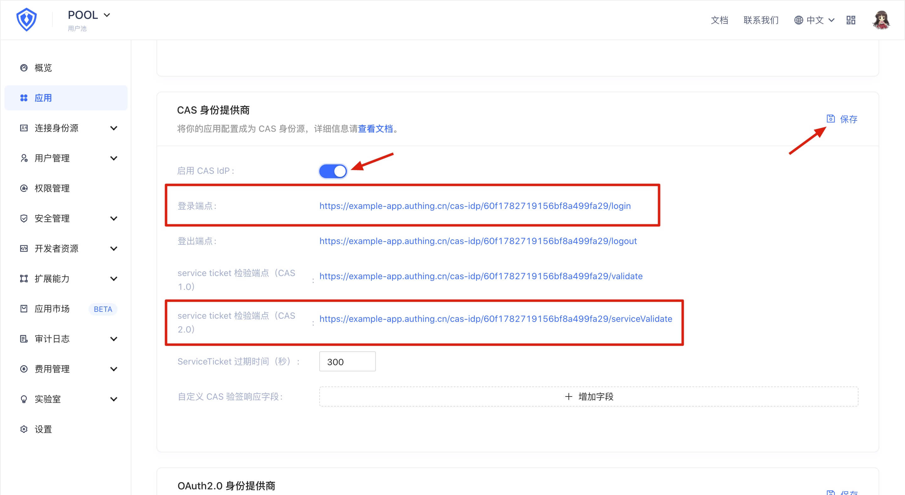
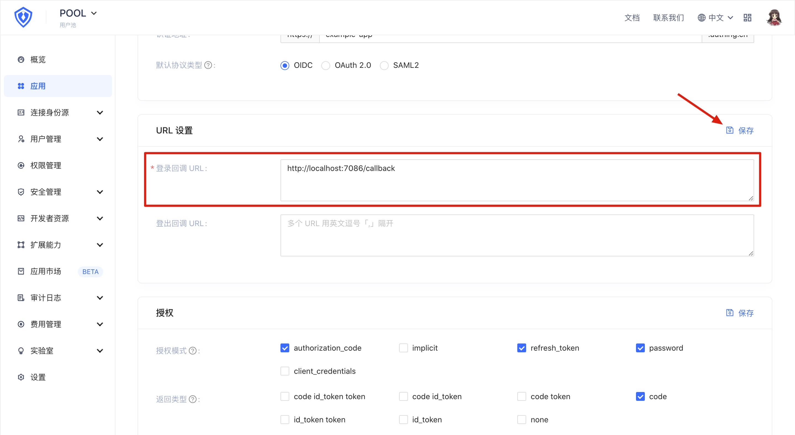

<IntegrationDetailCard title="Enable and configure CAS identity source">

In order to use the CAS 2.0 protocol for authentication, you first need to enable the CAS identity source function in the {{$localeConfig.brandName}} console and configure the callback address.

First open the {{$localeConfig.brandName}} console and enter the user pool configuration page. Open the application panel, find the application you want to connect, and enter the application configuration page:

In the "Application Configuration" tab, find the "CAS Identity Provider" panel, turn on the "Enable CAS IdP" switch, and click the "Save" button. Record the contents of the "Login endpoint" and "Service ticket verification endpoint (CAS 2.0)", which will be used in the subsequent configuration.

In addition, you need to find the "URL Settings" panel under the "Application Configuration" tab, and configure your own callback address in the "Login Callback URL" box to receive the Ticket parameter sent by {{$localeConfig.brandName}}. If you don't know what this is, you can continue to read it and come back to configure this item later.

After the configuration is completed, don't forget to click the "Save" button to save your configuration.

</IntegrationDetailCard>
