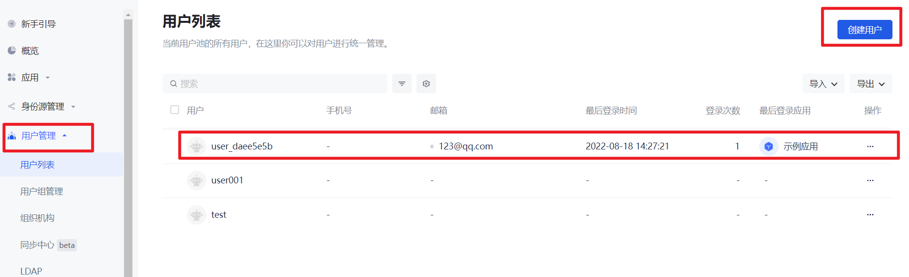
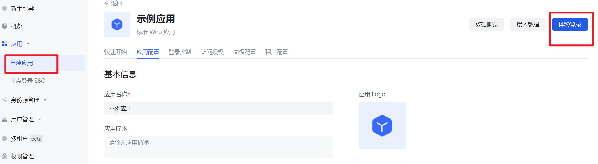

# authing-spring-boot-starter

> This article takes Spring Boot 2.x, which is used to provide authentication and access control in the Spring ecosystem, as an example to introduce in detail how Spring Boot can access GenAuth Spring Boot Starter.

Spring Boot can easily create independent, production-level Spring-based applications that can be **run directly**.

The main features of Spring Boot are:

- Create independent Spring applications
- Provide version arbitration starter dependencies to simplify your build configuration
- Automatically configure Spring and 3rd party libraries as much as possible
- No code generation or XML configuration required

## Integration introduction

GenAuth Spring Boot Starter can provide you with the function of intercepting and verifying tokens.

You can create a new spring-boot project to use this project, or directly use the sample project we provide in `/example/use-this-starter` for trial.

## Configure GenAuth

### Get GenAuth platform information

First, register an account in GenAuth, then enter the console and follow the guided steps to create a new user pool.

Click the "Application" menu item on the left, and you will see a default application created on the right.


Create some test users for your sample app.



If you want to see a user's token, click "Experience Login" in the sample app to simulate logging in as this user.



## Project setup

### Development environment

- Development tool: IDEA
- Project management tool: Maven
- JDK version: 1.8
- Version control tool: Git

### Use Spring Initializr to quickly build a project

Open IDEA, click New Project to create a new project, select Spring Initializr to create a Spring Boot project, and enter the project's Group and Artifact information


During the integration process, you need to add some other dependency packages in pom.xml, as follows:

### Add dependencies

Choose one of the following two reference methods.

#### Import from the central repository

Introduce in your Spring project:

```xml
<dependency>
<groupId>cn.authing</groupId>
<artifact>authing-spring-boot-starter</artifact>
<version>{latest-version}</version>
</dependency>
```

#### Import from github source code in jitpack mode:

Add repository,

```xml
<repositories>
<repository>
<id>jitpack.io</id>
<url>https://jitpack.io</url>
</repository>
</repositories>
```

Add dependency,

```xml
<dependency>
<groupId>com.github.GenAuth</groupId>
<artifactId>authing-spring-boot-starter</artifactId>
<version>{authing.version}</version>
</dependency>
```

Here, `authing.version` is the latest tag on github.

<br>

After introducing `authing-spring-boot-starter`,

> Due to the version conflict of okhttp3, please exclude `okhttp` from your `spring-boot-starter-web` and use `okhttp:4.8.0` version.

```xml
<dependency>
<groupId>org.springframework.boot</groupId>
<artifactId>spring-boot-starter-web</artifactId>
<exclusions>
<exclusion>
<groupId>com.squareup.okhttp3</groupId>
<artifactId>okhttp</artifactId>
</exclusion>
</exclusions>
</dependency>
<dependency>
<groupId>com.squareup.okhttp3</groupId>
<artifactId>okhttp</artifactId>
<version>4.8.0</version>
</dependency>
```

### Configuration

#### Configure user pool and application

Here is the `yml` format as an example. Add your user pool and application configuration in the `application.yml` configuration file:

```yml
authing:
user-pool:
user-pool-id: GEN_AUTH_USERPOOL_ID
secret: GEN_AUTH_USERPOOL_SECRET

app:
app-id: APP_ID
app-host: APP_HOST
```

- `authing.user-pool.user-pool-id`: user pool ID.
- `authing.user-pool.secret`: user pool secret.
- `authing.app.app-id`: application ID.
- `authing.app.app-host`: application domain name, format is `https://YOUR_DOMAIN.genauth.ai`

> You can [Learn how to get UserPoolId](https://docs.genauth.ai/guides/faqs/get-userpool-id-and-secret.html) here, and view your application list in **Application** in the console.

#### Configure authorization rules

##### Need to verify login status

By default, all resources are protected resources and require specific users to have specific permissions to access them.

For details, please refer to [User Permission Management](https://docs.genauth.ai/guides/access-control/) to create the corresponding `resources` and `authorizations`.

Note that please fill in 'read' for resource operations, currently only read operations are supported.


##### No need to verify login status

If you want to expose certain resources, such as registration page/login page, to allow non-logged in users to access, please configure the resource address in `application.yml`:

```yaml
authing:
exclude-paths:
  - /demo0/url0
  - /demo1/url1
```

`authing.exclude-paths`: URL whitelist that does not require verification.

### Failure handling

If you want to globally return a specific exception for authentication failure requests, such as HTTP 403 exception, you can add the following to your global exception handler:

```java
@ControllerAdvice(basePackages = "YOUR-PACKAGE")
@ResponseBody
@Slf4j
public class GlobalExceptionHandler {
@ExceptionHandler(AuthingException.class)
public ResponseResult handleAuthingException(AuthingException e) {
log.error("log:*token error{},exception class:{}",e.getMessage(),e.getClass());
return ResponseVO.fail(403,"wrong token");
}
}
```

### Getting started

Performing functional testing.

#### Access protected resources

For protected resources:

```java
@RestController
public class DemoController {
@GetMapping("/test/resources")
public ResponseVO getResource() {
return ResponseVO.success().setMessage("some resource need authorization");
}
}
```

Carry the correct token:

```http
GET /product/attr/info/<attrId> HTTP/1.1
Host: localhost:8080
User-Agent: apifox/1.0.0 (https://www.apifox.cn)
Authorization: YOUR TOKEN
```

Response result:

```json
{
  "code": 200,
  "message": "some resource need authorization"
}
```

Without token or with wrong token:

```http
GET /product/attr/info/<attrId> HTTP/1.1
Host: localhost:8080
User-Agent: apifox/1.0.0 (https://www.apifox.cn)
Authorization: WRONG TOKEN
```

Response result:

```json
{
  "code": 403,
  "message": "wrong token"
}
```

#### Access unprotected resources

```http
GET /product/attr/info/<attrId> HTTP/1.1
```
