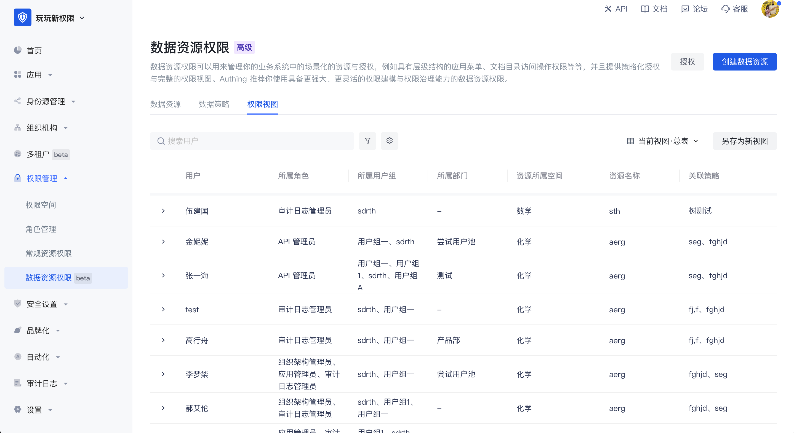

# Permission view

Permission view: In the permission view, the authorization relationship is calculated based on the user dimension. In the view, you can query which permissions each user has, which resources are corresponding to the policy, and which permission space is corresponding.

Administrators can use the permission view for permission auditing. Through data policies, resources are associated with users. No matter which user group the user belongs to, which role, or which department the user belongs to, the user's final permissions will eventually be presented in the user dimension.

In the permission view, it supports generating new permission views by filtering fields, saving as new views, and switching between views.

