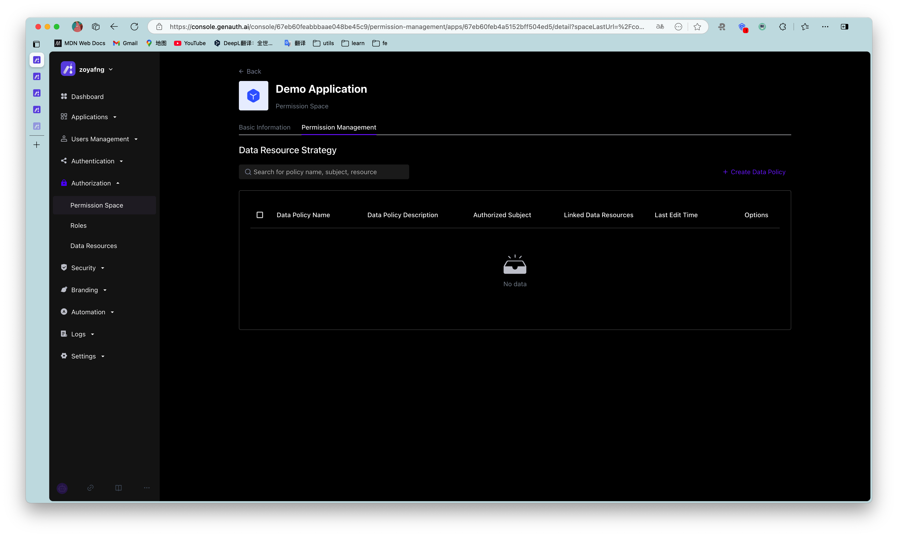

# Permission space

Permission space can be understood as a namespace for permissions. You can create roles, resources, and manage permissions in permission spaces. Roles and resources in different permission spaces are independent of each other, and there will be no conflict even if they have the same name.

## Main functions of permission space

- You can create and define different types of resources in permission space
- You can create and define roles in permission space
- You can authorize resources to roles in permission space, and then authorize roles to different users and organizations to implement permission management based on RBAC model; you can also authorize resources to other types of subjects such as users in permission space, and set condition-based authorization policies to implement permission management based on ABAC model.
- You can view and manage resource permission details in permission space

## Relationship between permission space and application

Whenever you create an application, GenAuth will create a corresponding permission space for you. The name is equal to the application name, and the corresponding space Code is equal to the application ID, which cannot be modified.

When some of your business systems do not need to connect to GenAuth authentication and only need permission capabilities, you can also create an independent permission space that has no corresponding relationship with the application, specifically used to manage permissions within the business system.

## Create a permission space

You can click Create permission space on the permission list page to enter the creation page:

When creating a permission space, you must fill in the space name and space code, and optionally fill in the space description. Fill in the instructions as follows:

| Field name | Description |
| --------- | -------------------------------------------------- |
| Space name | It is recommended to use the name of the business system, such as "Office Platform" |
| Space Code | The unique identifier of the permission space, it is recommended to use a semantic description, such as "OA" |
| Space description | Optional |

## Manage permission space

On the basic information page of the permission space, you can mainly:

- Manage roles under the permission space

  - Create roles under the permission space
  - View role details under the permission space
  - Edit roles under the permission space
  - Delete roles under the permission space

- Manage resources under the permission space
  - Create resources under permission space
  - View resource details under permission space
  - Edit resources under permission space
  - Delete resources under permission space

## Permission space permission management

On the permission space permission management page, you can mainly

- Manage general resource authorization under permission space
  - Create authorization
  - View and modify authorization
  - Delete authorization
- Manage data resource authorization under permission space
  - Create data policy
  - View and modify data policy
  - Delete data policy

