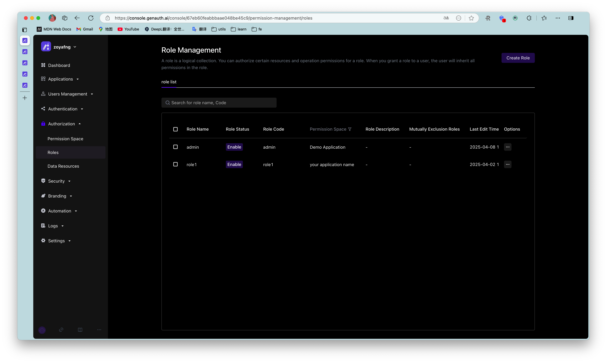

# Role Management

A role is a logical collection. You can define roles in each permission space and grant a role certain resource and operation permissions. When you grant a role to a user, the user will inherit all permissions in the role.

The role management module is mainly used to centrally manage roles in all permission spaces in the user pool.

## Create a role

You can click Create Permission Space on the list page to enter the creation page

| Field Name | Description |
| ---------------- | ------------------------------------------------------------ |
| Role Name | Name the role according to the permission scenario to be granted to the role, such as "Administrator" or "Auditor" |
| Role Code | The unique identifier of the role. It is recommended to use a semantic description, such as "admin" |
| Permission Space | The permission space to which the role belongs |
| Role Description | Optional |
| Role Auto-disable Time | You can set an auto-disable time for temporary roles. After disabling, the permissions associated with the role will be revoked. You can restore the permissions by enabling the role |

## Basic Role Information

On the basic information page of the role details, you can mainly

- Manage role subjects
  - Add role subjects
    - Add specified users as role subjects
    - Add specified organizations as role subjects
    - When adding a subject, you can set the automatic removal time of the subject.
  - View the role subject
  - Remove the role subject
- Manage the basic information of the role
  - View the basic information of the role
    - Role name
    - Role Code
    - Role ID
    - Role ARN
    - Role permission space
    - Role description
  - Modify the role name and role description

## Role permission management

On the permission management page of the role details, you can mainly

- Manage the general resource authorization associated with the role
  - Authorize general resources to the current role
  - View and modify the general resource authorization associated with the current role
  - Remove the general resource authorization associated with the current role
- Manage the data resource authorization associated with the role
  - Authorize the data policy to the current role
  - View the data policy and details authorized to the current role
  - Remove the data policy authorized to the current role

## Role Audit

On the Role Audit page of the role details, you can view the historical change records of the current role, mainly including

- Create a role
- Add a subject to a role, remove a subject
- Add authorization to a role, remove authorization

