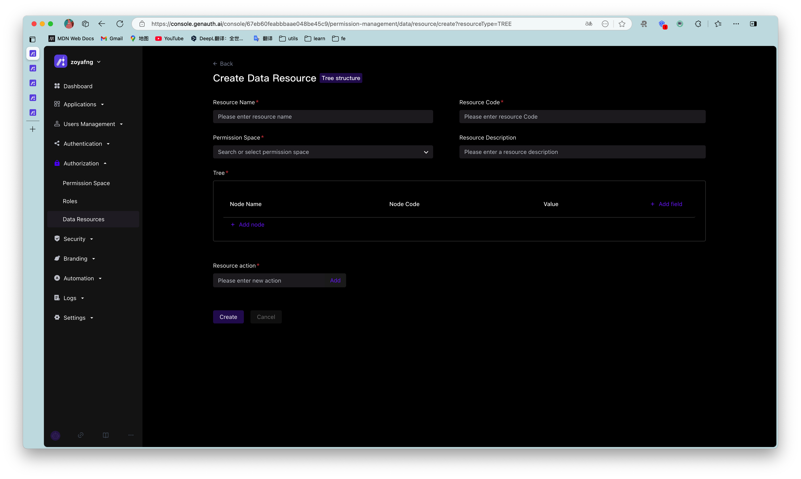
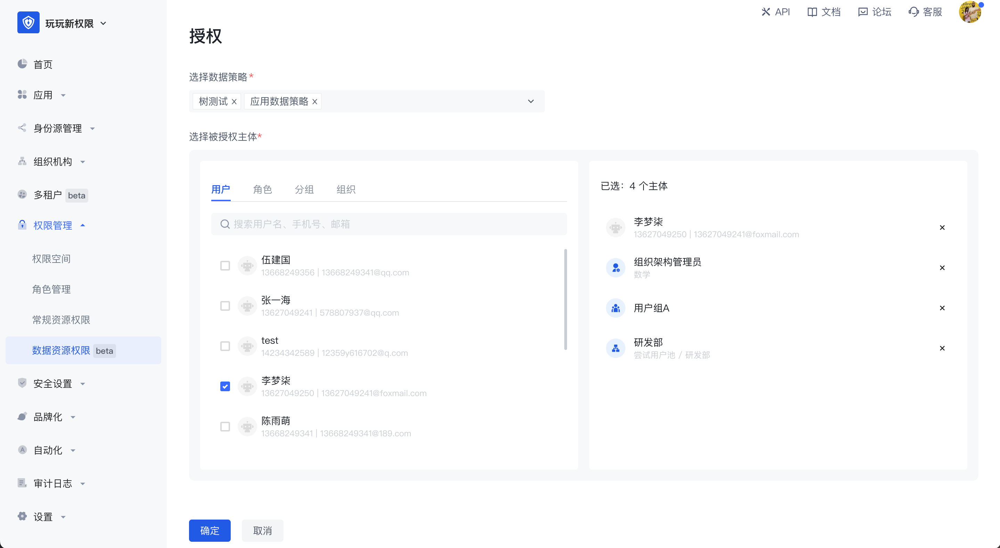

# Data resource permissions

As enterprise business systems become more and more complex, it becomes increasingly difficult to manage and control access rights to various resources. In order to ensure data security and comply with relevant regulations, enterprises need a flexible and powerful permission management tool to manage and monitor resource access rights in the system. GenAuth's data resource permissions are designed to solve this problem and help enterprises easily manage scenario-based resources and authorizations in business systems. GenAuth recommends that you use data resource permissions with more powerful and flexible permission modeling and permission governance capabilities.

1. Application scenarios

Data resource permissions are mainly used in the following scenarios:

- Manage application menus with hierarchical structures, such as the sidebar menu of an enterprise's internal management system.
- Manage document directory access operation permissions, such as read, edit, and delete permissions for an enterprise's internal knowledge base.
- Perform fine-grained permission management on other resources, such as API interfaces.

2. Problem solving

Data resource permissions mainly solve the following problems:

- Simplify the permission management process and improve work efficiency.
- Ensure data security and prevent data leakage and abuse.
- Support compliance audits and reports to reduce compliance risks.
- Adapt to the ever-evolving and changing needs of enterprises, and support flexible resource management and authorization strategies.

3. Functional advantages

- Highly flexible resource definition and management: GenAuth supports fine-grained definition and management of various types of resources, enabling enterprises to flexibly configure permission strategies according to actual needs.
- Policy-based authorization: A policy-based authorization method that assigns specific resource access rights to roles or users. Policies can contain multiple resources and operations, supporting flexible permission combinations and management.
- Complete permission view: By providing an intuitive permission view, it helps enterprises quickly understand and manage the authorization relationship between users, roles and resources, and improves the efficiency of permission management.
- Audit and monitoring: Record user access operations to resources, support real-time monitoring and regular auditing, and ensure data security and compliance.
- Easy to integrate and expand: GenAuth's data resource permission function can be easily integrated with existing enterprise systems, while supporting expansion according to customer needs to meet changing business needs.

By introducing GenAuth's data resource permission function, enterprises can achieve efficient, secure and flexible management and authorization of scenario-based resources in business systems. This will help reduce the operating costs and risks of enterprises, while improving the control of enterprises over data resource access and ensuring data security and compliance.

GenAuth data resource permissions are mainly composed of data resource management, data policy management and permission views. The following is a detailed introduction.

## Data Resource Management

Data resources are resources that are closer to the actual business data permission management scenario. In data resource permission management, a complete closed loop of definition, authorization and permission view query of various types of resources such as menus, document directories, APIs, contracts, etc. can be realized.

Data resources provide three types of resource structures, namely tree structure type, array structure type and string structure type, so that users can easily create resources of corresponding structures. Each type has its own unique data structure, and each type of data resource has many application scenarios. When entering the data resource permission management page, you can edit and view the list of data resources in the entire user pool. Click Create Data Resource in the upper right corner to select the data type.

- Tree structure

There are two common application scenarios for tree structure data resources, namely tree structure menus and document systems with directory hierarchies. In the scenario of managing menu resources, when the super administrator wants to set the system menu as a resource in the permission management and wants to enable each menu administrator to have the permission to use different menu resources, the menu can be split into different resources and authorized to different subject objects. The tree structure is hierarchical, and the value in each node can be customized. In the tree structure, child nodes can be created, and nodes of the same level can also be created.

- Array structure

The common application scenario of data resources with array structure is data management such as contract terms. Multiple data resources with array structure can be added. Any data can be added in an array, with a maximum of 50 characters.

- String structure

The common application scenario of data resources with string structure is the management of resources such as API. It is generally used for path reference. In string data resources, multiple lines of text content can be entered without restriction, or the API path can be filled in to implement resource management of API.

The difference between data resources and regular resources is:

1. Data resources provide three common data resource types, which can facilitate users to create various types of resources more flexibly;
2. Authorization method. Data resources cannot be directly authorized to the subject object. They need to be packaged into policies for authorization. Regular resources can be directly authorized to roles.

Data resource details: After creating a data resource, you can view and edit the value in the resource in the resource details page. After creation, the permission space and resource code in the resource cannot be modified.

JSON view: Supports viewing the data representation of resources in JSON in the resource details.

## Data strategy and policy authorization

Data strategy: A strategy is used to package several resources and operations together.

When creating a new data policy, a policy can have multiple data permissions. For each data permission, you need to select the authorization role first, then select the resources and related operations in the permission space. On this basis, you can also add permission restrictions, and finally package the resources together to form a data policy. In the data policy, you can select resources across permission spaces. If the resource is a tree-structured data resource, select granularity refinement, or select a node at a certain level.

After the policy is packaged, click the **Authorize** button in the upper right corner of the permission management page to authorize it to a subject. One or more data policies can be authorized to multiple authorization subjects across different types at the same time.

## Permission view

Permission view: can be used for permission auditing by administrators. The authorization relationship is calculated based on the user dimension. In the view, you can query what permissions each user has, what resources correspond to the policy, and which permission space it corresponds to. Through data strategies, resources are associated with users. No matter which user group, role, or department the user belongs to, the user's final permissions will be presented in the user dimension.

