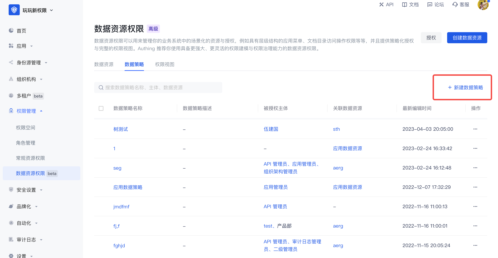
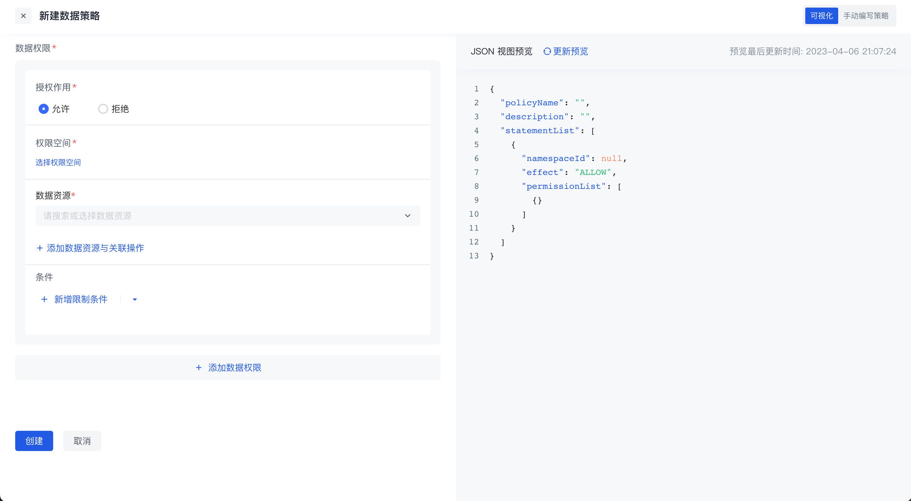

# Data policy and authorization

## Data policy

Data policy: Packing together several resources, operations, authorization roles and restrictions is called a policy.

In the data policy list, you can view all data policy authorization subjects and related data resources, and support adding, editing, modifying and deleting data policies.

When creating a new data policy, there are two editing methods:

- Visual editing policy

There can be multiple data permissions in a policy. For each data permission, you need to select the authorization role first, and then select the resources and related operations in the permission space. On this basis, you can also add permission restrictions, and finally package the resources together to form a data policy.

In the data policy, you can select resources across permission spaces. If the resource is a tree-structured data resource, select granularity refinement, or select a node at a certain level.

  

- Manually Write Policies

Switch to the manual writing policy in the upper right corner to write data permission policies through DSL.

  

Click the write condition in the upper left corner to support writing conditions in data permission policies through rego language. For details, see [Data Policy and OPA](link address)

## Authorization

After the policy is packaged, click the **Authorize** button in the upper right corner of the permission management page to authorize it to a subject. One or more data policies can be authorized to multiple authorized subjects across different types at the same time.

