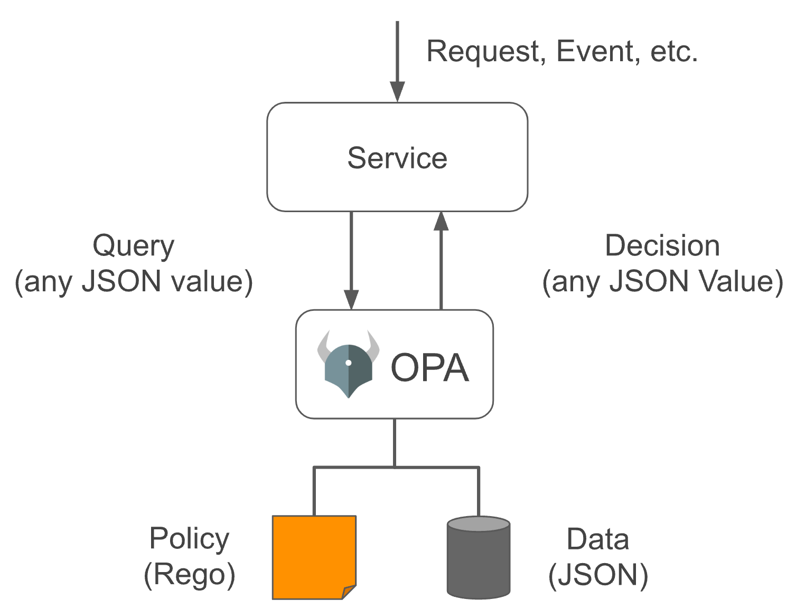
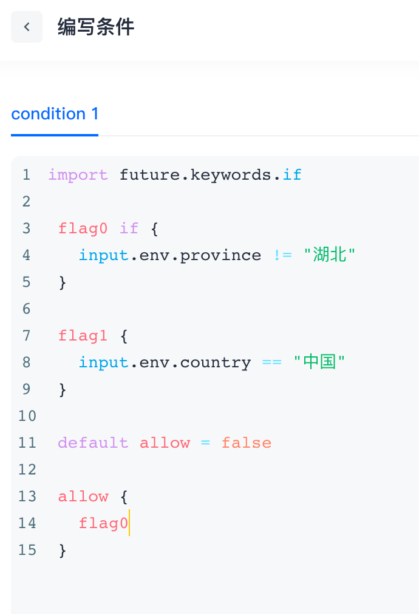
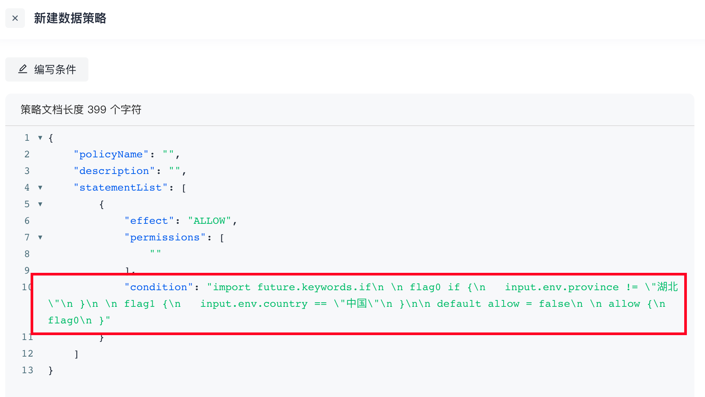
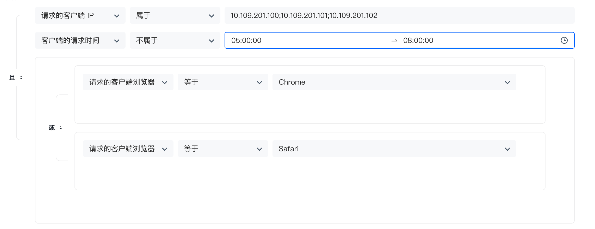
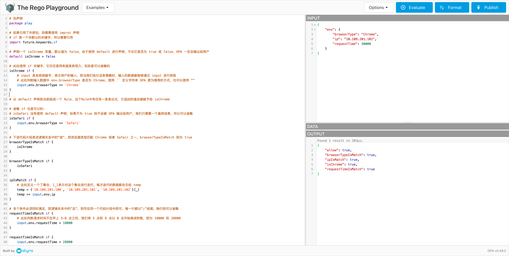
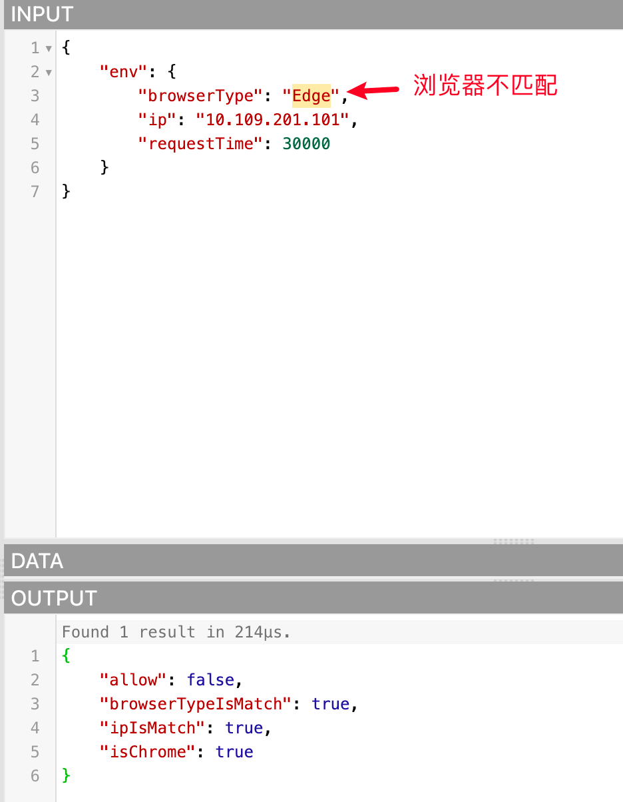
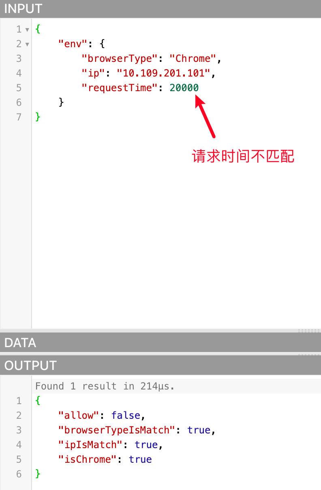

# Data Policy and OPA

`Policy`: Principles and methods determined according to the situation. For example, when we are sick, we have to go to the hospital to see a doctor. This is a policy, and the `if` and `switch` keywords in programming languages ​​are a good reflection of this.

`Open Policy Agent`, abbreviated as `OPA`, is an open source general policy engine written in the `Go` language. There may be a large number of policies in the code we write, which are highly coupled with services. Once there is a change, it needs to be recompiled or redeployed. OPA can help us solve this pain point. It decouples policies and services (i.e., policy decoupling). These policies **exist independently of the application**.

Official website address: **<https://www.openpolicyagent.org/>**

## Use of OPA

OPA provides a rich `RESTful API`. When we need to make policy decisions, we will query OPA and provide structured data (JSON) as input. Note: OPA accepts arbitrary structured data as input



In OPA, input is generally called `input`, which can be of any type. The output can also be of any type, that is, it can output a Boolean value of `true` or `false`, or a `JSON` string object.

Our permission management implements attribute-based access control (Attribute-based access control - *ABAC*), which is implemented by **converting** a set of conditions defined in the data policy into OPA policies and letting it help us make **policy decisions** when needed (OPA has many more uses)

## How to define OPA policies

OPA policies are written in the `Rego` language, which is inspired by [Datalog](https://en.wikipedia.org/wiki/Datalog), which is an easy-to-understand query language with a history of decades. Rego extends Datalog to support document models such as JSON/YAML. For a detailed introduction, please refer to the official document <https://www.openpolicyagent.org/docs/latest/policy-language/#what-is-rego>

OPA policies are defined in modules. Modules contain: Package, Import, and Rule. Except for Package, which is unique and required, the other two can be 0 or more. The Rule is composed of Head (defining variables) and Body (defining expressions). The **Abstract Syntax Tree (AST)** of the entire Module is as follows:

```SQL
Module
 |
 +--- Package (Reference)
 |
 +--- Imports
 |     |
 |     +--- Import (Term)
 |
 +--- Rules
       |
       +--- Rule
             |
             +--- Head
             |     |
             |     +--- Name (Variable)
             |     |
             |     +--- Key (Term)
             |     |
             |     +--- Value (Term)
             |
             +--- Body
                   |
                   +--- Expression (Term | Terms | Variable Declaration)
```

Rego policies are usually defined in a text file and parsed and compiled by OPA at runtime. So when you write Rego conditions in a data policy, they are converted into strings:





### Example

Judge whether the current request satisfies the following conditions: IP address: `10.109.201.100`, `10.109.201.101`, `10.109.201.102`; the request time is not between 5-8 am; and the browser is Chrome or Safari. The following figure is configured through a form:



Based on this case, we use Rego to write as follows:

```Go
# Package declaration
package play

# If an external package is referenced, you need to use improt declaration
# if is a non-default keyword, so you need to reference
import future.keywords.if

# Declare an isChrome variable with a default value of false. Since default is used for declaration, OPA will output it to the user regardless of whether it is true or false
default isChrome = false

# The if keyword is used here to improve expressiveness and can actually be omitted
isChrome if {
        # input is a system reserved word, indicating user input, that is, when we execute this policy, the input data can be obtained through input
        # Here, we determine whether env.browserType in the input data is Chrome. Use `` to define the string OPA recommends more, or you can use ""
        input.env.browserType == `Chrome`
}

# From the default declaration to the current formation of a Rule, there is only one expression in this Rule, and the value it returns will be assigned to isChrome

# It is also possible to omit if;
# isSafari does not use the default declaration. If it is not true, it will not be output to the user by OPA. We only need a final result, so it can be omitted
isSafari if {
        input.env.browserType == `Safari`
}

# The following code snippet expresses the "or" in the logical relationship, that is, the browser type matches Chrome or Safari, and browserTypeIsMatch is true
browserTypeIsMatch if {
        isChrome
}

browserTypeIsMatch if {
        isSafari
}

ipIsMatch if {
        # A set is defined here, [_] means iterating over this set, and the data of each iteration will be given to temp
        temp = {`10.109.201.100`, `10.109.201.101`, `10.109.201.102`}[_]
        temp == input.env.ip
}

# Multiple conditions must be met at the same time, that is, the "and" in the logical relationship, then they can be written in the same code snippet, each line ends with ";", and line breaks can be omitted
requestTimeIsMatch if {
        # Here, we judge that the request time is not between 5-8 am. We convert 5 and 8 o'clock to seconds starting from 0 o'clock, that is, 18000 and 28800
        input.env.requestTime < 18000
}{
        input.env.requestTime > 28800
}

#
# To prevent inconsistency, we agree that each policy must use default to declare a variable named allow, so that we can get the execution result through the API
# Because the above 3 The logical relationship of the rules is "and", so define a Boolean variable to summarize the final result
# Because the default statement is used, OPA will definitely return it to us. Finally, to determine whether the entire condition is met, observe whether the value of allow is true
default allow = false

allow if {
        browserTypeIsMatch
        ipIsMatch
        requestTimeIsMatch
}
```

The official website provides a [Playgroud](https://play.openpolicyagent.org) that supports online execution. The entire interface window is divided into the following four parts:

- The entire left side is the `Policy` window, where Rego is used to write policies
- The upper right corner is the `Input` window, where the external data required by the rule is defined, which can be in `JSON` or `YAML` data format
- The middle right corner is the `Data` window. If the data required by the rule comes from a persistent database, we can bind its storage layer interface to the policy, but we don’t need it here, so there is no need to pay attention to it
- The lower right corner is the `Output` window, where OPA outputs the results after making policy decisions. In the playground method, all information will be output to us. There is no way to specify the query field value. The output in the official prompt example is a Boolean value.

We will execute the written Rego code in the Playground, as follows:



Because the data passed in are all qualified, `allow` is `true`. We can also try to pass in unmatched data to see if allow is false, as follows:





## Notes on using Rego language to write conditions for data policies

- `package` does not need to be declared. Since we allow users to customize Rego to prevent conflicts with the same package name, it is generated by the program itself. Users do not need to pay attention to it and do not need to declare it.
- Some authentication APIs support passing in environment parameters related to this request. The data policy configures the conditions, and the program will pass these parameters to OPA. In the written Rego conditions, you can pass Rego The language's system reserved word `input` is obtained in conjunction with the **parameter attribute name**. These parameter names are as follows:
  - env: environment attribute
    - ip (IP)
    - city (city)
    - province (province)
    - country (country)
    - deviceType (device type)
    - systemType (system type)
    - browserType (browser type)
    - requestDate (request time, format: yyyy-mm-dd hh:mm:ss)
    - requestTime (the sum of the hours, minutes, and seconds of the request time. This parameter will be added after calculation based on the requestDate in the request parameter during authentication)

### Example case

- Get the IP of this authentication request: **input.env.ip**
- Get the device type of this authentication request: **input.env.deviceType**

In the future, we may release more attributes, such as user pool, application, user, etc., and the acquisition method is similar. For example, if we release the user attribute and obtain the user name, we can use input.user.username

- Since the API provided by OPA to query the policy execution results must pass in the variable name of a variable in the result, we agree that the conditions written by Rego must use the default keyword to define a Boolean variable named allow. When we judge whether the condition is hit, we will query OPA for the value of the `allow` variable in the policy execution result. If it is `true`, it means that the condition is hit and the authorization is established

## Rego code example

In order to reduce the cost of users learning Rego, we provide some commonly used Rego code snippet examples based on the several conditions currently supported by the data policy:

- The request address information is in Wuhan City, Hubei Province, China

```Go
countryIsMatch {
   input.env.country == "China"
}

provinceIsMatch {
   input.env.province == "Hubei"
}

cityIsMatch {
   input.env.city == "Wuhan"
}

default allow = false

allow {
   countryIsMatch
   provinceIsMatch
   cityIsMatch
}
```

- Request IP belongs to: 10.109.201.100, 10.109.201.101, 10.109.201.102

```Go
ipIsMatch {
   temp = {`10.109.201.100`, `10.109.201.101`, `10.109.201.102`}[_]
   temp == input.env.ip
}

default allow = false

allow {
   ipIsMatch
}
```

- Request device type is PC or Mobile

```Go
deviceTypeIsMatch {
   input.env.deviceType == "PC"
}
{
   input.env.deviceType == "Moblie"
}

default allow = false

allow {
   deviceTypeIsMatch
}
```

- Request request time is between 0-8 am (change 8 am to seconds starting from 0 am, which is 28800)

```Go
requestTimeIsMatch {
   input.env.requestTime >= 0
   input.env.requestTime <= 28800
}

default allow = false

allow {
   requestTimeIsMatch
}
```
