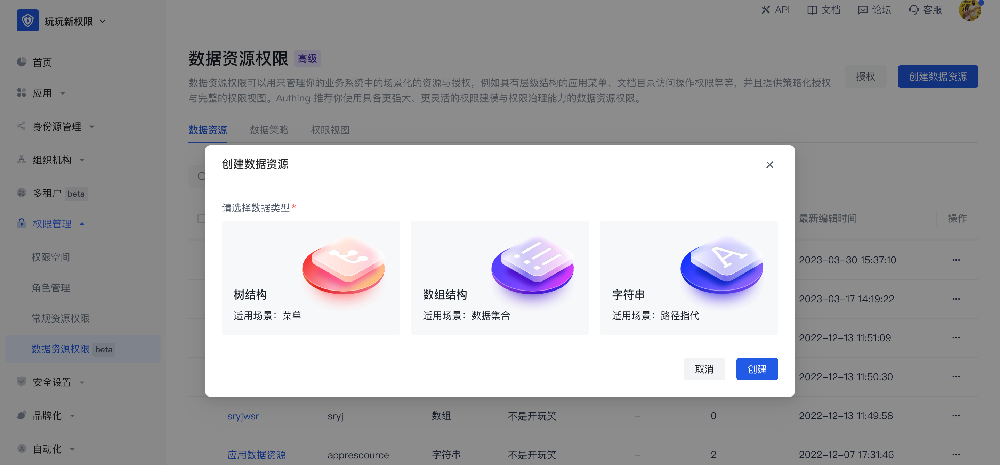
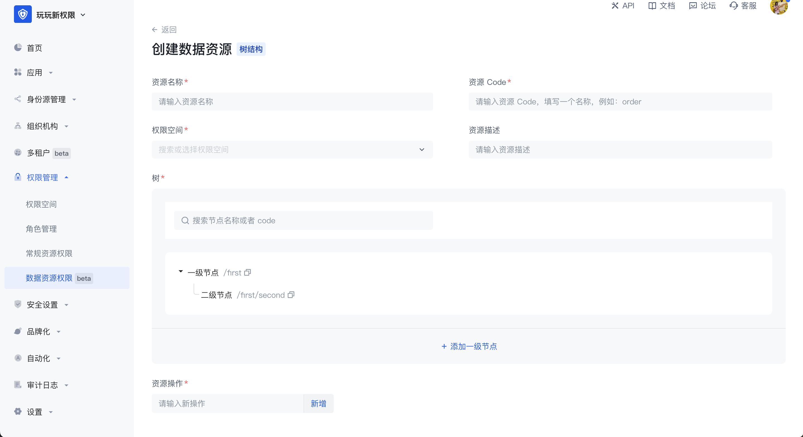
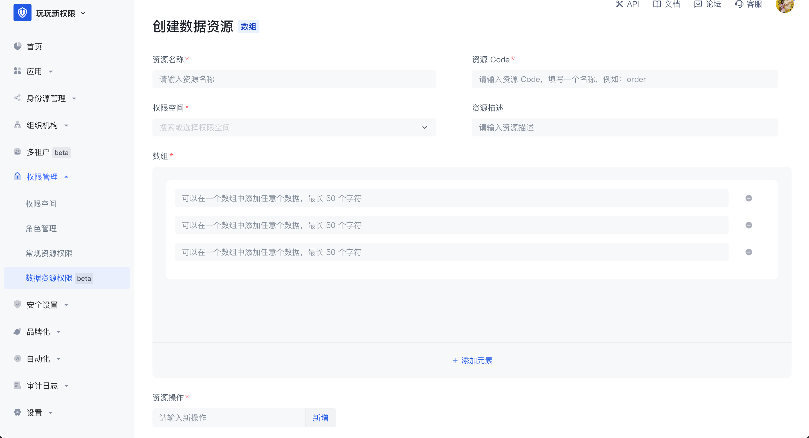
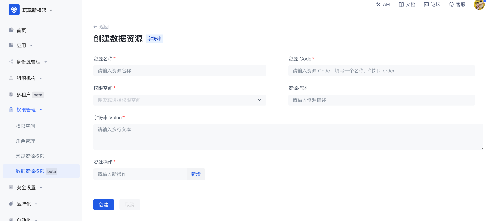
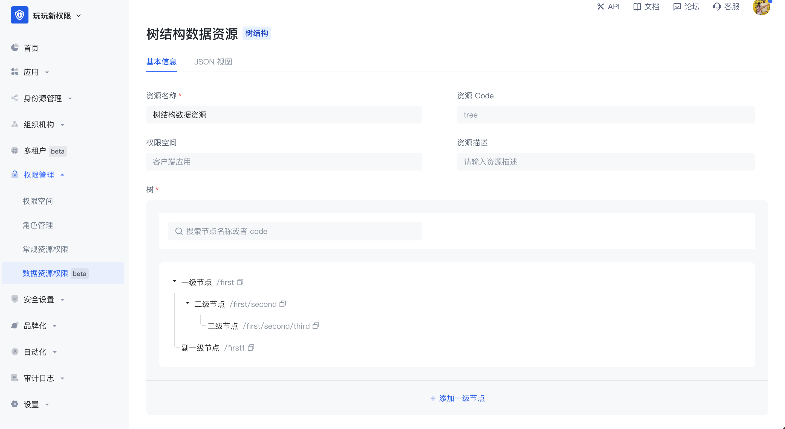
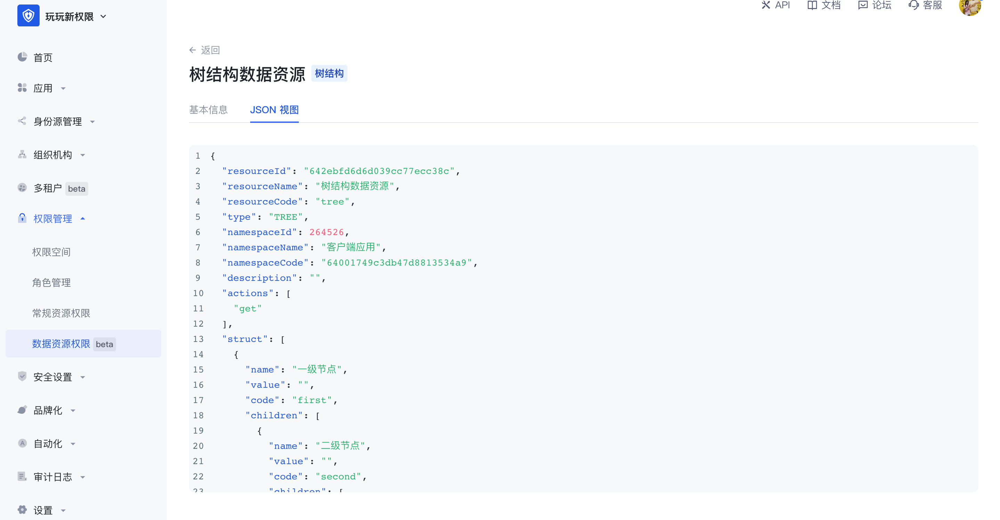

# Data resources

Data resources are resources that are closer to the actual business data permission management scenario. In data resource permission management, a complete closed loop of definition, authorization, and permission view query of various types of resources such as menus, document directories, APIs, and contracts can be realized.

Data resources provide three types of resource structures, namely tree structure type, array structure type, and string structure type, so that users can easily create resources of corresponding structures. Each type has its own unique data structure, and each type of data resource has many application scenarios. When entering the data resource permission management page, you can edit and view the list of data resources in the entire user pool. Click Create Data Resource in the upper right corner to select the data type.

- Tree structure

There are two common application scenarios for tree structure data resources, namely tree structure menus and document systems with directory hierarchies. In the scenario of managing menu resources, when the super administrator wants to set the system menu as a resource in the permission management and wants to enable each menu administrator to have the permission to use different menu resources, the menu can be split into different resources and authorized to different subject objects. The tree structure is hierarchical, and the value in each node can be customized. In the tree structure, child nodes can be created, and nodes of the same level can also be created.

- Array structure

The common application scenario of data resources with array structure is data management such as contract terms. Multiple data resources with array structure can be added. Any data can be added in an array, with a maximum of 50 characters.

- String structure

The common application scenario of data resources with string structure is the management of resources such as APIs. It is generally used for path reference. In string data resources, multiple lines of text content can be entered without restriction, or the API path can be filled in to implement resource management of APIs.

The difference between data resources and regular resources is:

1. Data resources provide three common data resource types, which can facilitate users to create various types of resources more flexibly;
2. Authorization method. Data resources cannot be directly authorized to the subject object. They need to be packaged into policies for authorization. Regular resources can be directly authorized to roles.

Data resource details: After creating a data resource, you can view and edit the value in the resource in the resource details page. After creation, the permission space and resource code in the resource cannot be modified.

JSON view: Supports viewing the data representation of resources in JSON in the resource details.

