# Manage resource permissions

<LastUpdated/>

As an administrator, you can **manage and assign permissions to resources** in the console. Before practicing permission management and authorization, you need to understand several concepts first.

1. **Application**: As an administrator, you can create **application**. An application is a definition of the application project you are developing in GenAuth. For example, if you are actually developing a "Network Notes" application, you should create an application called "Network Notes" in GenAuth.
2. **Resource**: Later, you can **define some resources** in GenAuth. For example, the resources in the "Network Notes" application may include notebooks, note content, authors, etc.
3. **User**: You can also assign permissions directly to users. You can also **divide** your users into different groups, roles, and organizational departments, so that it is easier to manage when assigning permissions in the future.
4. **Role**: A role is a collection of users. Users in a role will automatically inherit the permissions authorized by the role.

Next, we create applications, resources, and users, and then define the authorization relationship between resources and users.

## Create an application

Please refer to the Create an application [document](/guides/app-new/create-app/create-app.md).

## Create resources

Access the authorized resource card under the application and click the Add button on the right.

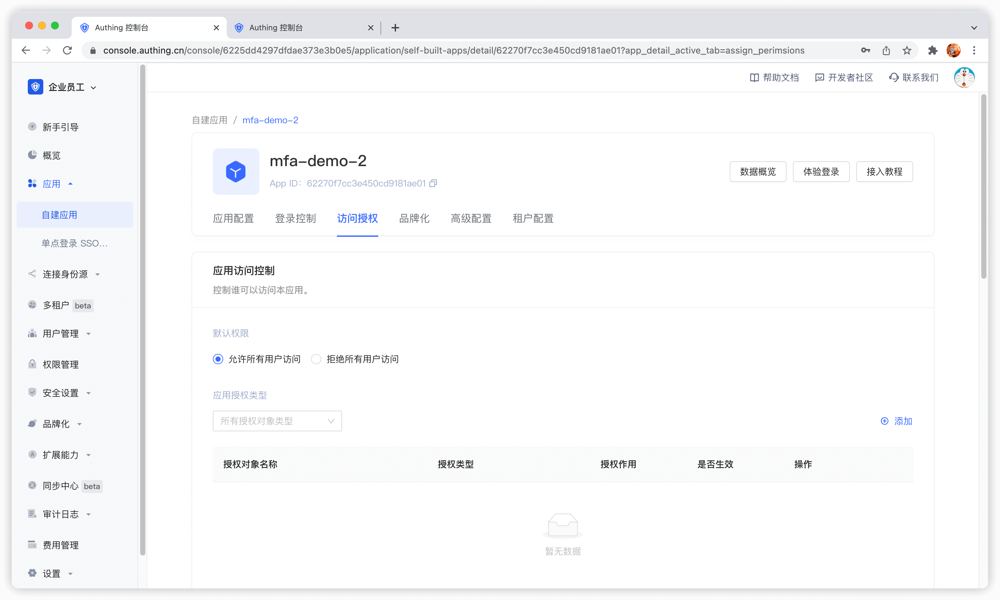

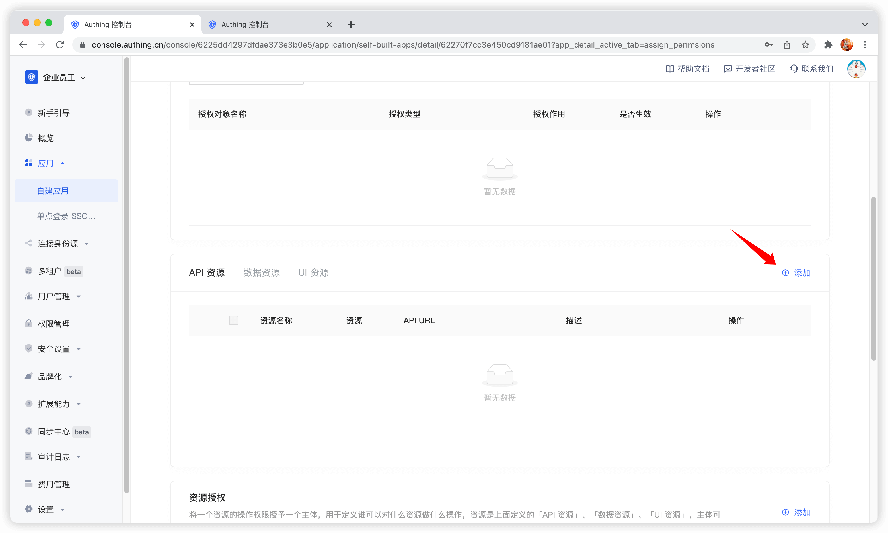

Then fill in a **resource name**. It is recommended to fill in a semantic resource name for easy subsequent management. In the operation type, you can define resource operations. Here, read and write operations are defined. Finally, click Save, and a resource is created.

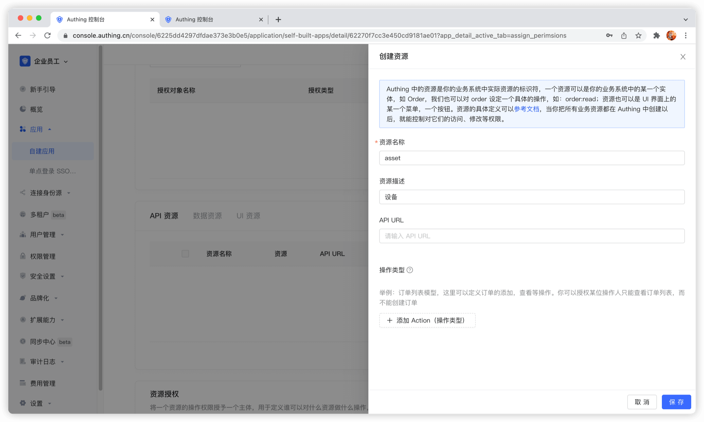

## Create a user

In the user list, click New to create a user.

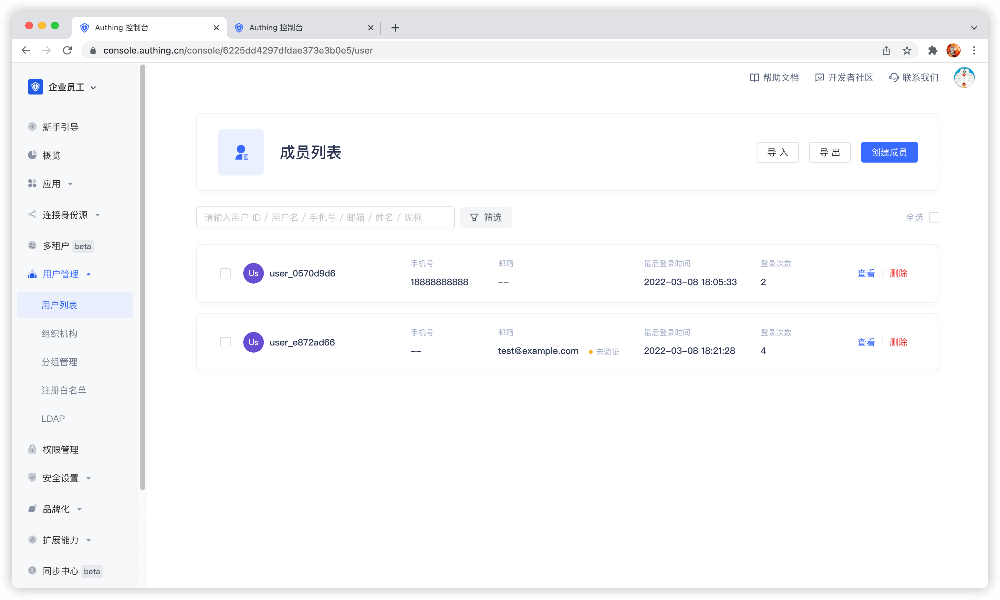

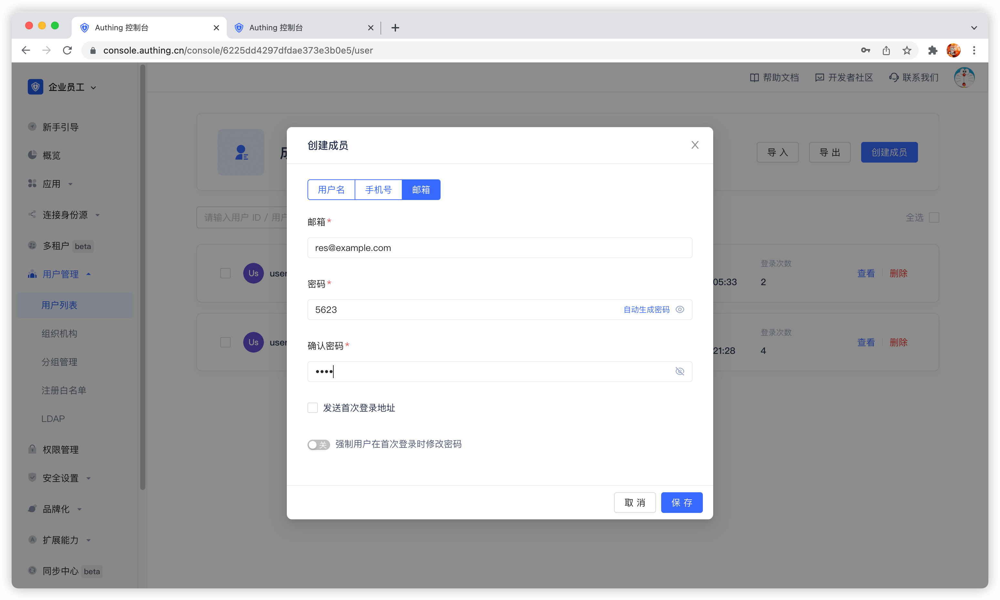

## Create a role

In the **Role Management** card of the **Access Authorization** menu of the App Details, click the Add button on the right:

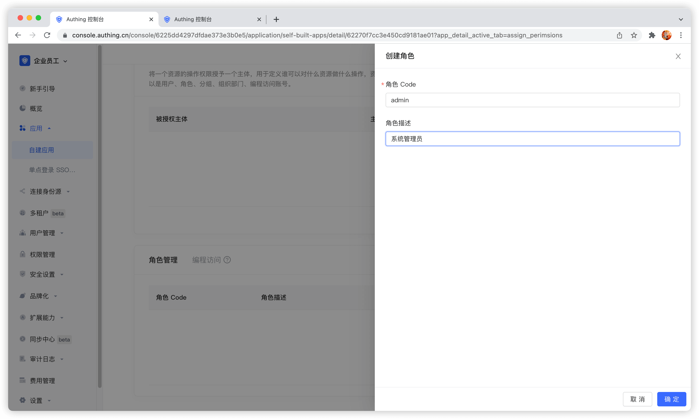

After creating a role, you can add users to this role:

> You can search for users by username, email, or nickname.

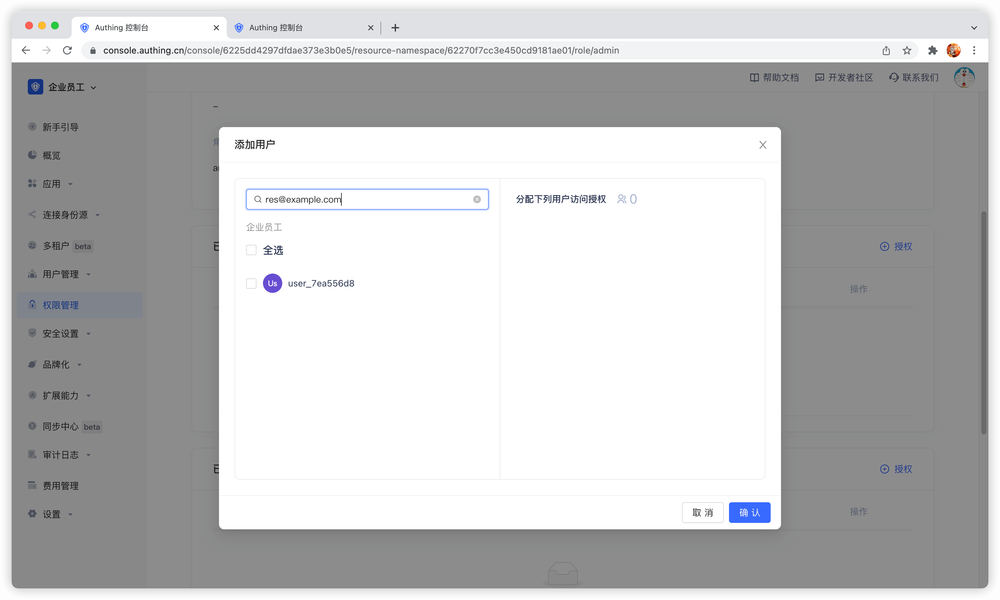

## Manage permissions

Now that you have **resources** and **people**, you need to define **who** can do what **operations** on what **resources**.
In the resource authorization card of the app, click the Add button on the right.

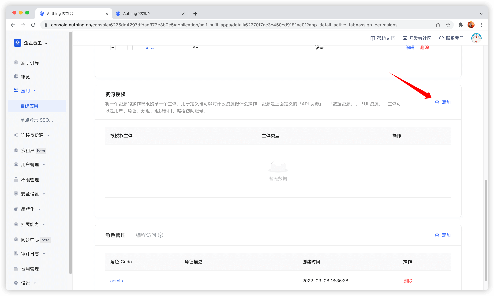

**Authorized subject** can select **user**, here we select the user we just created, and select the device resource we just created in the **resource type** below.
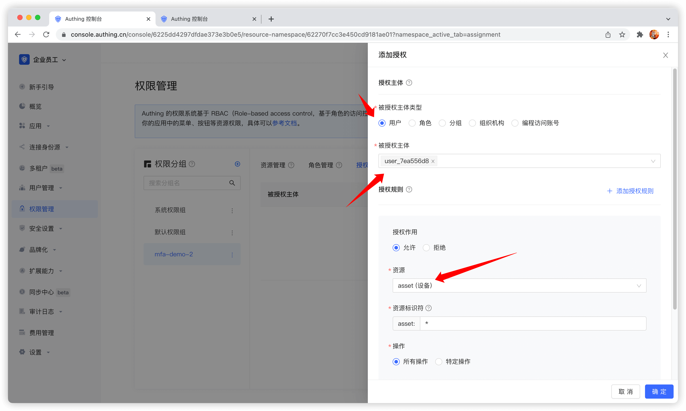

**Authorized subject** can also select **role**, so that all users in the role will automatically inherit the permissions authorized by the role.

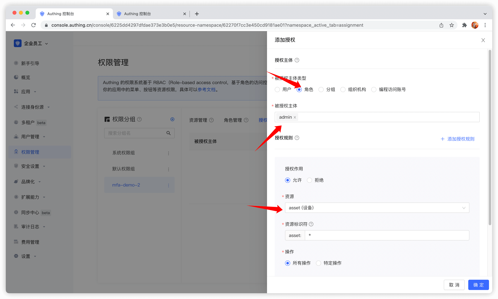

Then fill in `*` in **resource identifier**, which means authorizing all device resources, select **specific operation**, select the read device list operation in the **resource operation** we just defined, and finally click OK.

If you fill in a **specific identifier**, such as 42, it means that the device resource numbered 42 is authorized to the subject. The subject only has the permission for the resource asset:42, and can only authorize the relevant permissions of the asset:42 resource at most during authorization.

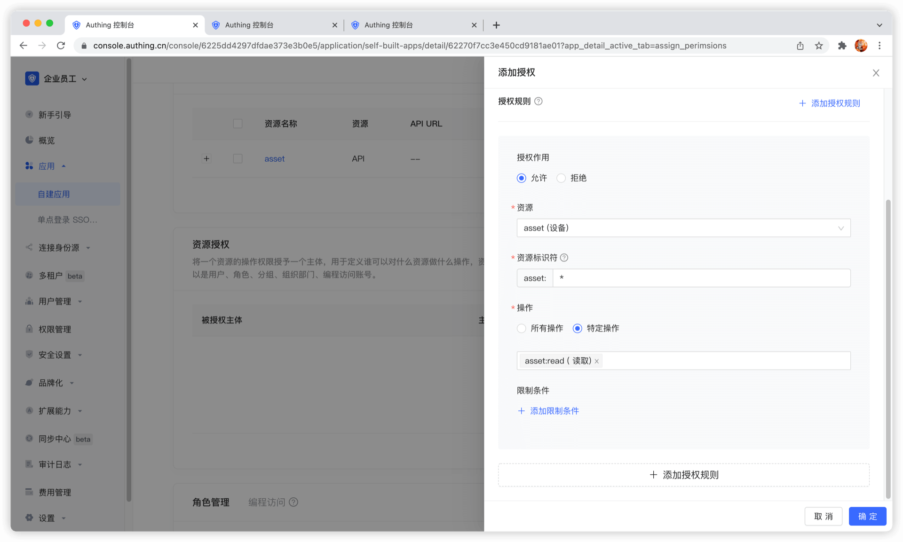

We can also add restrictions to the authorization rules, for example, this rule is only valid for Windows users. If authorization is initiated from a Linux machine, GenAuth will think that the user has no permission and cannot complete the authorization of device resources.

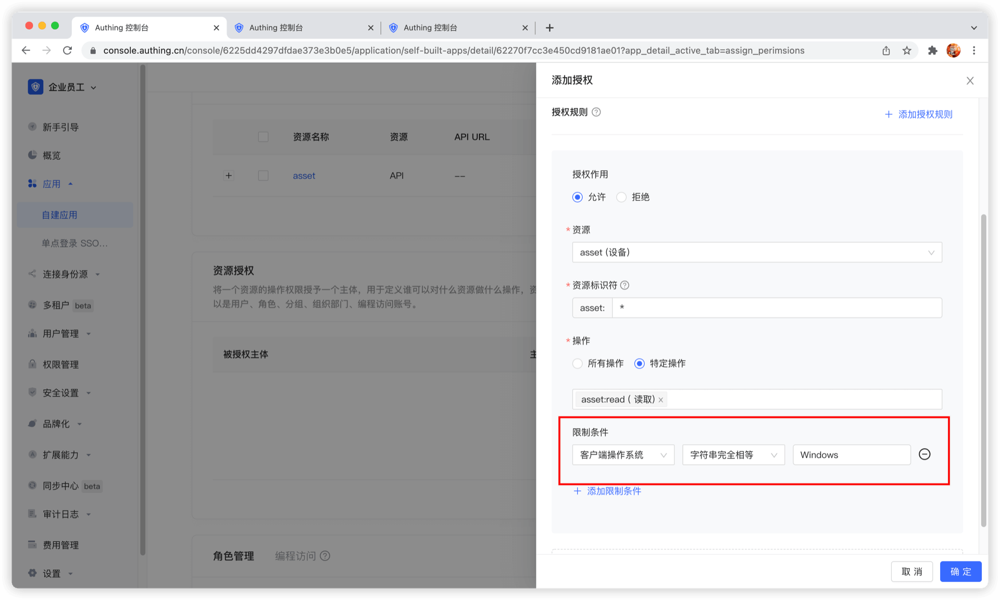

If you want to authorize multiple resources to the user, you can continue to add authorization rules.

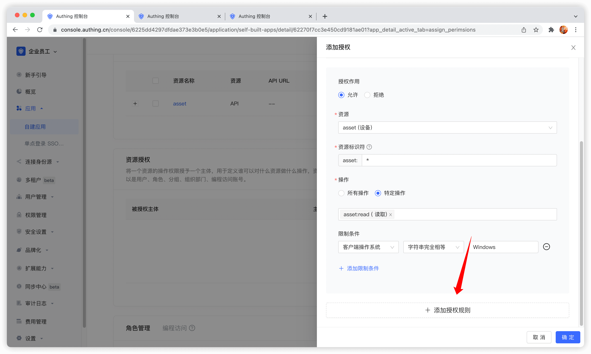

## Programmatic access account

The programmatic access account is a pair of AccessKey and SecretKey under the application, which is used to hand over to third-party vendors such as outsourcers. You can use the programmatic access account in combination with the OIDC authorization code to obtain the user's AccessToken and IdToken, or use the programmatic access account to perform OIDC ClientCredentials mode to request authorization on behalf of the caller itself.

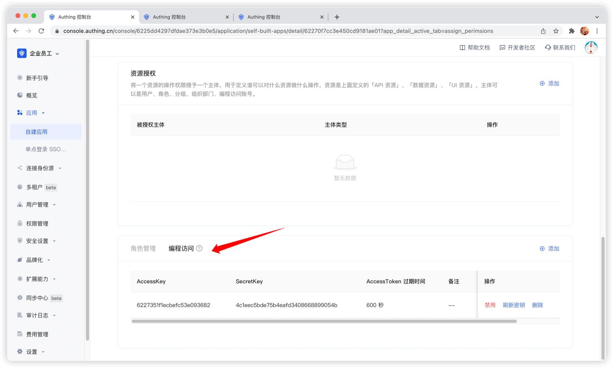
