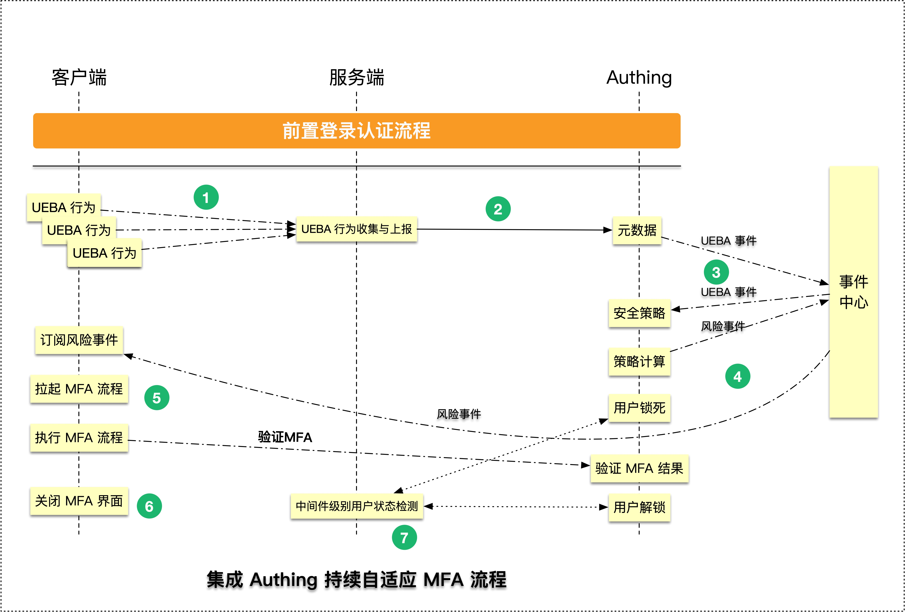
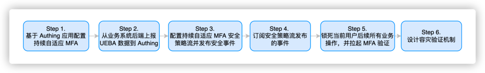
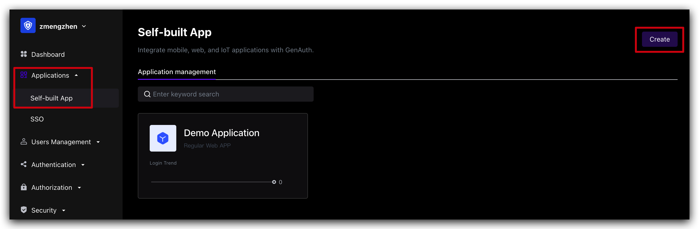
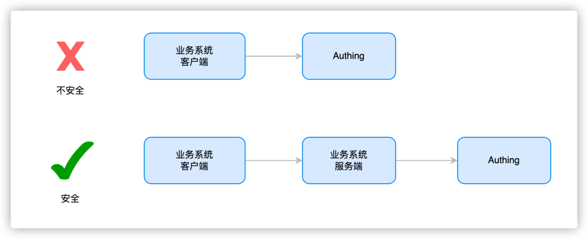

# Advanced MFA: Continuous Adaptive Multi-Factor Authentication (CAMFA) Guide

> Goal: Improve user experience and security, reduce enterprise costs through intelligence
> Current situation: Self-developed systems do not have MFA or MFA functions are weak and urgently need to call MFA in multiple scenarios (such as resource access, device addition, information change)
> Solution: Access GenAuth advanced MFA components to quickly implement multi-scenario calls



## What is Continuous Adaptive Multi-Factor Authentication

Continuous Adaptive Multi-Factor Authentication (CAMFA) is a secure authentication method that combines multiple authentication factors (such as passwords, biometrics, hardware tokens, etc.) and uses real-time risk assessment technology to dynamically evaluate users to improve security.

## How to configure continuous adaptive multi-factor authentication



### Step 1. Create a GenAuth MFA application

You need to create an MFA application in GenAuth first. Go to the console (opens new window) > Applications, and click "Add Application" in the upper right corner.



### Step 3. Report UEBA data from the business system backend to the GenAuth system

You need to introduce the GenAuth SDK in your server system and use MetadataManagementClient to report user behavior data to the GenAuth system. The specific operation process is as follows:

#### Step 3.1 Install GenAuth SDK

```bash
npm install authing-js-sdk
```

#### Step 3.2 Initialize MetadataManagementClient

```javascript
import { MetadataManagementClient } from "authing-js-sdk";

const appId = "AUHTING_APP_ID";
const appSecret = "AUHTING_APP_SECRET";

const authingMetadataManagementClient = new MetadataManagementClient({
  appId,
  appSecret,
});
```

#### Step 3.3 Get user behavior data and report it to the GenAuth system

```javascript
// Get user behavior data information
const userUEBAData = getUserUEBAFromRequest(req);

// Report user behavior data to the GenAuth system
const UEBAMetadata =
  authingMetadataManagementClient.authingUEBA.capture(userUEBAData);
```

GenAuth provides more friendly ways to obtain user behavior information, please refer to 「MetadataClient」GenAuth MFA Quick Start

###### Why forward user behavior data through the business system server



```
The purpose of transmitting data to the server is to make the data more secure, avoid data leakage, abuse and arbitrary modification, and also facilitate data persistence and ensure that data will not be lost. It is also convenient for data processing, better mining of data value, and support data sharing for use by other applications or devices.
```

#### Step 5. Subscribe to the events published by the security policy flow

The continuous adaptive security policy requires your client to continuously monitor the MFA events and respond in real time after receiving the MFA events. The specific process is as follows

##### Step 5.1 Install GenAuth SDK on the server

```bash
$ npm install authing-js-sdk
$ npm install @authing/mfa
```

##### Step 5.2 Initialize AuthenticationClient

```javascript
import { AuthenticationClient } from "authing-js-sdk";
import { AuthingMFA } from "@authing/mfa";
const appId = "YOUR_APP_ID";
const authingAuthenticationClient = new AuthenticationClient({ appId });
```

##### Step 5.3 Subscribe to MFA events, use MFA trigger data and AuthingMFA to start the MFA authentication process, and perform MFA authentication

```javascript
// Subscribe to MFA events, and automatically add the current user's MFA status check logic through GenAuth
authingAuthenticationClient.MFA.subscribe(
  "authing.security.mfa?originalIdentity=originalIdentityexternalid",
  (mfaTriggerData) => {
    // Use AuthingMFA SDK to start the MFA authentication process
    AuthingMFA(mfaTriggerData)
      .start()
      .then((mfaToken) => {
        // mfaToken is the jwt token generated after the user's MFA
        // You can use mfaToken as the user's successful login credential, or you can re-issue it based on the current token
      });
  }
);
```

##### Step 5.4 Determine whether the authentication is successful based on the MFA authentication result. If the authentication is successful, record the user login status and jump to the business system; if the authentication fails, display an error message and return to the login page

```javascript
// Use AuthingMFA SDK to start the MFA authentication process
AuthingMFA(mfaTriggerData).then((mfaToken) => {
  // You can use mfaToken as the user login credential, or re-issue it based on the current token
  // The following example is the process of re-issuing mfaToken
  const myToken = clientReIssueToken(mfaToken);
  if (myToken) {
    // 1. Record login status
    // 2. Jump to the business system
  } else {
    // The interface prompts that the authentication failed
  }
});
```

##### If you choose to use GenAuth mfaToken as the user authentication token, you can refer to the following code

```javascript
// Use AuthingMFA SDK to start the MFA authentication process
AuthingMFA(mfaTriggerData)
  .start()
  .then((mfaToken) => {
    // You can use mfaToken as the user login credential, or re-issue it based on the current token
    if (myToken) {
      // 1. Use mfaToken to record the login status
      // 2. Jump to the business system
    } else {
      // The interface prompts that the authentication failed
    }
  });
```

##### Step 6. Lock all subsequent business operations of the current user and pull up MFA verification

After an MFA risk event occurs, you need to transform your backend system to restrict operations for users with MFA risks and prohibit subsequent requests

##### First, use a simple express backend system code as an example to help you understand how to modify the code of your business system

##### Step 6.1 Initialize the metadata management client

```javascript
import { MetadataManagementClient } from "authing-js-sdk";

const appId = "YOUR_APP_ID";
const authingMetadataManagementClient = new MetadataManagementClient({ appId });
```

##### Step 6.2 Add express middleware to verify user MFA status to the server system

```javascript
import express from 'express'
import { MetadataManagementClient } from 'authing-js-sdk'

const appId = 'YOUR_APP_ID'
const authingMetadataManagementClient = new MetadataManagementClient({appId})

const authingUEBA = authingMetadataManagementClient.authingUEBA
const mfaAuthMiddleware = (req, res, next) => {
    // Get the user ID in the token
    const { myUserId } = utils.getUser(req.header.token)
    // Check the user MFA status, you need to pass in the user ID
    const { mfaVerified } = await authingUEBA.checkUserStatus({ originalId: myUserId })
    // Reverse the process according to the MFA status
    if(mfaVerified) {
        // The customer performs the next business operation
        next()
    } else {
        throw new UnauthorizedClientError()
    }
}

const app = new express()
app.use(mfaAuthMiddleware)
```

#### Step 7 Design a disaster recovery verification mechanism

##### Step 7.1 Keep the MFA verification status persistent in the scenario of refreshing the page

After the user refreshes the page, GenAuth will automatically query the current user MFA verification success status in the security policy subscription method. If the status is verification failure, the current subscription function will be automatically executed. It is recommended that developers implement the trigger MFA method in the subscription function. The following is a specific code example:

**Step 7.1.1 Install GenAuth SDK on the server**

```bash
$ npm install authing-js-sdk
$ npm install @authing/mfa
```

**Step 7.1.2 Initialize AuthenticationClient**

```javascript
import { AuthenticationClient } from "authing-js-sdk";
import { AuthingMFA } from "@authing/mfa";
const appId = "YOUR_APP_ID";
const authingAuthenticationClient = new AuthenticationClient({ appId });
```

**Step 7.1.3 Subscribe to MFA events, use MFA trigger data and AuthingMFA to start the MFA authentication process, and perform MFA authentication**

```javascript
// Subscribe to MFA events, and the current user's MFA status will be automatically added through GenAuth check logic
authingAuthenticationClient.MFA.subscribe(
  "authing.security.mfa?user=xxx",
  (mfaTriggerrData) => {
    // Use AuthingMFA SDK to start MFA Authentication process
    AuthingMFA(mfaTriggerData)
      .start()
      .then((mfaToken) => {
        // mfaToken is the jwt token generated after the user MFA
        // mfaToken can be used as the user's login credential, or it can be re-issued based on the current token
      });
  }
);
```

**Step 7.1.4 Determine whether the authentication is successful based on the MFA authentication result. If the authentication is successful, record the user login status and jump to the business system; if the authentication fails, display an error message and return to the system login page**

```javascript
// Use AuthingMFA SDK to start the MFA authentication process
AuthingMFA(mfaTriggerData)
  .start()
  .then((mfaToken) => {
    // You can use mfaToken as a user login credential, or you can re-issue it based on the current token
    // The following example is the process of re-issuing using mfaToken
    const myToken = clientReIssueToken(mfaToken);
    if (myToken) {
      // 1. Record login status
      // 2. Jump to the business system
    } else {
      // The interface prompts that the authentication failed
    }
  });
```

**If you choose to use GenAuth mfaToken as the user authentication token, you can refer to the following code**

```javascript
// Use AuthingMFA SDK to start the MFA authentication process
AuthingMFA(mfaTriggerData)
  .start()
  .then((mfaToken) => {
    // You can use mfaToken as the user login credential, or re-issue it based on the current token
    if (myToken) {
      // 1. Use mfaToken to record the login status
      // 2. Jump to the business system
    } else {
      // The interface prompts that the authentication failed
    }
  });
```

##### Step 7.2 GenAuth automatically implements a disaster recovery mechanism for releasing users when the MFA service is down

In the authingUEBA.checkUserStatus method, GenAuth will have a built-in MFA service monitoring process. When the result returned by the MFA service is abnormal, the current user MFA will always be released

## For more information about the features, please refer to

- [GenAuth Adaptive MFA Overview](./intro)
- [Integrate MFA based on GenAuth Guard login component](./guard)
- [Transform existing IAM/IDaaS/authentication systems to integrate GenAuth adaptive MFA capabilities](./legacy)
