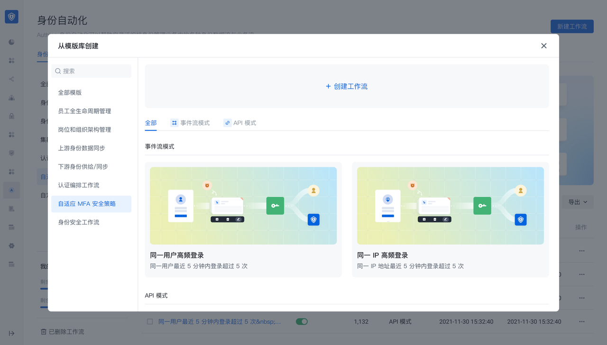
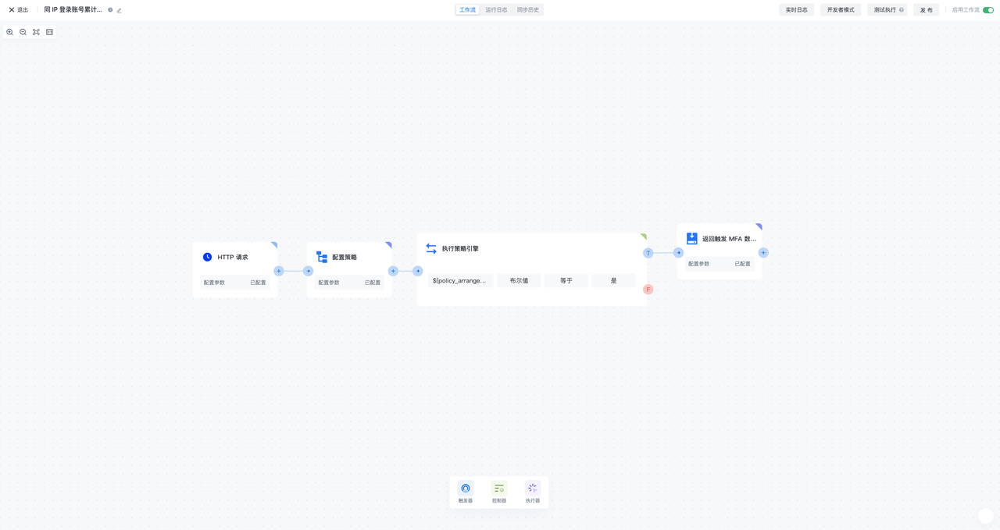
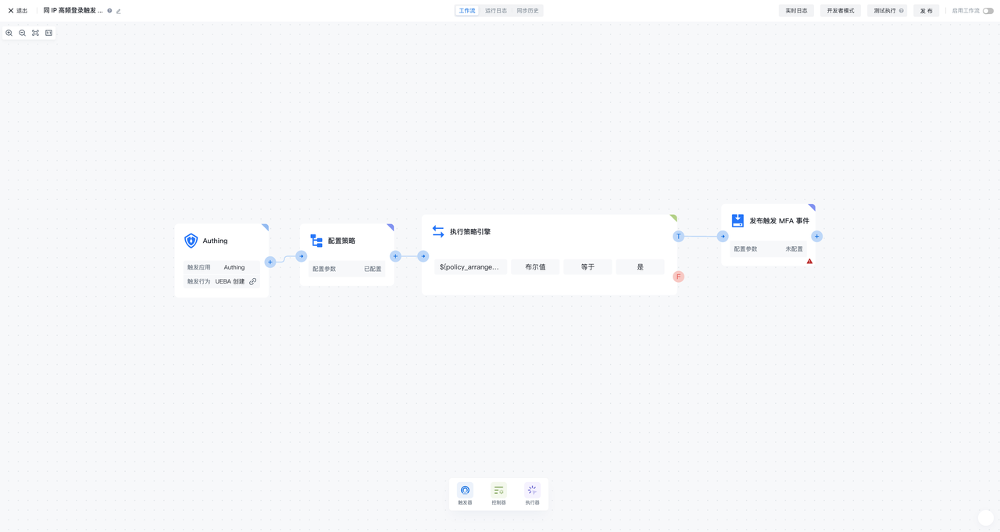
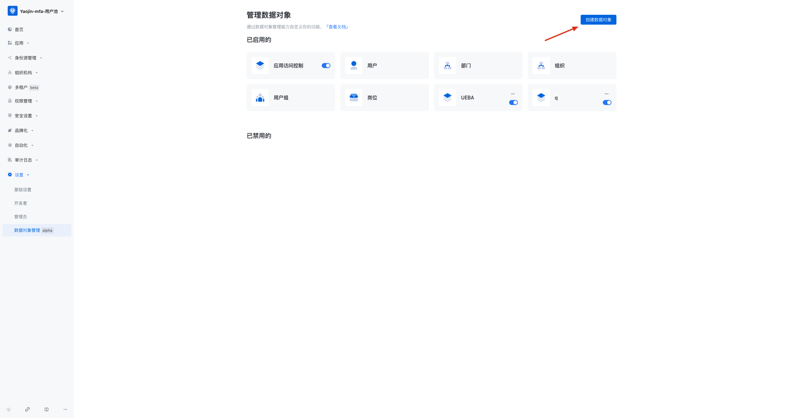
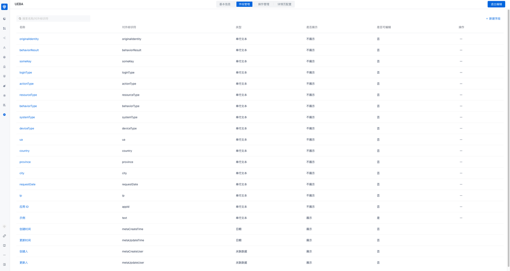
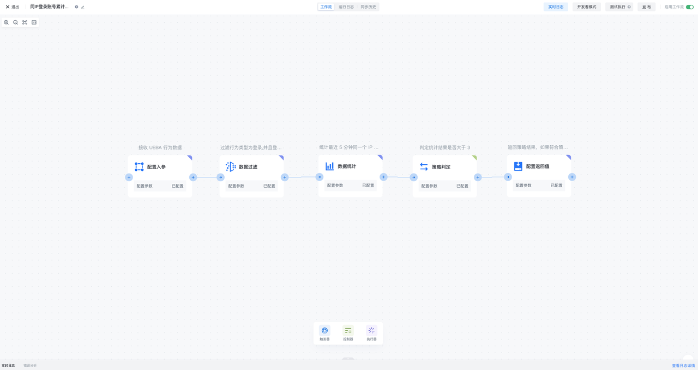

# Adaptive MFA orchestration/policy configuration instructions

## Create adaptive MFA security orchestration through templates

In the Identity Automation module, click New Workflow and find the "Adaptive MFA Security Policy" module to create an adaptive MFA security orchestration workflow through a template. The template has two modes:

- API mode: suitable for adaptive MFA scenarios
- Event stream mode: used for continuous adaptive MFA scenarios

## Enter MFA security orchestration-API mode after creating through template

MFA security policy-API mode is a security orchestration flow consisting of HTTP request, configuration policy, execution policy engine, and return trigger MFA data. It is used for adaptive MFA scenarios and can trigger security orchestration workflows through HTTP requests, calculate user risks according to configuration policies, and return trigger MFA data according to calculation results

### HTTP request

HTTP request is used as the trigger of MFA security policy flow. Whenever a new HTTP request is generated, the workflow will be triggered

### Configure policy

In the configuration policy node, you can reference the policy orchestration function preset by GenAuth, or create a new custom policy orchestration function and then reference it. The policy orchestration function can receive the input data of the UEBA change event of the previous node, flexibly define the algorithm strategy, and output the corresponding return value of the configuration, which is given to the subsequent node execution policy engine for use

### Execution policy engine

In the execution policy engine node, you can assemble the return value of the adaptive MFA security policy referenced in the configuration policy, such as the policy judgment result, and then configure the conditional expression (or combination of conditional expressions) to perform the calculation of the policy judgment

### Return trigger MFA data

When the conditions (groups) of the execution policy engine node are met, it will enter the return trigger MFA data node. In the return trigger MFA data node, you can configure which MFA authentication method needs to be triggered, and you can flexibly configure the custom return value

## Enter MFA security orchestration-event flow mode after template creation

MFA security policy-event flow mode is a UEBA change event, configuration policy, execution policy engine, and release MFA The security orchestration flow composed of events is used for continuous adaptive MFA scenarios. It can continuously subscribe to UEBA events, calculate user risks according to the configuration policy, and publish specific MFA events based on the calculation results

### UEBA change event

The UEBA change event is used as a trigger for the MFA security policy flow. Whenever a new UEBA event is generated, the workflow will be triggered

### Configure policy

In the configuration policy node, you can reference the policy orchestration function preset by GenAuth, or create a new custom policy orchestration function and then reference it. The policy orchestration function can receive the input data of the UEBA change event of the previous node, flexibly define the algorithm strategy, and output the corresponding return value of the configuration, which is given to the subsequent node execution policy engine for use

### Execution policy engine

In the execution policy engine node, you can assemble the return value of the adaptive MFA security policy referenced in the configuration policy, such as the policy judgment result, and then configure the conditional expression (or combination of conditional expressions) to perform the calculation of the policy judgment

### Publish MFA event

When the conditions (groups) of the execution policy engine node are met, it will enter the publish MFA event node. In the publish MFA event node, you can configure which MFA authentication method needs to be triggered, and you can flexibly configure the custom return value

### UEBA data object module configuration

When using MFA security orchestration-event flow mode, you also need to create a UEBA data object module in Settings-Data Object Management

The specific user data field list is as follows

Specific field list reference:

| Name | External identifier | Explanation | Generation method |
| ---------------- | :----------: | :---------------------------: | :------------------: |
| ---------------- | Application ID |
| appId            | Request date |
| requestDate      | ip |
| ip               | Request city | | Generate based on IP resolution |
| city             | Request province | | Generate based on IP resolution |
| province         | Request country | | Generate based on IP resolution |
| country          | User agent |
| ua               | Device type | | Generate based on UA ​​resolution |
| deviceType       | Device system | | Generate based on UA ​​resolution |
| systemType       | Browser | | Generate based on UA ​​resolution |
| browserType      | User unique identifier | The unique ID of the user in the business system | Business system must be transmitted |
| originalIdentity | Behavior type | | Business system optional (recommended) |
| behaviorType     | Behavior result | | Business system optional (recommended) |
| behaviorResult   | Resource type | User operation resource type | Business system optional (recommended) |
| resourcesType    | Operation type | User operation type on resources | Business system optional (recommended) |
| actionType       | Authentication method | | Business system optional (recommended) |
| loginType        | Custom field | Custom field | Business system optional (recommended) |

## Configure adaptive MFA security policy

Adaptive MFA security policy is a security policy flow consisting of configuration input parameters, data filtering, data statistics, policy judgment, and configuration return value. It is used in adaptive/continuous self-use MFA scenarios. It can define the parameters for calculation input, filter data, statistics, make policy judgments, and finally output the policy calculation results. Adaptive MFA security policies can be referenced by adaptive MFA security orchestration workflows to obtain policy calculation results of behavioral data, thereby achieving flexible orchestration of MFA

### Configuring input parameters

Configuring input parameter nodes can flexibly define the parameters and data types received by adaptive MFA security policies

### Data filtering

Data filtering nodes can configure filtering conditions based on the data input by the previous order, and pass the data that meets the conditions to the back

### Data statistics

Data statistics nodes can configure data statistics conditions after receiving data from the previous order node, and can set the statistical cycle, statistical field and statistical type, and output statistical results based on the configuration of statistical conditions

### Policy judgment

Policy judgment nodes can configure policy judgment conditions based on the data input by the previous order node and the results of data statistics, and output policy hit results based on the conditions of policy judgment

### Configuring return values

Configuring return value nodes can assemble the output results of the previous order node, including configuring the data fields of the input parameters, the statistical results of data statistics, the policy results of policy judgment, and the ability to customize any return value

## For more information about functions, please refer to

- [GenAuth Adaptive MFA Overview](./intro)
- [Integrate MFA based on GenAuth Guard login component](./guard)
- [Transform existing IAM/IDaaS/authentication systems to integrate GenAuth adaptive MFA capabilities](./legacy)
- [Advanced MFA: Continuous Adaptive Multi-Factor Authentication (CAMFA) Guide](./camfa)
