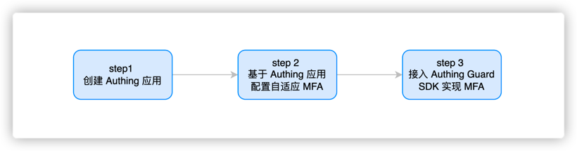
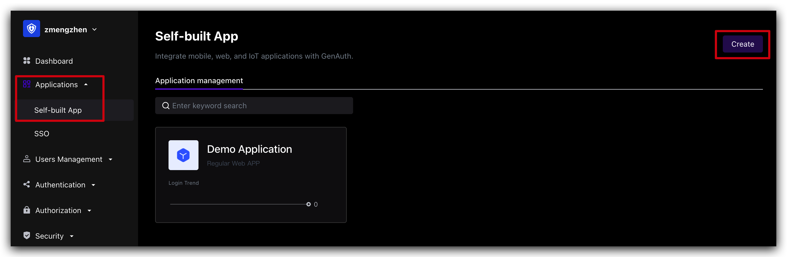
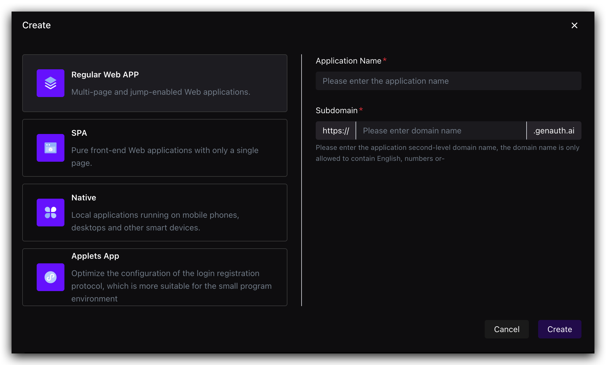
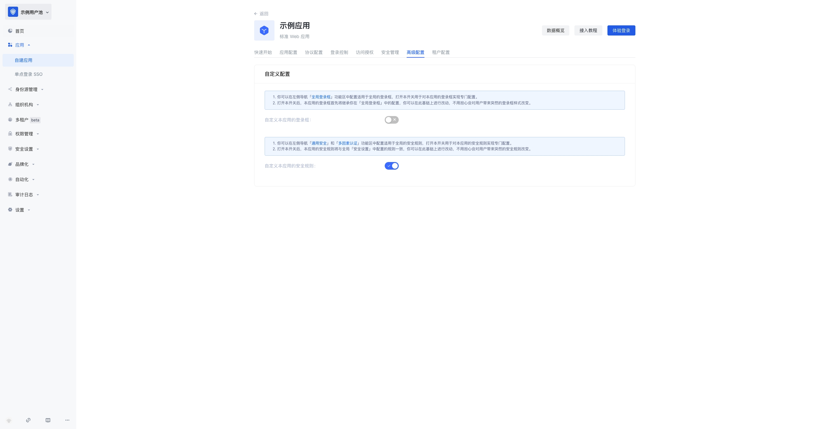

# Based on GenAuth Guard access GenAuth continuous adaptive MFA

We will assume that the following situation is your current goal and status, and we will provide you with the best solution

> Goal: In self-developed applications or applications with code modification permissions, quickly launch MFA and security policy protection capabilities, improve business access security, improve user experience, support diversified business scenarios, and reduce enterprise management costs
>
> Status: The current system MFA capability is weak
>
> Solution: Access the GenAuth Guard authentication component to quickly access login and security policy capabilities

## What is GenAuth Guard?

GenAuth Guard is a secure and reliable authentication and authorization service provided by GenAuth that can help enterprises and developers quickly build secure and reliable applications and services, improve user experience and protect user identity and information security.
GenAuth Guard uses industry best practice security design and can be integrated into your development project with only a few lines of JavaScript code. It can be loaded directly from CDN or NPM, or built from source code. GenAuth Guard also provides multiple integration modes for Javascript native, React, Vue, and Angular, which can be seamlessly integrated in any of your projects and enjoy high customization flexibility.
For more detailed information, please see [Connecting to GenAuth Guard](https://docs.genauth.ai/reference/guard/).

## The overall process of connecting to MFA through the GenAuth Guard login component



### Step 1. Create a GenAuth application

You need to create an application in GenAuth first. Go to [Console](https://console.genauth.ai/console) > Applications and click "Create a self-built application" in the upper right corner.

Fill in a domain name for the authentication address. It must be in a legal domain name format, such as my-awesome-app, as the unique identifier of this application in GenAuth.

For detailed configuration, please refer to: https://docs.genauth.ai/guides/app-new/

### Step 2. Configure adaptive MFA based on GenAuth application

1. Enter [Console (opens new window)](https://console.genauth.ai/console) > Click Application Details > Click Advanced Configuration, and turn on **Customize the security rules for this application. **
<!-- 
 -->

### Step 3. Connect to GenAuth Guard SDK to implement MFA

GenAuth Guard is a lightweight authentication component that you can embed in any application that interacts with users through a browser to handle complex user authentication processes in one stop. MFA is a module in the Guard component. You can use MFA capabilities by connecting GenAuth Guard to your project.

#### Step 1: Install and initialize Guard (browser loading)

First, use script and link tags to import files directly in your HTML file, and use the global variable GuardFactory

```html
<!DOCTYPE html>
<html lang="en">
  <head>
    <meta charset="UTF-8" />
    <meta http-equiv="X-UA-Compatible" content="IE=edge" />
    <meta name="viewport" content="width=device-width, initial-scale=1.0" />
    <title>GenAuth Guard Demo</title>
    <script src="https://cdn.authing.co/packages/guard/5.1.5/guard.min.js"></script>
    <link
      rel="stylesheet"
      href="https://cdn.authing.co/packages/guard/5.1.5/guard.min.css"
    />
  </head>
  <body>
    <div id="authing-guard-container"></div>
    <!-- Import Guard -->
  </body>
</html>
```

#### Step 2: Get Guard instance (CDN)

```tsx
// Code example: https://github.com/Authing/Guard/blob/master/examples/guard/normal/embed.html
const guard = new GuardFactory.Guard({
  // You can view your App ID on the app details page in the GenAuth console
  appId: "GEN_AUTH_APP_ID",

  // If you are using a privately deployed GenAuth service, you need to pass in a custom host, such as:
  // host: 'https://my-authing-app.example.com',

  // By default, the first callback address you configured in the GenAuth console will be used as the callback address for this authentication.
  // If you have configured multiple callback addresses, you can also specify them manually (this address also needs to be added to the "Login callback URL" of the application):
  // redirectUri: "YOUR_REDIRECT_URI"
});

console.log("guard instance: ", guard);
```

For more installation methods, please refer to [Web Guard](https://docs.genauth.ai/reference/guard/web.html)

## For more features, please refer to

- [GenAuth Adaptive MFA Overview](./intro)
- [Transforming Existing IAM/IDaaS/Authentication Systems to Access GenAuth Adaptive MFA Capabilities](./legacy)
- [Advanced MFA: Continuous Adaptive Multi-Factor Authentication (CAMFA) Guide](./camfa)
