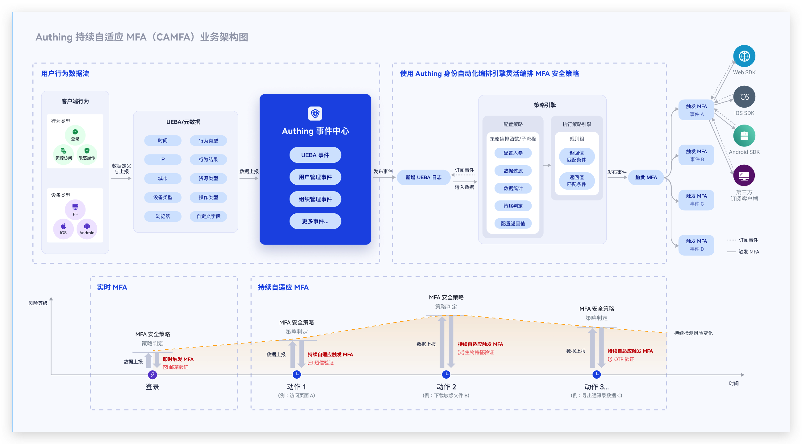
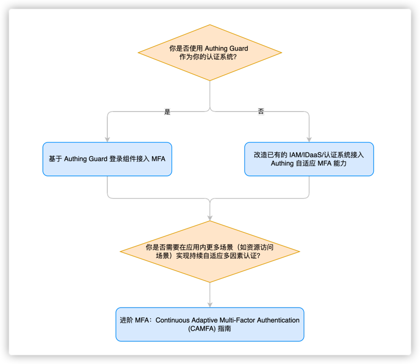

# GenAuth CAMFA Overview

## What is Continuous Adaptive Multi-Factor Authentication?

Continuous Adaptive MFA (CAMFA) is a secure authentication method that combines multiple authentication factors (such as passwords, biometrics, hardware tokens, etc.) and uses behavioral risk assessment technology to continuously and dynamically evaluate users' key behaviors in real time during the user's access lifecycle. When a risk is triggered, the user's current status will be confirmed by calling MFA authentication, thereby improving the security of the account and better protecting the data and resource security in the business system.

## Typical application scenarios of continuous adaptive MFA

- You want users to complete authentication normally without triggering MFA in the geographical location (country/city) where they often log in. However, when their account logs in in an uncommon location, they need to complete MFA again before they can log in.
- You want enterprise members to access your application in the intranet environment without triggering MFA and complete authentication normally. However, when they access the application in the extranet environment, they need to complete MFA again before they can log in.
- You want users in your enterprise to be able to trigger different MFAs based on different attributes such as organization and role when logging into internal applications. For example, members of the finance department need to verify their mobile phone number via SMS when logging in, and members of the human resources department need to verify their OTP when logging in.
- You want users to access your application. If a certain IP logs in to multiple applications continuously in a short period of time or fails to log in continuously, then this IP needs to perform an MFA verification before continuing to log in.

In short, continuous adaptive MFA is suitable for scenarios where your application hopes to continuously monitor user behavior and conduct targeted MFA verification based on user behavior risks.

## Core features of GenAuth continuous adaptive MFA

GenAuth continuous adaptive MFA, relying on the orchestration capabilities of GenAuth identity automation, is based on an event-driven approach. It can flexibly orchestrate security policies based on user attributes and user behavior characteristics, continuously monitor risks during user access, and set up triggering of multiple MFAs. While ensuring user experience, it effectively improves the security of authentication and resource access scenarios.

GenAuth continuous adaptive MFA has the following features:

- **Multiple access methods**: You can access GenAuth continuous adaptive authentication capabilities for your application in a variety of ways. Currently, it supports providing continuous adaptive MFA capabilities for your applications through GenAuth Guard/Authing application gateway/Authing MFA components
- **Multi-source behavior data reporting**: Continuous adaptive MFA can access user behavior data from multiple scenarios and multiple application systems, including device characteristics, network environment, behavior type, etc. If you access based on GenAuth MFA components, you can also fully customize user behavior data
- **Visual orchestration of security policies**: You can visually and flexibly orchestrate MFA security policies for different applications through workflows. Policies can be orchestrated based on multiple user attributes, behavior characteristics, and risk control indicators, supporting multiple policy branches, and different policies trigger different MFAs
- **Multiple MFA verification methods**: GenAuth continuous adaptive authentication supports multiple authentication methods, including mobile phone SMS verification/email verification/OTP verification/face recognition verification
- **Developer-friendly**: Provide SDK and open interfaces to help developers quickly call related capabilities.

## How to access GenAuth CAMFA?

**_Currently, the GenAuth CAMFA function is only available to internal test customers. If you need to obtain internal test qualifications, you can contact your business consultant or contact us online_**

## For more information about functions, please refer to

- [Access MFA based on GenAuth Guard login component](./guard)
- [Transform existing IAM/IDaaS/authentication systems to access GenAuth adaptive MFA capabilities](./legacy)
- [Advanced MFA: Continuous Adaptive Multi-Factor Authentication (CAMFA) Guide](./camfa)
