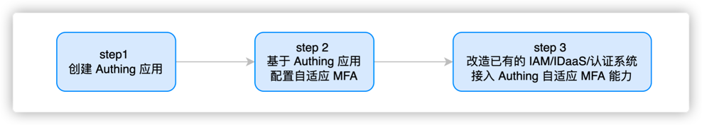
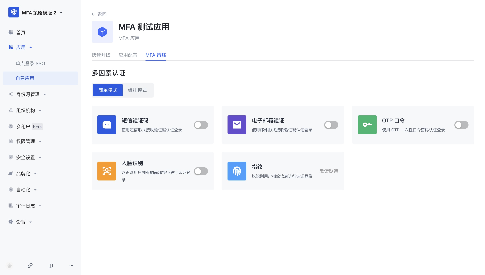
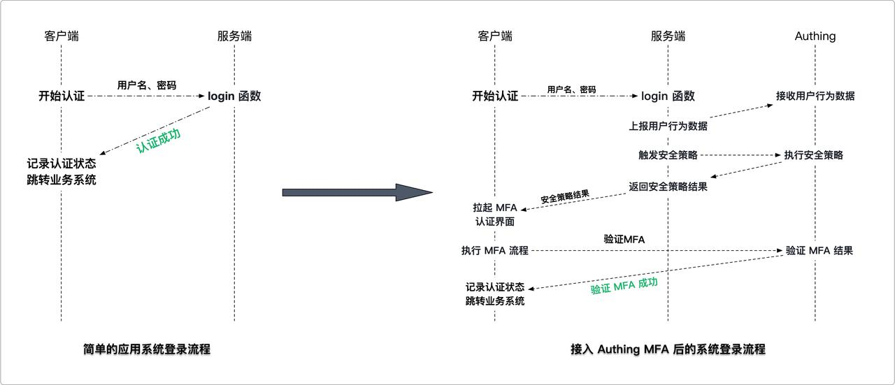

# Transform the existing IAM/IDaaS/authentication system to access GenAuth adaptive MFA capabilities

We will assume that the following is your current goal and status, and we will provide you with the best solution

> Goal: Enhance the login authentication security of the existing system, protect the company's sensitive data and applications, and improve the user experience
> Status: The existing IAM/IDaaS/authentication system is mainly self-developed or developed by a third party, with weak security capabilities or MFA does not have dynamic adaptive perception capabilities (for example, office equipment switching and office network changes can automatically evoke MFA). They usually support multiple authentication methods, such as username/password, social account login, mobile phone verification code, etc. However, these systems still have some problems, such as password leakage, social account theft, etc.
> Solution: Connect to the GenAuth security policy engine and MFA components to quickly improve security awareness

## The overall process of transforming the existing IAM/IDaaS/authentication system to connect to GenAuth's adaptive MFA capabilities



### Step 1. Create a GenAuth MFA application

You need to create an MFA application in GenAuth first. Go to Console (opens new window) > Applications and click "Add Application" in the upper right corner.


### Step 2. Configure adaptive MFA based on GenAuth application

Enter [Console](https://console.genauth.ai/console) > Application > Click Application Details > Click Security Management, and find the multi-factor authentication factor configuration interface as follows (click the corresponding switch to enable the authentication factor):


> The adaptive MFA authentication strategy is based on GenAuth UEBA, which can perform in-depth analysis of user behavior and user profiles, and automatically select the MFA strategy that matches the current behavior.
> In the adaptive MFA authentication strategy, the GenAuth UEBA engine analyzes and judges based on the user's behavior and profile, such as the user's login history, device information, IP address, geographic location, activity mode, etc., to determine the current user's identity and risk level, and select the MFA strategy that matches it.

### Step 3. Modify the existing IAM/IDaaS/authentication system to access GenAuth adaptive MFA capabilities

> Assuming that your system has a relatively simple login authentication process, we will show you how to add GenAuth adaptive MFA security policy authentication capabilities to the simple login authentication process step by step

#### We recommend you to modify the existing system to access GenAuth adaptive MFA solutions

The following is the interaction sequence diagram


[Live Demo For MFA ](https://codesandbox.io/s/damp-paper-ub60yu?file=/src/index.js)

##### Client modification solution

- Install GenAuth MFA SDK, GenAuth SDK and introduce AuthinMFA, MetadataClient in the code
- Use MetadataClient to obtain user behavior data in the current system, such as IP, browser and other information
- Modify the original login authentication interface and transmit user behavior data to the system background
- Determine whether MFA authentication is currently required
- If MFA is required, use the MFA trigger data and AuthinMFA returned by the backend interface to start the MFA authentication process and perform MFA authentication
- Determine whether the authentication is successful based on the MFA authentication result. If the authentication is successful, record the user login status and jump to the business system; if the authentication fails, display an error message and return to the login page
  Server-side transformation plan
- Install GenAuth SDK in the code, introduce AuthenticationClient and MetadataManagementClient, and initialize them
- Transform the login interface to receive and carry the authentication status to report the user behavior data to the GenAuth system
- After the user behavior data is reported, if the user passes the authentication once, call the GenAuth security policy engine to calculate whether this authentication triggers MFA
- If MFA is triggered, return the trigger data of this MFA to the client; if MFA is not performed, the verification is successful

##### Server-side transformation plan

- Install GenAuth SDK in the code, introduce AuthenticationClient and MetadataManagementClient, and initialize them
- Transform the login interface to receive and carry the authentication status to report the user behavior data to the GenAuth system
- After the user behavior data is reported, if the user passes the authentication once, call the GenAuth security policy engine to calculate whether this authentication triggers MFA
- If MFA is triggered, return the trigger data of this MFA to the client Return to the client; if MFA is not performed, the verification is successful

##### Take a simple application system login code example to help you understand how to gradually transform the system

We assume that the client and server codes for your login system are as follows, which are simple enough to understand

###### Client code:

```javascript
// Client code example

// Get the username and password of the current user
const username = form.username;
const password = form.password;

// Carry the username and password to initiate an authentication request to the server
const loginResult = clientLogin(username, password);

// Determine whether to perform subsequent operations based on the login result
if (loginResult.status) {
  // 1. Record login status
  // 2. Jump to the business system
} else {
  // 1. The interface prompts that the authentication failed
  // 2. Return to the login interface
}
```

###### Server code:

```javascript
// Server code example

// Server login authentication method
function login(username, password) {
  // Query the current authenticated user
  const user = db.findByUsername(username);

  // Determine whether the user password is correct
  if (user.password === md5(password)) {
    return {
      status: true,
      token: jwt(user),
    };
  } else {
    return {
      status: false,
      message: "Account or password error",
    };
  }
}
```

### Step 3.1 Client code transformation example

#### Step 3.1.1 Install and introduce GenAuth MFA SDK (used to pull up the MFA front-end interface) and GenAuth SDK (used to report user behavior data) in the code

```bash
$ npm install authing-js-sdk
$ npm install @authing/mfa
```

```javascript
import { MetadataClient } from "authing-js-sdk";
import { AuthingMFA } from "@authing/mfa";

const appId = "AUHTING_APP_ID";
const appSecret = "AUHTING_APP_SECRET";

const authingMetadataClient = new MetadataClient();
```

#### Step 3.1.2 Use Metadata Client to obtain user behavior data in the current system, such as IP, browser, etc.

**Metadata Client** is an out-of-the-box metadata rapid generation toolkit provided by GenAuth to help customers quickly access the GenAuth metadata platform. It has dozens of built-in metadata types of the GenAuth platform. For the usage of **Metadata Client**, please refer to: Metadata SDK usage document. In this example, it is mainly used to report user behavior data

```javascript
// The load method collects the client environment information and stores it in json, such as IP, DeviceType (current request device type), SystemType (current operating system type), BrowserType (current request browser type), etc.
const metadata = authingMetadataClient.authingUEBA.load();
```

#### Step 3.1.3 Modify the original login authentication interface and transmit user behavior data to the system background

```javascript
// Transmit user behavior data to the server through the login interface
const loginResult = clientLogin(username, password, metadata);
```

#### Step 3.1.4 Determine whether MFA authentication is currently required. If MFA is required, use the MFA trigger data returned by the backend interface and the GenAuth MFA SDK to start the MFA authentication process and perform MFA authentication

```javascript
// Determine the login result returned by the server,
if (loginResult.status) {
  // 1. Login successfully records the login status
  // 2. Jump to the business system
} else if (loginResult.mfaTriggerData) {
  // Use AuthingMFA SDK to start the MFA authentication process
  AuthingMFA(loginResult.mfaTriggerData)
    .start()
    .then((mfaToken) => {
      // mfaToken is the jwt token generated after the user's MFA
      // You can use mfaToken as the user's successful login credential, or you can re-issue it based on the current token
    });
} else {
  // 5. The interface prompts that the authentication failed
}
```

#### Step 3.1.5 Determine whether the authentication is successful based on the MFA authentication result. If the authentication is successful, record the user login status and jump to the business system; if the authentication fails, display an error message and return to the login page

```javascript
// Use AuthingMFA SDK to start the MFA authentication process
AuthingMFA(loginResult.mfaTriggerData)
  .start()
  .then((mfaToken) => {
    // You can use mfaToken as the user login credential, or re-issue it based on the current token
    // The following example is the process of re-issuing mfaToken
    const myToken = clientReIssueToken(mfaToken);
    if (myToken) {
      // 1. Record login status
      // 2. Jump to the business system
    } else {
      // The interface prompts that the authentication failed
    }
  });
```

**If you choose to use GenAuth mfaToken as the user authentication token, you can refer to the following code**

```javascript
// Use AuthingMFA SDK to start MFA Authentication process
AuthingMFA(loginResult.mfaTriggerData).start().then(mfaToken => {
    // TODO verify token legitimacy

    // You can use mfaToken as a user login credential, or re-issue it based on the current token
    if(myToken) {
        // 1. Use mfaToken to record login status
        // 2. Jump to business system
    } else {
        // Interface prompts authentication failure
    }
}
```

#### The overall code after client transformation is as follows

```javascript
import { MetadataClient } from "authing-js-sdk";
import { AuthingMFA } from "@authing/mfa";

const appId = "AUHTING_APP_ID";
const appSecret = "AUHTING_APP_SECRET";

const authingMetadataClient = new MetadataClient();

// The load method collects information about the client environment and stores it in json, such as IP, DeviceType (current request device type), SystemType (current operating system type), BrowserType (current request browser type), etc.
const metadata = authingMetadataClient.authingUEBA.load();

// Pass user behavior data to the server through the login interface
const loginResult = clientLogin(username, password, metadata);

// Determine the login result returned by the server,
if (loginResult.status) {
  // 1. Login successfully records the login status
  // 2. Jump to business system
} else if (loginResult.mfaTriggerData) {
  // Use AuthingMFA SDK to start MFA authentication process
  AuthingMFA(loginResult.mfaTriggerData)
    .start()
    .then((mfaToken) => {
      // You can use mfaToken as the user login credential, or you can re-issue it based on the current token
      // The following example is the process of re-issuing mfaToken

      // TODO SDK verify
      const myToken = clientReIssueToken(mfaToken);
      if (myToken) {
        // 1. Record login status
        // 2. Jump to business system
      } else {
        // The interface prompts that the authentication failed
      }
    });
} else {
  // 5. The interface prompts that the authentication failed
}
```

### Step 3.2 Server code modification example

#### Step 3.2.1 Install GenAuth SDK in the code and introduce AuthenticationClient, MetadataManagementClient, and initialize

```bash
$ npm install authing-js-sdk
```

```javascript
import { MetadataManagementClient, AuthenticationClient } from "authing-js-sdk";

const appId = "AUHTING_APP_ID";
const appSecret = "AUHTING_APP_SECRET";

const authingMetadataManagementClient = new MetadataManagementClient({
  appId,
  appSecret,
});
const authingAuthenticationClient = new AuthenticationClient({ appId });
```

#### Step 3.2.2 Modify the login interface, receive and carry the authentication status, and report the user behavior data to the GenAuth system

```javascript
const authingUEBA = authingMetadataManagementClient.authingUEBA

// User login interface
function login(username, password, metadata) {
    // Query the current authenticated user
    const user = db.findByUsername(username)
    const loginStatus = user.password === md5(password)

    // Report user behavior data with authentication status to the GenAuth system
    const clientUEBAMetadata = metadata
    const UEBAMetadata = await authingUEBA.capture({
        ...clientUEBAMetadata,
        loginStatus
    })

    // If authentication fails, just return an error
    if(!loginStatus) {
        return {
            status: false,
            message: 'Account or password error'
        }
    }
}
```

###### Why should user behavior data be forwarded through the business system server?


```
Data is transmitted to the server to make it more secure, avoid data leakage, abuse and arbitrary modification, and facilitate data persistence and ensure that data will not be lost. It is also convenient for data processing, better mining of data value, and support data sharing for use by other applications or devices.
```

#### Step 3.2.3 Call the GenAuth security policy engine to calculate whether this authentication triggers MFA

```javascript
// After the metadata is successfully uploaded, call the authentication side MFA workflow (specify the MFA work policy ID and the collected metadata information for each application, and obtain the metadata analysis results
const mfaTriggerData = authingAuthenticationClient.triggerWorkflow({
  workflowId: "xxx",
  metadata: clientUEBAMetadata, // Data in the UEBA metadata format bound by the user
});
```

#### Step 3.2.4 If MFA is triggered, return the trigger data of this MFA to the client; if MFA is not performed, the verification is passed

```javascript
const mfaTriggerData = authingAuthenticationClient.MFA.triggerWorkflow({
  workflowId: "xxx",
  metadata: clientUEBAMetadata, // Data in the UEBA metadata format bound by the user
});

if (mfaTriggerData) {
  return {
    status: false,
    mfaTriggerData: mfaTriggerData,
  };
} else {
  return {
    status: true,
    token: jwt(user),
  };
}
```

#### Step 3.2.5 Add a new interface to verify the validity of MFA token and reissue the user token based on the verification result

```javascript
// MFA verify interface
function clientReissueToken(mfaToken) {
  const mfaRes = authingAuthenticationClient.verify(mfaToken);
  // If mfaToken verification succeeds
  if (mfaRes.status) {
    // Take out the Id information contained in mfaToken
    const { originalIdentity } = mfaRes.data;
    // Query the user contained in the Id, and return the Token package if the user exists
    const user = db.findByUsername(originalIdentity);
    return {
      status: true,
      token: jwt(user),
    };
  } else {
    // If mfaToken verification fails, return failure information
    return {
      status: false,
      message: mfaRes.message,
    };
  }
}
```

#### The overall code after the server modification is as follows

```javascript
import { MetadataManagementClient, AuthenticationClient } from 'authing-js-sdk'

const appId = 'AUHTING_APP_ID'
const appSecret = 'AUHTING_APP_SECRET'

const authingMetadataManagementClient = new MetadataManagementClient({appId, appSecret})
const authingAuthenticationClient = new AuthenticationClient({appId})

const authingUEBA = authingMetadataManagementClient.authingUEBA

// User login interface
function login(username, password, metadata) {
    // Query the current authenticated user
    const user = db.findByUsername(username)
    const loginStatus = user.password === md5(password)

    // Carry the authentication status to report the user behavior data to the GenAuth system
    const clientUEBAMetadata = metadata
    const UEBAMetadata = await authingUEBA.capture({
        ...clientUEBAMetadata,
        loginStatus
    })

    // If authentication fails, just return an error
    if(!loginStatus) {
        return {
            status: false,
            message: 'Account or password error'
        }
    }

    // After metadata is uploaded successfully, call the authentication side MFA workflow (specify the MFA work policy Id and collected metadata information for each application, and obtain the metadata analysis results
    const mfaTriggerData = authingAuthenticationClient.triggerWorkflow({
        'workflowId': 'xxx',
        'metadata': clientUEBAMetadata,// Data in the UEBA metadata format bound by the user
    })

    if(mfaTriggerData) {
        return {
            status: false,
            mfaTriggerData: mfaTriggerData
        }
    } else {
        return {
            status: true,
            token: jwt(user)
        }
    }
}


// MFA verify interface
function verifyMFA(mfaToken) {
    const mfaRes = authingAuthenticationClient.verify(mfaToken)
    // If mfaToken verification succeeds
    if(mfaRes.status) {
        // Get the ID information contained in mfaToken
        const { originalIdentity } = mfaRes.data
        // Query the user contained by ID, and return the Token package if the user exists
        const user = db.findByUsername(originalIdentity)
        return {
            status: true,
            token: jwt(user)
        }
    } else {
        // If mfaToken verification fails, return the failure information
        return {
            status: false,
            message: mfaRes.message
        }
    }
}
```

## For more information about functions, please refer to

- [GenAuth Adaptive MFA Overview](./intro)
- [Access based on GenAuth Guard login component MFA](./guard)
- [Advanced MFA: Continuous Adaptive Multi-Factor Authentication (CAMFA) Guide](./camfa)
