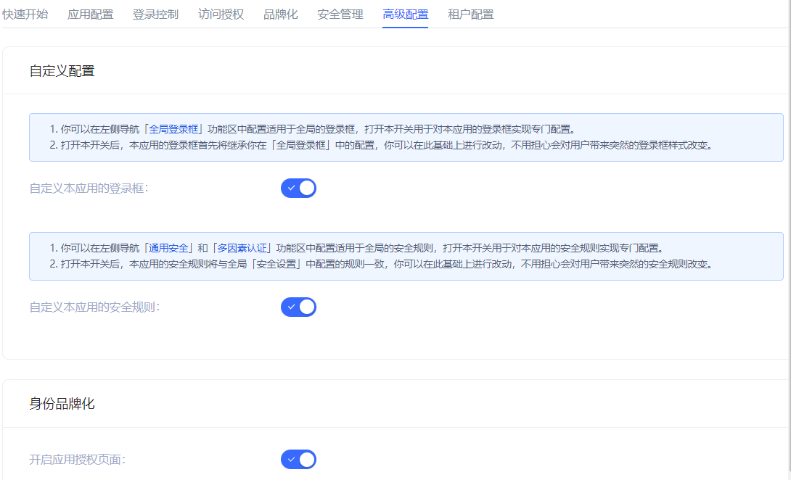
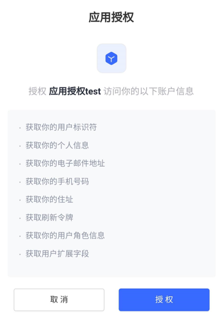

# Advanced Configuration
​
<LastUpdated/>

Path: **Application->Self-built Application->Application Details->Advanced Configuration**

Administrators can enable the application login box switch, application security rule switch, and application authorization page switch in the **Advanced Configuration** tab according to business needs.

## Custom Configuration
​
​

::: hint-info
After turning on the switch in this module, the relevant configuration of the application will first inherit the global configuration. Make changes on this basis without worrying about giving users an abrupt login experience.
:::

|Switch|Description|
|----|----|
|Customize the login box of this application|Off by default. After turning it on, the **Branding** tab is opened on the same page to customize the login box of the current application. For details, see [Branding](./customize-guard.md). |
|Customize the security rules of this application|Off by default. After turning it on, the **Security Management** tab is opened on the same page to customize the security policies such as login/registration of the current application. For more information, see [Security Management](./security-management.md). |

## Identity Branding

When the business software and identity data are not controlled by the same party, before the business software obtains user data through the business API, the identity provider is obliged to inform the end user which user data (such as mobile phone number, email address) and which resource permissions other companies need to obtain from them, and **must obtain the user's consent first**. After turning it on, the user will be shown the rights confirmation page when logging in.

