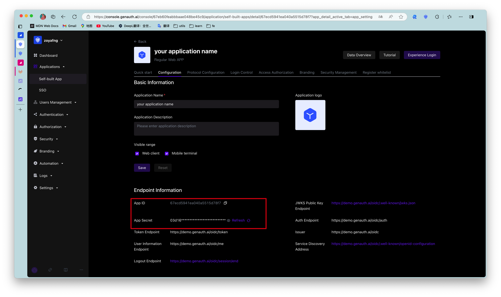

# Application Configuration
​
<LastUpdated/>

Path: **Application->Self-built Application->Application Details->Application Configuration**

When you want to use {{$localeConfig.brandName}} as a service provider (SP), you can complete the configuration of the application **Basic Information** and **Authentication Related** on the **Application Configuration** page. At the same time, when integrating the self-built application into {{$localeConfig.brandName}}, you will need to use **Endpoint Information** (such as **App ID**, **App Secret**, etc.) and **Authentication Configuration** (**Authentication Address**) related information.

​
​
| Field|Description |
| :-----| :---- |
| **Authentication Configuration->Login Callback URL**| This link needs to fill in your business callback address. After the user logs in to this application, the browser will jump to this address, where you can exchange user information. Example: `https://myawesomeapp.com/login/callback`. |
| **Login URL**|Click **Experience Login** in the {{$localeConfig.brandName}} app details or click the app icon in the app panel to jump to this URL, which is the login page of this app by default. |