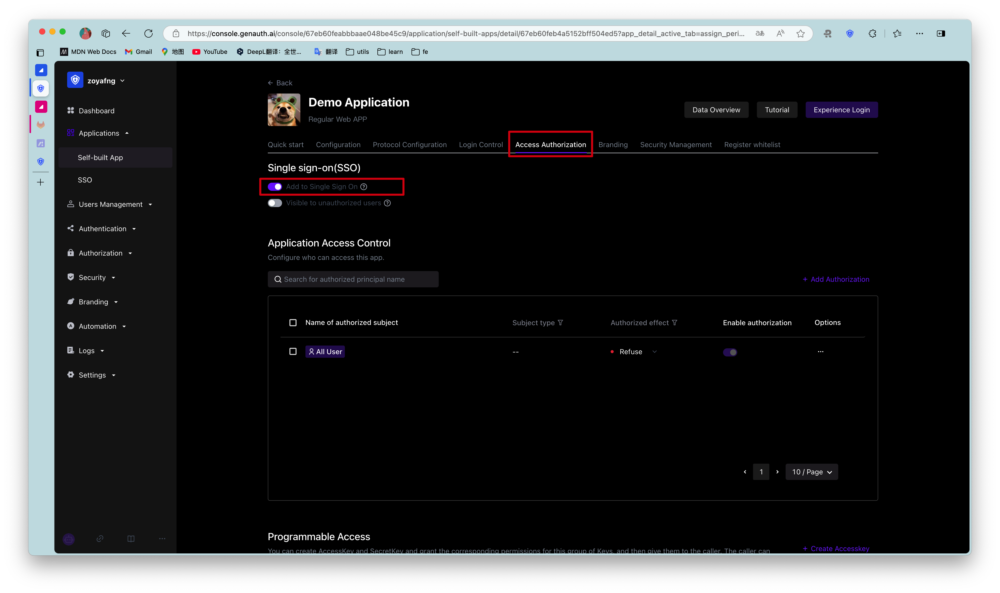
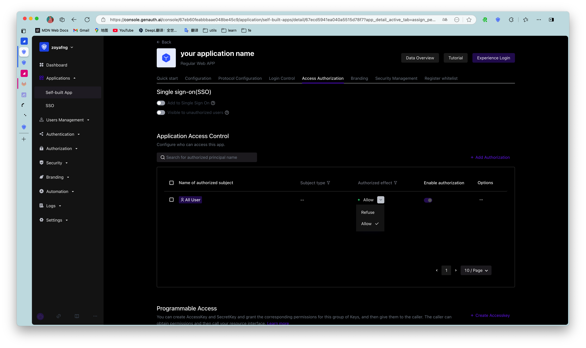
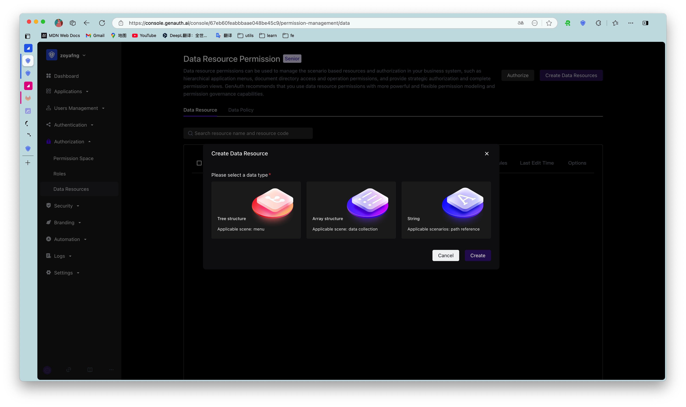
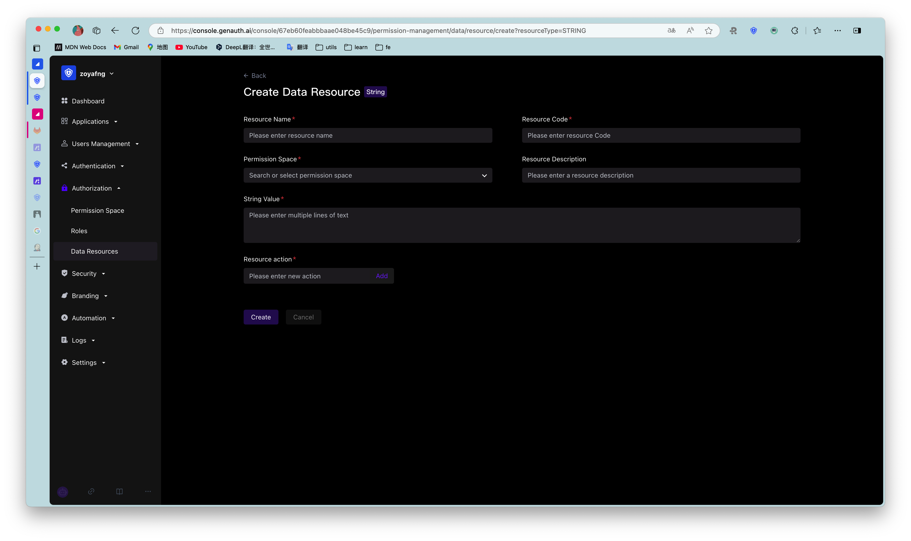
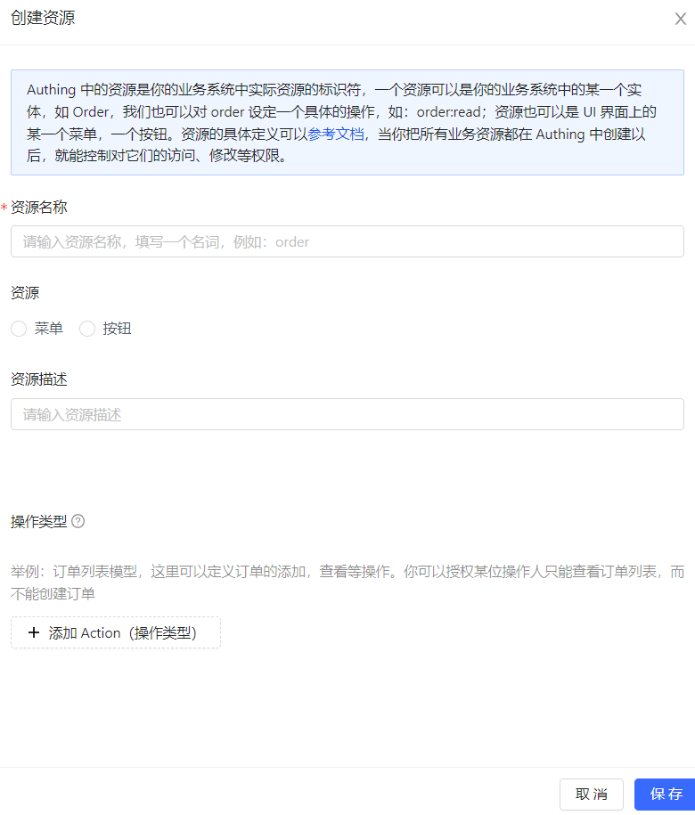
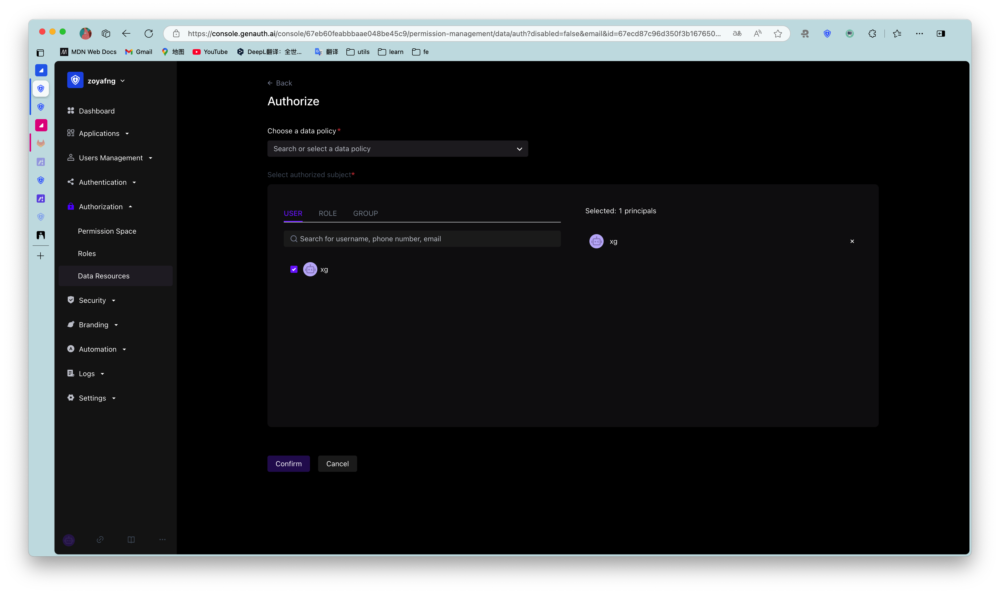
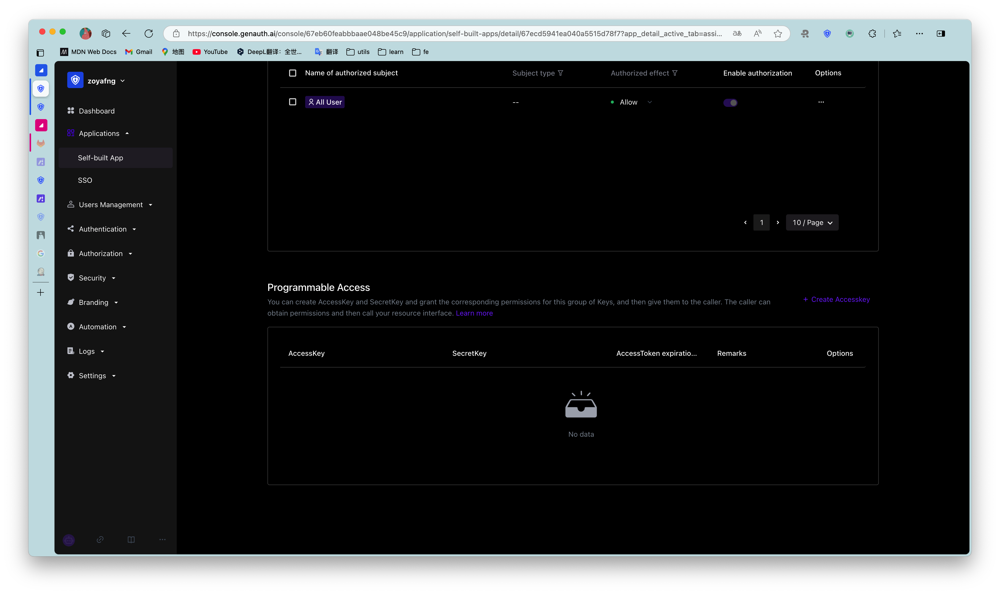

# Access authorization ​

​
<LastUpdated/>

Path: **Application->Self-built application->Application details->Access authorization**

Suppose you are a company doing social communication business, and there is another company that wants to develop a chat record sorting and exporting tool by calling your business API, and has signed a cooperation agreement with your company. Now you want to safely authorize user information to this company, and you expect:

- API calls are only open to partner companies.
- Different partners have different access rights and can access different business APIs.
- If the cooperation is terminated or changes in the future, you hope to be able to revoke the permissions of certain data or disable them completely.

As an administrator, you can manage and assign permissions to resources in the console. Before practicing permission management and authorization, you need to understand several concepts first.

- **Application**: Administrators can create applications. Applications are a definition of the application project you are developing in GenAuth.
- **User**: You can directly assign permissions to users, or you can divide your users into different groups, roles, and organizational departments, so that it is convenient to manage when assigning permissions in the future.
- **Role**: A role is a collection of users. Users in a role automatically inherit the permissions granted to the role.
- **Resource**: You can define some resources in GenAuth. For example, resources in an application may include APIs, data resources, menus, buttons, etc.

**Access authorization** defines the subject's access rights to the current application from the application dimension. Administrators can integrate the current application into single sign-on (SSO) on the **Access authorization** page, and can also define authorized subjects, roles, resources, authorization rules, and programmatic access.

## Single sign-on

Administrators can add the current self-built application to the application panel in this module.

To do this, administrators only need to turn on the **Add to single sign-on** switch under the **Single sign-on** module.

Adding an application to [Single Sign-on (SSO)](../../app-new/sso/README.md) means that your users can log in to all SSO-enabled applications at once after logging in to the application panel.

## Application Access Control

Administrators can specify the subjects who can access the current application in this module.

| Serial number | Field / Button | Description |
| :--: | :----------- | :--------------------------------------------------------------------------------------------------------------------------------------------------------------------------------------------------------------------------------------------------------------------------------------------------------------------------------------------------------------------------------------------------------------------------------------------------------------------------------------------------------------------------------------------------------------------------------------------------------------------------------------------------------------------------------------------------------------------------------------------------------------------------------------------------------------------------------------------------------------------------------------------------- |
|  1   | Default permissions | Options include: <ul><li>**Allow all users to access** (default)</li><li>**Deny all users to access**</li></ul>The default permissions have a lower priority than the authorizations in the list below. For example: **Default authorization** selects **Deny all users to access**, but if there are authorization items in the authorization list below, the authorizations in the list take precedence. |
|  2   | Application Authorization Type | You can filter and view the authorization objects below by authorization type. The options include: <ul><li>**User**</li><li>**Role**</li><li>**Group**</li><li>**Organization**</li><li>**Programming Access Account**</li></ul> |
|  3   | Add | Open the **Add Authorization** window to add an authorization object.   Authorization types include: <ul><li>**User**  The data source is synchronized with **User Management->User List**.   You can enter a user name, mobile phone number or email address in the **Authorization Object** field to search for users. </li><li>**Role**:</li> The options of the **Select Permission Group** field and its associated field **Authorization Object** are synchronized with the data source of **Permission Management->Permission Group** and **Role Management** under the corresponding group. The **Select Permission Group** field only supports **System Permission Group**, **Default Permission Group** and the group where the current application is located in **Permission Management**. It is recommended to select the group where the current application is located here.  <li>**Group**</li>The data source is synchronized with **User Management->User Group Management**. <li>**Organization** **Authorization Object** The data source is synchronized with **Organization->My Customer**.  **Subnode Inheritance** The field specifies whether the subnode users in the organization inherit permissions. </li></ul> |
|  4   | Whether to take effect | Determine whether to enable the current authorization. After adding a new authorization, it is enabled by default. |
|  5   | Edit | Edit the current authorization item. |
|  6   | Delete | Delete the current authorization item.                                                                                                                                                                                                                                                                                                                                                                                                                                                                                                                                                                                                                                                                  |

## Role Management

Administrators can specify roles that can access the current application in this module. After the specification, all specified subjects under the role have authorized permissions.

::: hint-info
The data source of the **Role Management** module is synchronized with the **Role Management** data source in the **Permission Management** application permission group.
:::

To create a role, perform the following steps:

1. Click the **Add** button in the upper right corner of the **Role Management** module.
2. Enter the **Role Code** and **Role Description** in the **Create Role** window in the side pull box.
3. Click the **OK** button.

The newly added role will be displayed at the top of the **Role Management** list, and the **Role Management** list under the **Permission Management** application permission group will be updated synchronously.

Administrators can click the **Role Code** column of the role row to open the role details page, edit the role information, and add authorized users, organizations, and rules. For more information, see [Role Management](../../access-control/rbac.md).

To delete a role, just click the **Delete** button in the **Operation** column of the row where the role is located.

::: hint-info
Role deletion is irreversible, so be careful.
:::

## Resources

The resource module classifies all resources in the application into **API resources**, **Data resources**, and **UI resources**. Administrators can view, add, edit, and delete resources in this module.

::: hint-info
There is no essential difference between API resources, data resources, and UI resources. The types are only used to distinguish them at the management level. Creating a good resource classification can help administrators quickly focus on different resources.
:::

To add resources, follow these steps:

1. Under **Access Authorization->API/Data/UI Resources**, click the **Add** button in the upper right corner.
2. Enter the resource information in the **Create Resource** window in the sidebar and define the operation type.

::: hint-info

- **Resource Name**: It is recommended to fill in a semantic resource name for easy subsequent management.
- **Operation Type**: Administrators can customize the operation permissions of resources such as adding, deleting, modifying, and checking. You can click the '+' button in front of the resource row in the resource list to view the detailed operation permissions of each resource.
  :::

3. Click **Save**.

A resource is created.

::: img-description API resources
:::

::: img-description Data resources ​
:::

::: img-description UI resources ​
:::

To edit or delete a resource, click the **Edit** / **Delete** button in the **Operation** column of the corresponding resource row in the resource list.

## Resource authorization

Now that we have **resources** and **people**, we need to define "**who**" can do what "**operation**" to what "**resource**".

To authorize a resource, follow these steps:

1. Under **Access Authorization->Resource Authorization**, click the **Add** button in the upper right corner.  Open the **Authorization** window.
2. Specify the authorization subject and authorization rules.

::: hint-info

- The authorization subject is the data source of the authorization object list in the **Application Access Control** module. Among them, **Programming Access Account** is the **AccessKey** value automatically generated when adding **AccessKey** and **SecretKey**.
- Authorization rules are: Under a certain "condition", allow or deny a certain "subject" to perform specific or all operations on a certain "resource".
  _ **Specific operations** include the operation types defined for resources in **API resources / data resources / UI resources**.  Specific operations can only be specified for a single resource, and **specific operations** cannot be specified for all resources.
  _ **Restrictions** are to add restrictions to the authorization rules. \* If you want to authorize multiple resources to the user, you can click the **+Add Authorization Rules** button at the bottom to continue adding rules.
  :::

Administrators can also click the **View Details** and **Cancel Authorization** buttons in the resource authorization list to view authorization details and cancel authorization.

## Programmatic Access Account

The programmatic access account is a pair of **AccessKey** and **SecretKey** under the application. Administrators can create **AccessKey** and **SecretKey**, and grant corresponding permissions to this set of keys for third-party vendors such as outsourcers to call. The caller uses the programmatic access account in combination with the OIDC authorization code to obtain the user's AccessToken and IdToken, or uses the programmatic access account to request authorization on behalf of the caller itself in the OIDC ClientCredentials mode, thereby calling your resource interface.

To create a programmatic access account, follow these steps:

1. Under **Access Authorization->Programmatic Access**, click the **Add** button in the upper right corner.  Open the **Add Programmatic Access Account** drop-down box.
2. Specify the **AccessToken expiration time (seconds)**.
3. Click the **OK** button.

A new record will be added to the top of the programmatic access account list.

Administrators can **disable**, **refresh key**, and **delete** the account in the programmatic access account list.

::: hint-info
Clicking **Refresh key** will only update the **SecretKey**.
:::
