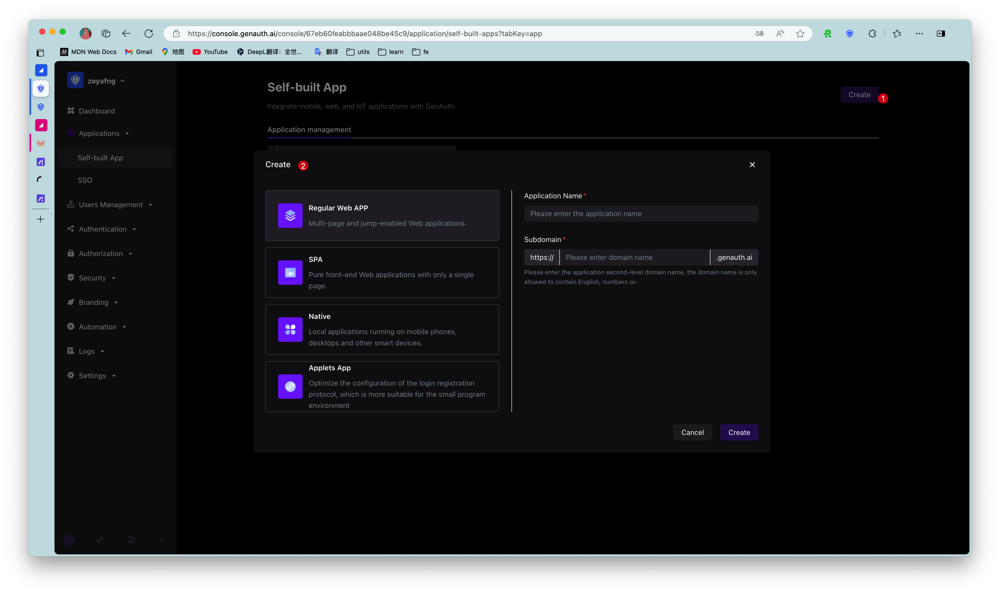

# Create a self-built application
​
<LastUpdated/>

Path: **Application->Self-built Application**

You can view all self-built applications on the **Self-built Application** page.

To create a new self-built application, perform the following steps:​
​
1. Click the **Create Self-built Application** button in the upper right corner of the page. ​
​
2. Fill in the following information in the pop-up window:​

    * **Application Name**: Specify the application name. ​

    * **Authentication Address**: Enter the secondary domain name, which must be in a legal domain name format (only English, numbers and ‘-’ are allowed, such as `my-awesome-app`​).

    * **Select Type**: Select the application type in {{$localeConfig.brandName}} according to the actual type of your business application.
​
3. Click the **Create** button.
