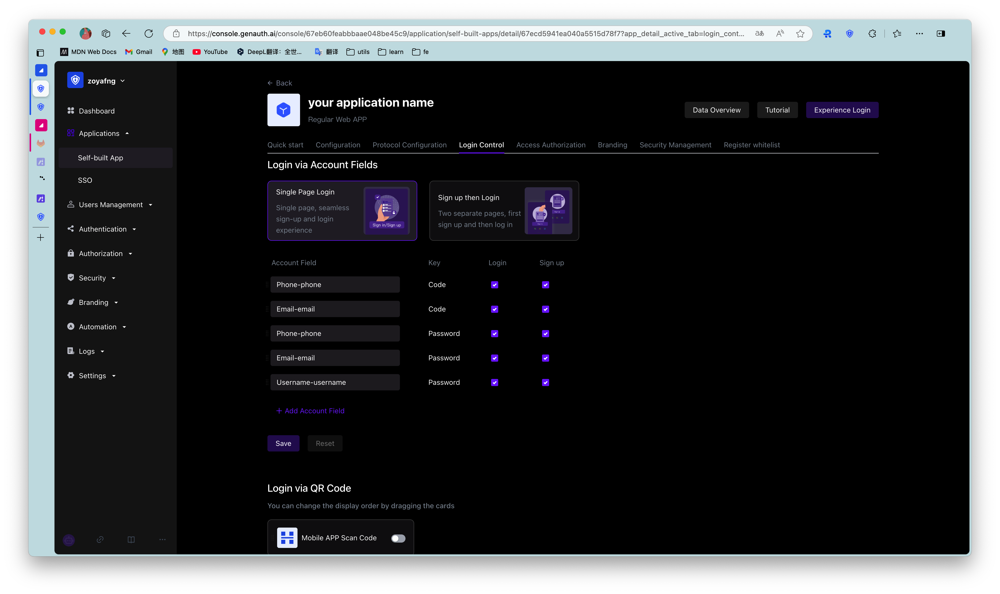
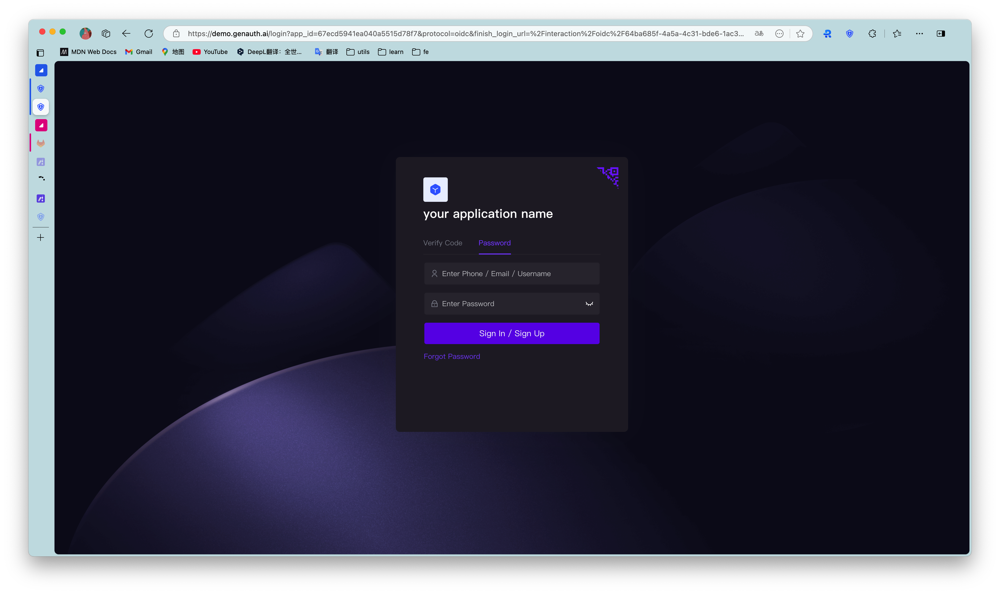
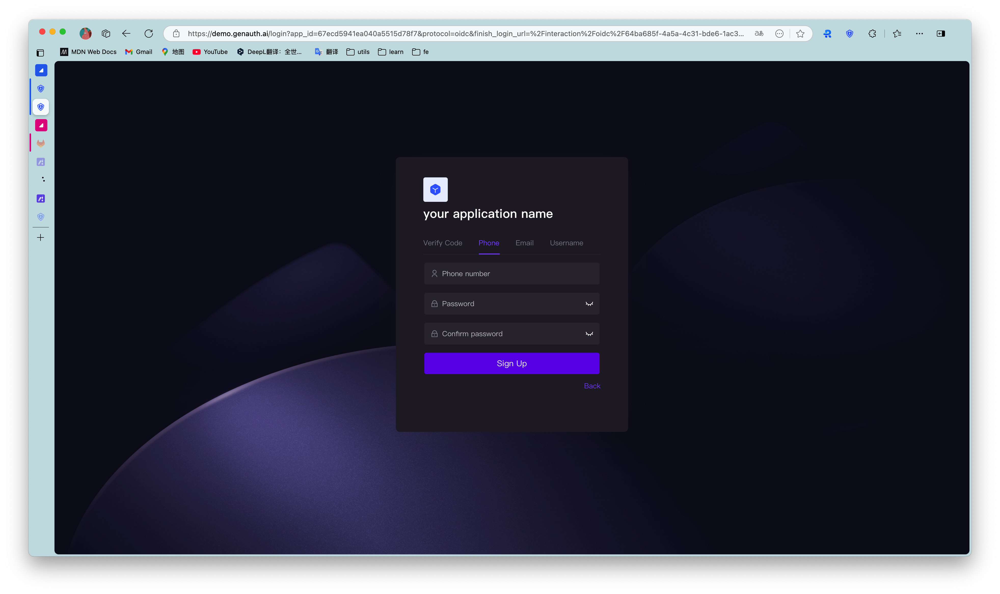
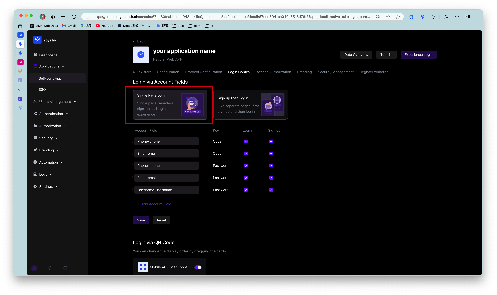
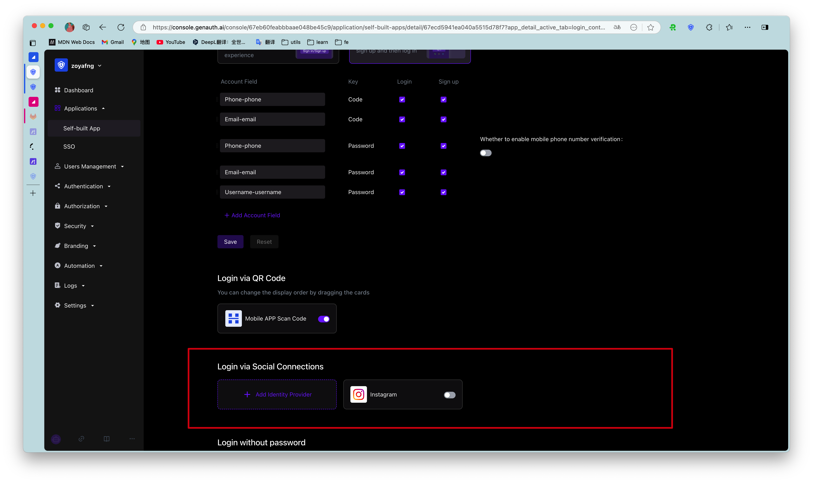
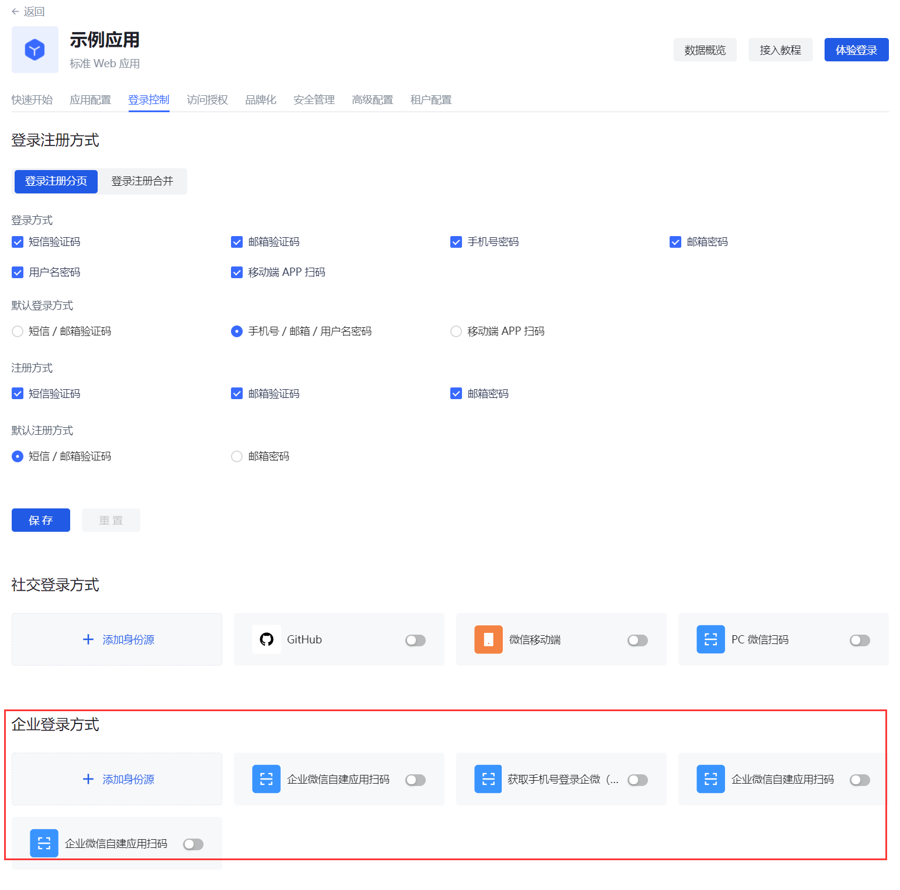

# Login control

​
<LastUpdated/>

Path: **Application->Self-built application->Application details->Login control**

Login experience is one of the most important user experiences that software developers need to consider. It is not easy to provide users with a seamless, convenient and secure authentication experience. Generally speaking, login logic is also associated with registration, password reset, account association, etc. More importantly, enhancing security in the form of strong and adaptive authentication during the login process is often critical for many implementations.

Each user pool in {{$localeConfig.brandName}} has an independent second-level domain name and is equipped with an online login page. You can open the login page of this application by visiting the address of the application. {{$localeConfig.brandName}} provides a lot of authentication methods for developers to choose and combine. You don't need to write a line of code. You can maintain the login page through the **Login control** of the self-built application on the hosted page and make some customized configurations.

The **Login Control** tab supports the following login/registration methods:​
​

- [Account and Password Login](#Configure Login Method)
- [SMS/Email + Verification Code Login](#Configure Login Method)
- [Mobile App Scan Code Login](#Configure Login Method)
- [Social Identity Source Login](#Social Login Method​)
- [Enterprise Identity Source Login](#Enterprise Login Method​)

Multiple login/registration methods support multiple cross-implementation scenarios such as web, mobile, and mini-programs. For more details, see the relevant section under [Authenticating Users](/guides/authentication/).

Account and Password Login, Verification Code Login, and Mobile App Scan Code Login can implement login and registration paging and login and registration merging in the **Login Control** tab. The following will introduce each type of login/registration method.

## Login and Registration Paging ​

​
The following describes the various scenarios for the login and registration paging display.​
​

### Login page ​

​
You can configure the login method by password, verification code and code scanning. ​
​
{{$localeConfig.brandName}} provides the following login combinations: ​
​

- Mobile phone number + password ​
- Email + password ​
- User name + password ​
- Mobile phone number + verification code ​
- Email + verification code ​
- Mobile APP code scanning

#### Configure login method

​
To configure the login method on the hosting page, perform the following steps: ​
​

1. Check the required login method under **Login control->Login registration method->Login registration page->Login method**. ​

2. Select **Default login method**. ​

::: hint-info
The default login method refers to the default login method (password, verification code, code scanning) selected when jumping to the login page.
:::
​ 3. Click the **Save** button to save the configuration.

#### Login using password, verification code, or scan code

Administrators can experience various configured login methods through the **Experience Login** button.

To log in to the application using an account and password, perform the following steps:

1. Enter your mobile number/email address/user name in the upper input box. ​
2. Enter your login password in the lower input box. ​
3. Click the **Login** button. ​
   ​

For verification code login, perform the following steps:

1. Enter your mobile number/email address in the upper input box. ​
2. Click **Send Verification Code**.
3. Enter the verification code received by your mobile phone/email address in the lower input box. ​
4. Click the **Login** button. ​

::: hint-info
The scan code login function requires that the customer has both a web application and a mobile APP, and has logged in to the mobile app. At this time, you can use the mobile APP to scan the code to log in. ​
:::

For the mobile APP scan code login, follow the steps below:

1. Open this application on the mobile terminal.
2. Use the mobile APP to scan the web login box.

#### Forgot password ​

If you forget your password, follow the steps below to retrieve your password:​
​

1. Click **Forgot password** in the lower left corner of the login box. ​
2. Enter your mobile phone number/email address. ​
3. Click **Send verification code**. ​
4. Enter the verification code. ​
5. Enter your new password. ​
6. Click the **Confirm** button. ​
   ​
   The reset is successful, return to the login page and log in again.

### Registration page ​

​
You can register the application by password or verification code.​
​
{{$localeConfig.brandName}} provides the following registration combinations: ​
​

- Email + Password ​
- Phone Number + Verification Code ​
- Email + Verification Code

#### Configure Registration Method ​

To configure the registration method on the hosting page, follow these steps: ​
​

1. Check the required login method under **Login Control->Login Registration Method->Login Registration Paging->Registration Method**. ​

2. Select **Default Registration Method**. ​

::: hint-info
The default registration method refers to the registration page that is opened by default when you jump to the registration page (password registration, verification code registration). ​
:::

3. Click the **Save** button to save the configuration.

#### Register with password or verification code ​

To register the app with a password, follow these steps:​
​

1. Enter your email address in the upper input box. ​
2. Enter your password in the lower input box and confirm it again. ​
3. Click the **Register** button.
   ​

For verification code registration, follow these steps:​
​

1. Enter your phone number/email address in the upper input box. ​
2. Click **Send verification code**. ​
3. Enter the verification code received by your phone/email address in the lower input box. ​
4. Click the **Register** button.

## Login and Registration Merge ​

​
Login and registration combined display supports the following scenarios: ​
​

::: hint-info
For the two display modes of login and registration paging and login and registration combined, the configuration and usage of login and registration are similar. Please refer to the login and registration paging section for details. ​
:::

## Social Login Method ​

Social login refers to the process of users using the identity authentication information of the social platform to authenticate and log in to third-party applications or websites. For example, people often use personal WeChat, QQ, Weibo and other social accounts to log in to Didi, NetEase Cloud Music, etc. ​

Social login not only helps to simplify the user's login experience on third-party platforms, but also provides a simpler and more convenient way for users to create new accounts on third-party platforms. Whether for ordinary users or enterprises, social login has incomparable advantages.​

GenAuth currently supports nearly 30 [social logins](../../connections/social.md) at home and abroad, such as [WeChat](../../connections/social/wechat-pc/README.md), [GitHub](../../connections/social/github/README.md), [Apple](../../connections/social/apple-web/README.md), [Alipay](../../connections/social/alipay-web/index.md), etc.

::: hint-info
You need to create the social identity source to be used before you can select the created identity source in the **Self-built application->Login control** tab.
:::
​

To add a social identity source for a single app, follow these steps:
​

1. Select **Login Control->Social Login** on the app details page. ​
2. Click **+Add Identity Source** to open the **Select Social Identity Source** page. ​
3. Select the target social identity source to add.

In addition to integrating existing third-party social identity sources, administrators can also connect custom social logins.

For a detailed introduction to social login methods, see [Social Identity Sources](/guides/connections/social.md).

## Enterprise Login Methods ​

​
Enterprise identity source login refers to the process of users using the company's identity authentication information to authenticate and log in to internal company applications or third-party applications. In the {{$localeConfig.brandName}} console, enterprise identity sources include two categories: office applications (such as Lark, WeChat for Enterprise, DingTalk) and standard protocol applications (such as OIDC, SAML, CAS and other standard protocols). You can configure the enterprise identity source connection to use a third-party identity source to log in to the {{$localeConfig.brandName}} application and [import organizations and users from third-party identity sources](/guides/org/create-or-import-org/#Import organizations) to reduce migration costs. GenAuth will automatically synchronize user information to the user directory of {{$localeConfig.brandName}} every time a user logs in using an enterprise identity source.

::: hint-info
You need to create the enterprise identity source to be used before you can select the created identity source in the **Self-built application->Login control** tab.
:::
​

To add an enterprise identity source for a single application, perform the following steps:

1. Select **Login Control->Enterprise Login Method** on the application details page.

2. Click **+Add Identity Source** to open the **Select Enterprise Identity Source** page.

3. Select the target enterprise identity source to add.

For more information about enterprise login methods, see [Enterprise Identity Source](/guides/connections/enterprise.md).

## Logged-in Users

Administrators can view the list of logged-in users of the current application, view and manage user information, and force offline in the **Login Control** tab:

- To view the details of a logged-in user, click the target user in the **Logged-in Users** list to open the user details page.

- For more information about managing user information, see [Managing User Accounts](/guides/user/manage-profile.md).​
- To log out a logged-in user, in the row of the target user, in the **Action** column, click the More button (...), select **Force logout**, and click **Confirm** to confirm the logout.