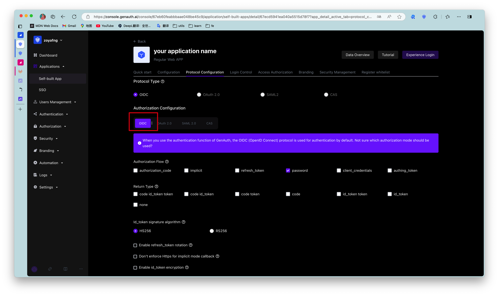
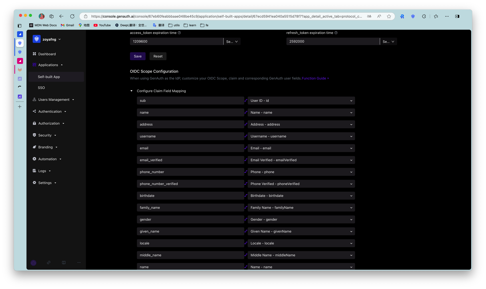
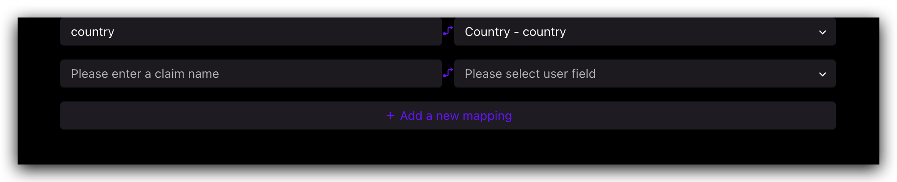
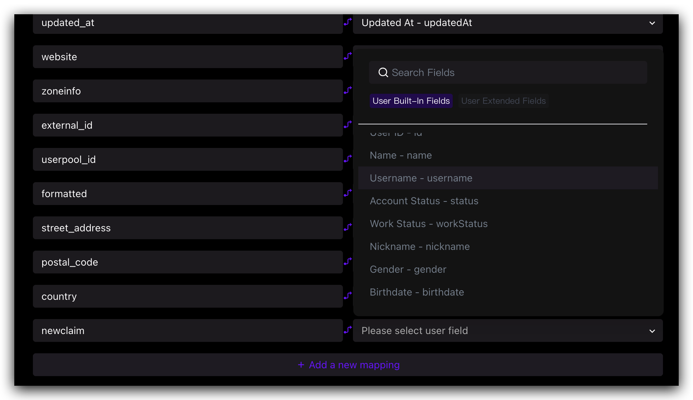
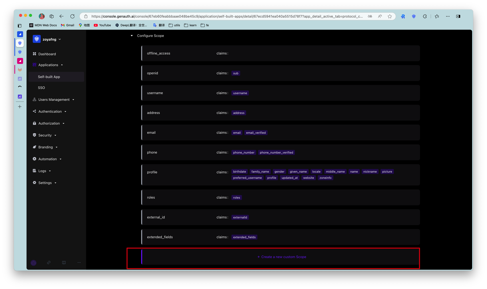
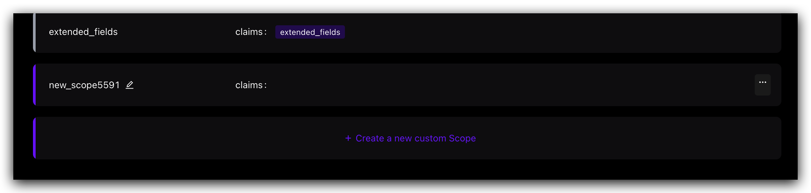
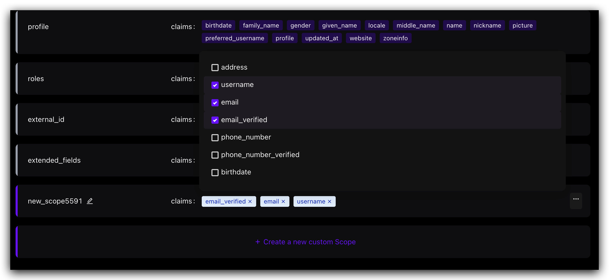

# Customize OIDC Scope

## Usage scenarios

Customize the user information returned by the ID Token by customizing the Scope and the Claims in it.

## OIDC Scope Function Configuration

After creating a self-built application, you can find the "OIDC" function area under the "Protocol Configuration" function area and find the "OIDC Scope Configuration".

### Claim Configuration

#### Default Claim

| Claim Name | Mapped GenAuth User Fields |
| --------------------- | ----------------------- |
| sub                   | userId                  |
| name                  | name                    |
| address               | address                 |
| username              | username                |
| email                 | email                   |
| email_verified        | emailVerified           |
| phone_number          | phone                   |
| phone_number_verified | phoneVerified           |
| birthdate             | birthdate               |
| family_name           | familyName              |
| gender                | gender                  |
| given_name            | givenName               |
| locale                | locale                  |
| middle_name           | middleName              |
| name                  | name                    |
| nickname              | nickname                |
| picture               | picture                 |
| preferred_username    | preferredUsername       |
| profile               | profile                 |
| updated_at            | updatedAt               |
| website               | website                 |
| zoneinfo              | zoneinfo                |
| external_id           | externalId              |
| userpool_id           | userpoolId              |
| formatted             | formatted               |
| street_address        | streetAddress           |
| postal_code           | postalCode              |
| country               | country                 |

#### Custom Claim

If the above default Claim still does not meet the user fields you expect to be returned, you can create a custom Claim and customize which GenAuth user field (basic field or extended field) your Claim maps to.

**Step 1: Click "Add a Mapping"**

**Step 2: Edit the name of your custom Claim**

**Step 3: Configure the Authing user field mapped by the custom Claim**

### Scope Configuration

#### Default Scope

| Scope name | Contained claims | Description |
| --------------- | --------------------------------------------------------------------------------------------------------------------------------------------------- | ------------------------------------------------------------------------ |
| offline_access | / | If this parameter exists, the token interface will return the refresh_token field |
| openid | sub | Used to store user ID |
| username | username | User name |
| address | address | User address |
| email | email, email_verified | User email and verification status |
| phone | phone_number, phone_number_verified | User phone number and verification status |
| profile | birthday, family_name, gender, given_name, locale, middle_name, name, nickname, picture, preferred_username, profile, updated_at, website, zoneinfo | User details |
| roles | roles | User role list corresponding to role information |
| external_id | externalId | User ID in the original system |
| extended_fields | extended_fields | User's extended field information, the content is an object, the key is the extended field name, the value is the extended field value |

#### Custom Scope

If the default scope above still does not meet the user fields you expect to be returned, you can create a custom scope and customize which claims will be included in your scope.

**Step 1: Click "New Custom Scope"**

**Step 2: Modify the name of your custom scope**

**Step 3: Configure the claims included in the custom scope**

### Use custom scope & claim

- Use the hosted login page: GenAuth will return all preset scopes and your custom scope by default.
- Use SDK to call directly: You can freely choose to call all the scopes you have configured and the claims they contain.
