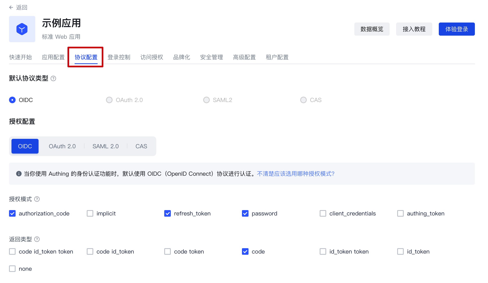
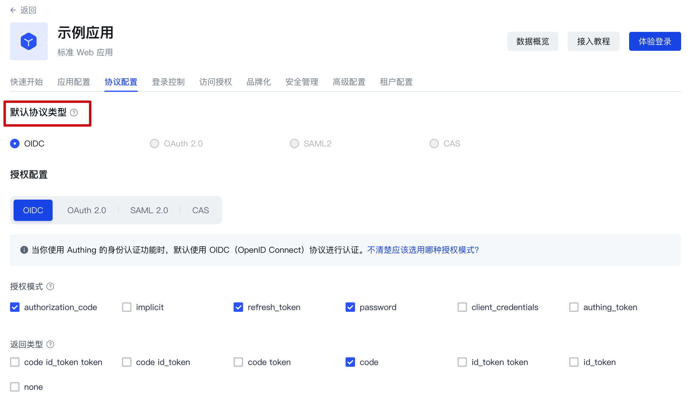

# Protocol configuration

Path: **Application->Self-built application->Application details->Protocol configuration**

## What is a protocol?

First of all, it should be made clear that the protocol works in the authentication scenario.

So, why do users need authentication?

The most direct reason is that the administrator needs to set boundaries for the content that users can access. After a specific user completes identity authentication, he logs in to a specific application. In this process, the system administrator implements the user's ["authorization"](/concepts/authorization.md) through function configuration.

Under the identity authentication model provided by GenAuth, this authorization of users occurs during the user's identity authentication process. The protocol is used to clarify the details of information transmission and verification between the client and the server in this authorization process.

In other words, the "protocol" we are discussing here is the standard process and rules that the administrator follows when "authorizing" users during the identity authentication process. **

If you are still unclear about the concept of "authorization", please read: [What is authorization? ](/concepts/authorization.md)

## Protocol types supported by GenAuth

### OIDC

**1. Definition**

OpenID Connect is an authentication protocol based on OAuth 2.0. The authorization process of OIDC is the same as that of OAuth 2.0. The main difference is that the Id Token is returned in the OIDC authorization process.

**2. Key subjects**

In addition to the subjects already specified in OAuth2.0, in the OIDC protocol, **"Authorization Server"** not only issues Access Token, but also issues ID Token.

**3. Basic elements**

In addition to the key elements already specified in OAuth2.0, **Id Token** is added: issued by OpenID Provider, containing information fields about the end user.

For a more detailed description, please read: [Interpretation of OAuth2.0 and OIDC. ](/concepts/oidc/oidc-overview.md)If you want to learn more about OIDC, you can read the [protocol specification](https://openid.net/specs/openid-connect-core-1_0.html).

### OAuth2.0

**1. Definition**

OAuth2.0 is a standard protocol for authorization. An OAuth 2.0 authorization means that the user **authorizes the caller** to grant permissions.

**2. Key Subjects**

- **Authorization Server**: Responsible for issuing Access Tokens, GenAuth is the authorization server.
- **Resource Owner**: The user of your application is the owner of the resource and authorizes others to access his resources.
- **Caller**: The caller requests an Access Token, and after the user authorizes it, GenAuth issues an Access Token to it. The caller can carry the Access Token to the resource server to access the user's resources.
- **Resource Server**: Accepts the Access Token, verifies its granted permissions, and finally returns the resource.

**3. Basic elements**

- **Code authorization code**: issued by the authorization server GenAuth, used by the caller to exchange the code for a token.
- **Access Token**: issued by the authorization server GenAuth, holding an Access Token indicates that user authorization has been completed.
- **Refresh Token**: an optional token used to obtain a new Access Token after the Access Token expires.

**4. Common authorization modes**

- In your application, let the user access the login link, the browser jumps to GenAuth, and the user completes the **authentication** in GenAuth.
- The browser receives an **authorization code** sent from the GenAuth server.
- The browser sends the **authorization code** to your application **backend** through redirection.
- Your application service sends the **authorization code** to GenAuth to obtain the **AccessToken**, and returns a refresh token if necessary.
- Your application backend now knows the user's identity, and can subsequently save user information, redirect to other front-end pages, use AccessToken to call other APIs of the resource party, and so on.

For a more detailed description, please read: [Interpretation of OAuth2.0 and OIDC. ](/concepts/oidc/oidc-overview.md) If you want to know more about OAuth 2.0, you can read [Protocol Specification](https://tools.ietf.org/html/rfc6749).

### SAML2.0

**1. Definition**

The application (SP) needs to know the identity of the user, so it needs to ask the identity provider (IdP). The IdP knows the identity of the user. When the user successfully logs in to the IdP, the IdP sends the user's identity to the SP in the form of a SAML assertion. The SP trusts the identity assertion sent by the IdP, thereby granting the user relevant permissions in the SP.

**2. Key Subject**

- **Service Provider**: The application itself
- **Identity Provider**: The object that provides identity to SP; GenAuth can be used as an identity provider, and there are other identity providers, such as Okta, SSOCircle, and Auth0, which can return identity assertions to SP.

**3. Basic Elements**

Assertion: Identity assertion in XML format. **Identity Provider** can send **identity assertion** to SP. The so-called identity assertion is a token issued by GenAuth that can **identify a person's identity**, but in the SAML protocol, the format of this token is XML.

For a more detailed description, please read: [SAML Protocol Interpretation. ](/concepts/saml/saml-overview.md) If you want to know more about OIDC, you can read the [Protocol Specification](https://www.rfc-editor.org/rfc/rfc7522).

### CAS

**1. Definition**

CAS is a single sign-on protocol that allows websites to authenticate users. It can provide a single sign-on solution for multiple applications. Unlike OAuth and OIDC, CAS is a tool for authenticating users; authorization is based on the actual application.

**2. Key Subjects**

1. Application (SP): It can be a web application with a front-end page or a database server with only back-end services
2. Browser: The application communicates with the CAS server through the browser
3. CAS Server

**3. Basic Elements**

The application service (SP) and the CAS server communicate the verification results through Ticket.

**4. Common authentication and authorization processes**

- The user tries to access an application that has not been authenticated
- The user is redirected to the CAS server (GenAuth can be used as a CAS server)
- The user completes the identity authentication on the authentication page provided by the CAS server, and the CAS server verifies whether the user is credible
- After successful authentication, a Ticket is generated as a credential for successful authentication, which is attached to the URL for return
- The application (SP) sends a request to the CAS server to verify whether the Ticket is valid, and calls back to the application (SP) after verification

If you want to know more about CAS, you can read the [Protocol Specification](https://www.rfc-editor.org/rfc/rfc7522).

## Under what circumstances do you need to configure the protocol?

All self-built applications of GenAuth are based on the OIDC protocol for authentication and authorization by default. If your application needs to implement the authentication and authorization process based on other protocol types, you can enable the corresponding type of protocol in the "Protocol Configuration" function area and complete the configuration.

## Protocol configuration steps

### Step 1: Create a self-built application and find the configuration area

After creating a self-built application, find the "Protocol Configuration" function area:

### Step 2: Complete the protocol configuration

#### Configure the OIDC protocol

**1. Select the appropriate authorization mode**

When you create a self-built application, GenAuth uses the OIDC authorization code mode by default. If you need to change the authorization mode, please refer to the document in advance to determine the degree of fit between the authorization model and your actual situation: [Choose the appropriate OIDC authorization mode](/concepts/oidc/choose-flow.md)

**2. Complete the configuration under the authorization mode**

After determining the authorization mode to be selected, you can complete the function configuration under the corresponding authorization mode according to the guidance here: [OIDC authorization mode configuration](/guides/federation/oidc.md)

**3. Configure Claim and Scope**

This is an advanced feature supported by GenAuth for the OIDC protocol. You can:

- View the default claims of GenAuth and their mapping relationship with the GenAuth user fields
- Create custom claims and customize the mapping relationship of these claims
- View the default scope of GenAuth and the claims it contains
- Create custom scopes and customize the claims carried in each of these scopes

For more information about the default scope and claim of GenAuth and how to use this feature, please see: [Custom OIDC Scope](oidc-scope.md)

#### Configure OAuth2.0 protocol

**1. Select the appropriate authorization mode**

In terms of authorization model, OIDC is a superset of OAuth2.0. Therefore, you can refer to the authorization mode of OIDC to select the type that matches your scenario: [Select the appropriate OAuth authorization mode](/concepts/oidc/oidc-overview.md)

**2. Complete the configuration under the authorization mode**

After determining the authorization mode to be selected, you can complete the function configuration under the corresponding authorization mode according to the guidance here: [OAuth authorization mode configuration](/guides/federation/oauth.md)

#### Configure SAML protocol

In the "SAML2 Identity Provider" card, turn on the Enable SAML2 Provider switch, fill in the **Default ACS address**
and **Settings** information. Then click Save. The specific ACS address will be provided by the SAML SP, and the specific settings need to be configured according to the requirements of the SAML SP. For more detailed configuration process, please refer to: [Configure SAML Protocol](/guides/federation/saml.md)

#### Configure CAS Protocol

In the "CAS" card, turn on the Enable CAS IdP switch and enter your user unique identifier, such as: `${user.username}`

Click Save to complete the configuration. For more detailed configuration process, please refer to: [Configure CAS Protocol](/guides/federation/cas.md)

### Step 3: Select the default protocol type

After completing the configuration, if you use the hosted login page directly, you can directly switch to your newly configured protocol type in "Default Protocol Type":

