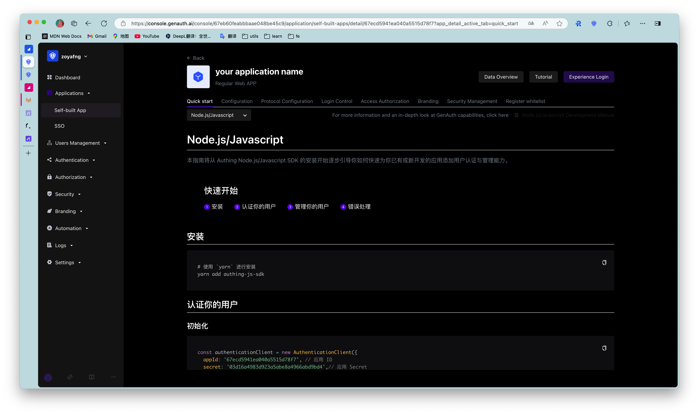

# Quick Start
​
<LastUpdated/>

Path: **Application->Self-built Application->Application Details->Quick Start**

The **Quick Start** tab of each application will briefly introduce how to install and use each language SDK to quickly authenticate and manage users for existing or newly developed applications, and provide methods for handling common errors.

::: hint-info
This section only provides a quick guide. For details on the use of each language SDK, you can click the link in the upper right corner of the page to access the corresponding chapter of the development manual.
:::

​