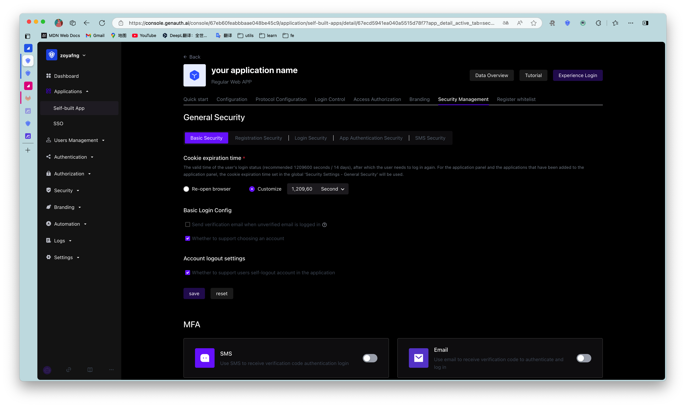
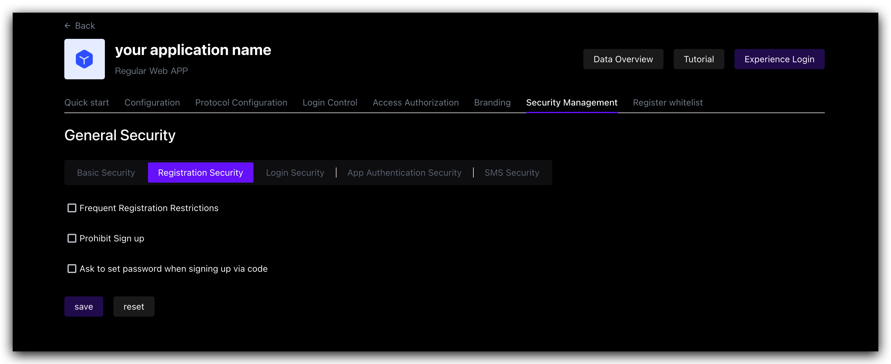
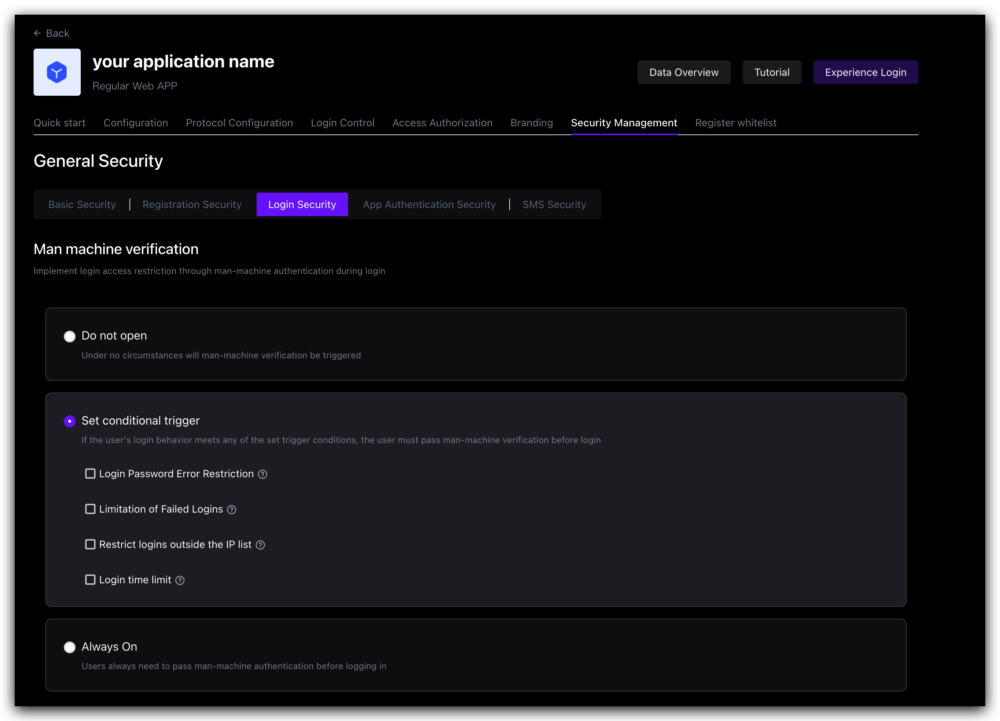
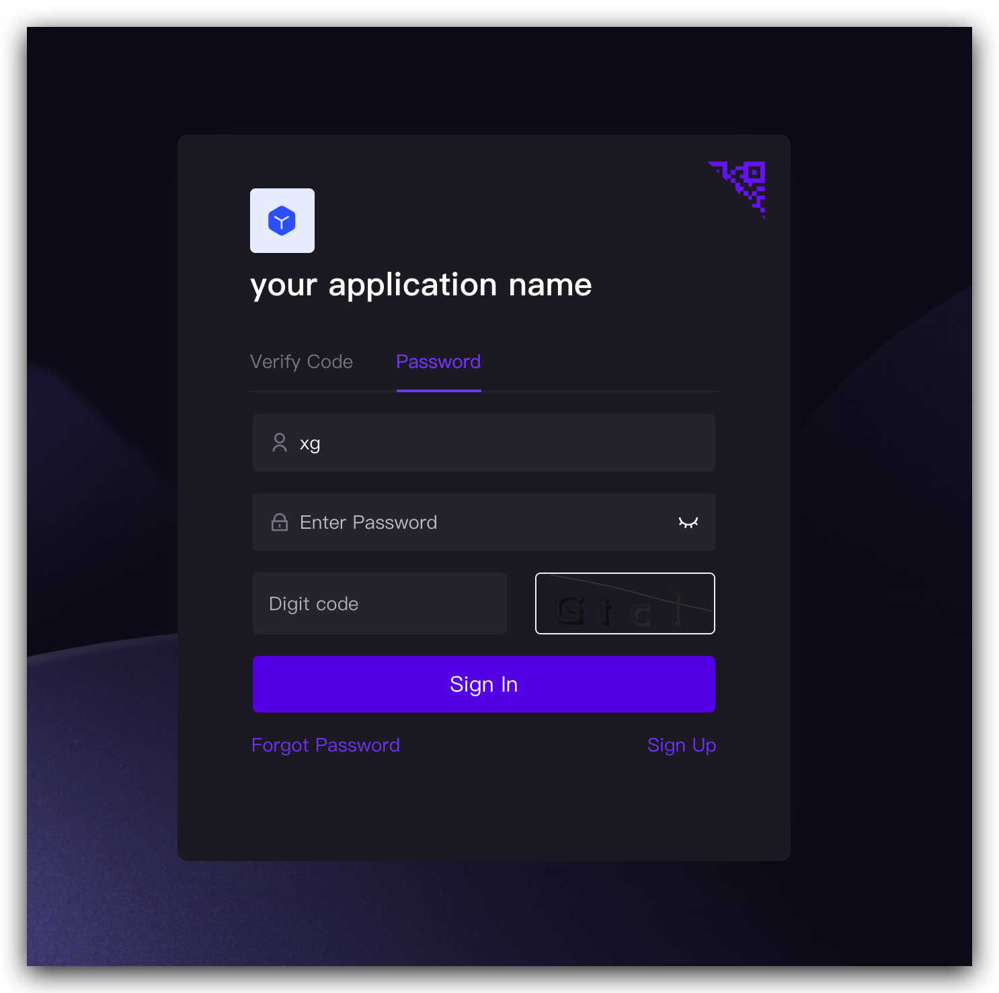
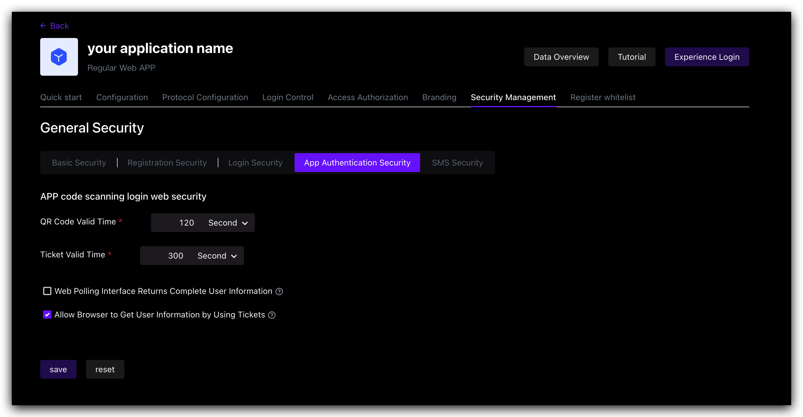
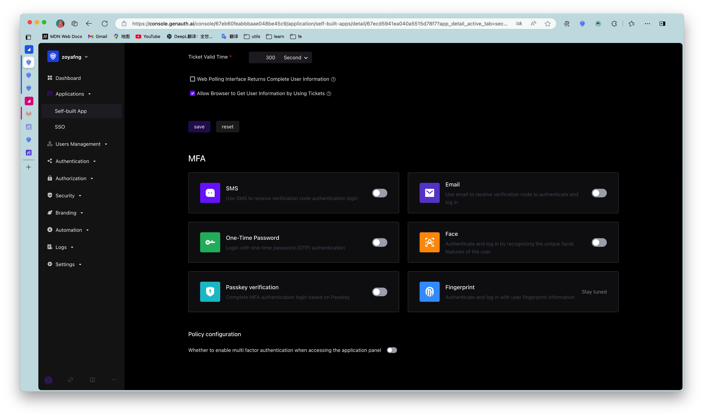

# Security Management​
​
<LastUpdated/>

Path: **Application->Self-built Application->Application Details->Security Management**

This chapter introduces security-related configuration items such as cookie expiration time, registration security, login security, APP scan code login Web security, multi-factor authentication, etc.

::: hint-info
* The **Security Management** tab in the application is closed by default. At this time, the security management-related configuration of the application will be controlled by the global security management configuration. To configure the security of a single application separately, you can turn on the **Customize the security rules of this application** switch in **Advanced Configuration->Custom Configuration**.

* When the **Customize the security rules of this application** switch is turned on, the security rules of the current application will inherit the configuration in the current global security management (**Security Settings**). After turning it on, the administrator's security rule configuration for this self-built application will be independent of the configuration in the global security rules (including general security, [password security](../../security/pw-security/) and [multi-factor authentication](../../security/mfa/README.md)).
  :::

After turning on the **Customize security rules for this application** switch, you can configure the following related functions for this application:

## Basic security

Users can specify the validity period of the login status (i.e. **cookie expiration time**) in this module:

|Options|Description|
|----|----|
|Browser session|Expires immediately after the current browser is closed, and you need to log in again the next time you open it. |
|Custom expiration time|You can specify the expiration time in the input box on the right. 1209600 seconds (14 days) is recommended. Users need to log in again after the expiration.  **Note**: For the application panel and applications that have been added to the application panel, the cookie expiration time set in the global **Security Management** will be used. |

## Registration security

|Switch|Description|
|----|----|
|Frequent registration limit|Administrators can limit the number of registrations per IP address within a certain number of seconds by specifying **Limited period time** and **Limited frequency within period**. |
|Prohibit registration|After turning on this switch, ordinary users will not be able to register through the login box or API. Only administrators can manually create accounts. |

## Login anti-brute-forcing

{{$localeConfig.brandName}} provides login security policies for **Account lock** and **Graphic verification code** scenarios.

### Account lock

|Switch|Description|
|----|----|
|Login password error limit|When a user enters an incorrect password when logging in, the corresponding policy will be triggered according to the login security policy rules. When the **Login Password Error Limit** switch is turned on, you can limit the number of incorrect password inputs for the same account within a certain number of seconds by specifying **Limited Cycle Time** and **Limited Frequency Within Cycle**. If the number of incorrect password inputs exceeds the specified time, the user needs to enter a graphic verification code when logging in again. |
|Send verification email when logging in with an unverified email address|After turning it on, if a user logs in with an unverified email address, {{$localeConfig.brandName}} will send a verification email to the email address, and the user needs to go to the email address and click the verification link before completing the login. |

### Graphic Verification Code

In addition to the two policies for the **Account Lock** scenario mentioned above, **Graphic Verification Code** can also define **Limited Number of Login Failures**: When the user enters incorrect login information, the corresponding policy will be triggered according to the login security policy rules. When the **Login Failure Limit** switch is turned on, you can limit the number of failed logins for the same account within a certain number of seconds by specifying **Limited Cycle Time** and **Limited Frequency Within Cycle**. If the number of incorrect logins exceeds the specified time, the user needs to enter a graphic verification code when logging in again.

## APP Scan Code Login Web Security

{{$localeConfig.brandName}} has always been committed to providing developers with a highly customized development experience, so we provide the following custom configuration items. Developers can balance security and convenience according to their business needs.

|Field / Switch|Description|
|----|----|
|QR code validity period|Default 120s. |
|Ticket validity period|Default 300s. |
|Web polling interface returns complete user information|Default not returned. Since the QR code status query interface does not have permission verification, it means that returning user information (including login credentials token) directly in this interface is a security risk, so we recommend that developers follow the best practice: the QR code status query interface only returns the user nickname and avatar, and uses the ticket to exchange for user information. |
|Allow using the ticket to exchange for user information in the browser|Allowed by default, it needs to be called on the server side, that is, it needs to be initialized with the user pool key. [Click to learn how to initialize the backend SDK](/reference/sdk-for-node/README.md). A typical usage scenario is: after the user scans the code to agree to the authorization, the developer gets the ticket and sends it to his own backend, uses the backend SDK to exchange for user information, and then redirects to the logged-in page, and writes the user information to localStorage. |

## Multi-factor authentication

Multi-factor authentication (MFA) is a very simple security practice that can add an extra layer of protection beyond the username and password. After enabling MFA, when users log in, in addition to providing their username and password (first authentication), they will also need to perform a second authentication. Multi-factor authentication combined will provide higher security protection for your accounts and resources. You can learn about [What is multi-factor authentication](/concepts/mfa.md) here.

You can enable MFA for your application as shown below:

For more details, see [Overview of Multi-Factor Authentication](/guides/security/mfa/).