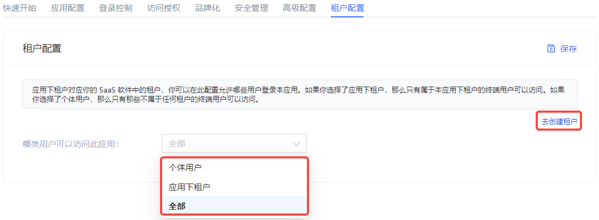

# Tenant Configuration

<LastUpdated/>

Path: **Application->Self-built Application->Application Details->Tenant Configuration**

Tenants under the application correspond to tenants in your SaaS software. Administrators can configure which users are allowed to log in to the current application here: If **Tenant under the application** is selected, only end users under the tenant can access it. If **Individual User** is selected, only end users who do not belong to any tenant can access it.

{{$localeConfig.brandName}} supports administrators to create tenants and provides tenant-level authentication and authorization, end-user management, login page branding and other functions for the application.

::: hint-info
Currently, only self-built applications support multi-tenant functions.
:::

To create a tenant, the administrator can click the **Go to Create Tenant** button on the right side of the **Tenant Configuration** tab. For details on creating tenants, see the **Multi-tenant** section.