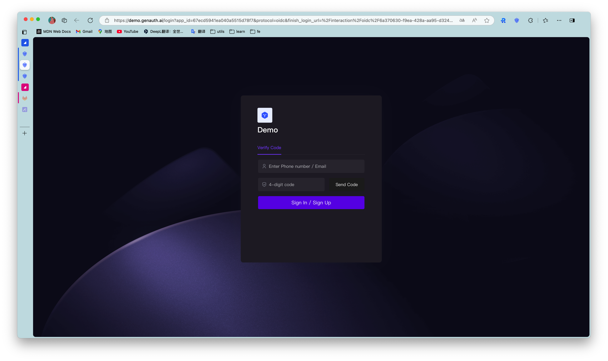

# Self-built application SSO solution

<LastUpdated/>

{{$localeConfig.brandName}} provides self-built applications. The user pool stores all user data in the user system, while the self-built application corresponds to the business application created according to business needs in reality. A user pool may have multiple self-built applications. After enabling single sign-on between applications, the login status between different applications under the same user pool will be connected, and the end user only needs to log in once to travel between different applications.

## Configure single sign-on in the {{$localeConfig.brandName}} console

### Step 1: Create two applications

First, you can create two applications according to the [Guide](/guides/app-new/create-app/create-app.md).

### Step 2: Configure single sign-on

1. Go to the menu **Application->Single Sign-on SSO**, and click **Add self-built application** in the upper right corner.

<!-- Go to the configuration page of the two applications respectively, select the **Login Control** tab, and turn on the multi-domain single sign-on switch. -->

2. Find and add the created application in the list.

### Step 3: Experience application single sign-on

1. Go to the **Application List** tab of **Single Sign-On SSO**, select an application, and click **Experience Login**.

2. Complete the login on the login page.

After success, it will jump to the application callback address:

3. Next, we click the experience button of another application.

The user does not need to enter the password again and directly enters the callback address of the application:

## Use SDK to access single sign-on

For detailed access process, please refer to the [Single Sign-on SDK](https://docs.genauth.ai/v3/reference/sdk/web/) document.
