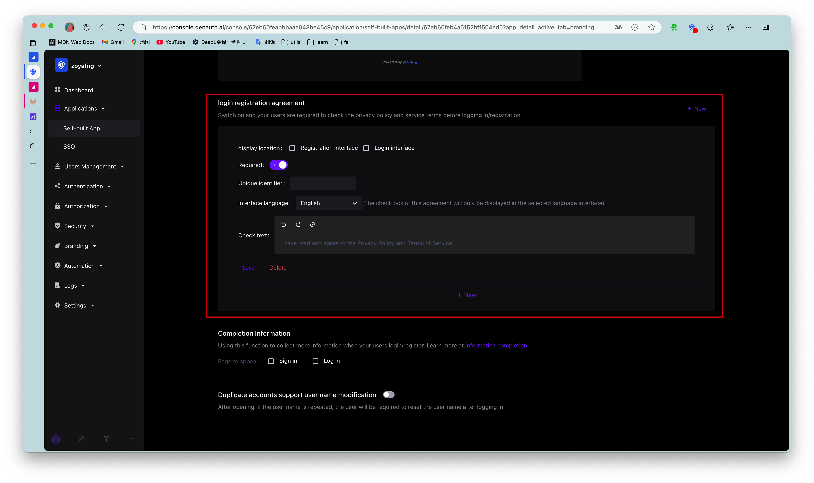
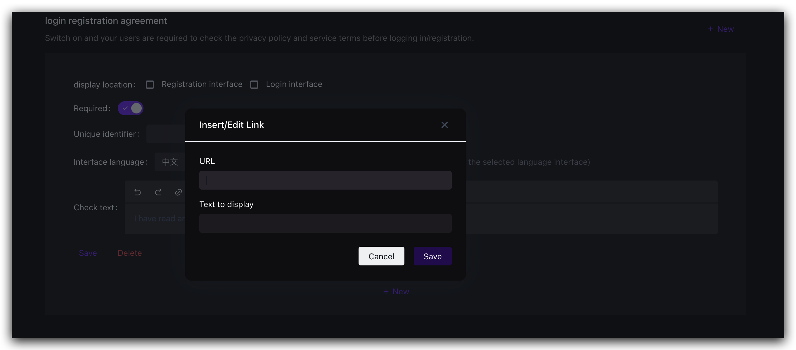
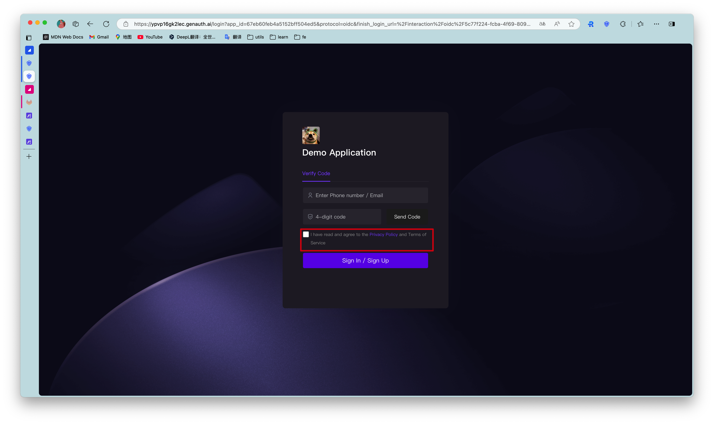

# Add registration agreement

<LastUpdated/>

When a user registers, you may need to let the user understand and agree to your terms of service before allowing them to register. You can configure it in **Branding->Global Login Box->Function Configuration->Login Registration Agreement**:

## Configure registration agreement

First click the switch to turn on the registration agreement, then click the Add button and fill in the agreement information:

- The agreement title is the agreement title that the user sees on the login interface
- There are two modes for the agreement type
  - External link: that is, you have deployed the page with the detailed content of the agreement, just enter the page address, and the user will jump to the link you configured when clicking the agreement title.
  - Manual input: You can enter the details of the agreement in {{$localeConfig.brandName}} through a rich text editor, and the user will see this content when clicking the agreement title.

After the configuration is completed, you can see it on the registration interface:

