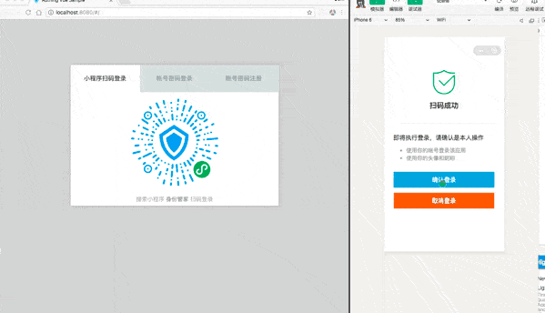

# Configure login and registration methods

<LastUpdated/>

By default, your application only includes the most basic login and registration methods: mobile phone number verification code login, account password login, email registration, mobile phone number registration.

In addition to the most basic login and registration methods mentioned above, {{$localeConfig.brandName}} also supports:

- [Configure login and registration methods](#Configure login and registration methods)
  - [Add social login](#Add social login)
    - [Configure custom social login](#Configure custom social login)
    - [WeChat solution](#WeChat solution)
  - [Add scan code login](#Add scan code login)
    - [Add mini program scan code login](#Add mini program scan code login)
    - [Add self-built mobile application scan code login](#Add self-built mobile application scan code login)

## Add social login

{{$localeConfig.brandName}} currently supports nearly 20 social logins at home and abroad, such as WeChat, GitHub, Sign in with Apple, Alipay, etc. The following is a complete list:

!!!include(common/social-connections-table.md)!!!

### Configure custom social login

{{$localeConfig.brandName}} provides the ability to access **custom OAuth2.0 identity providers**. If you need to connect to a social login identity source that is not built in {{$localeConfig.brandName}}, you can <router-link to="/connections/custom-social-provider/" target="_blank">Read this guide</router-link>.

### WeChat solution

{{$localeConfig.brandName}} has a complete solution for the WeChat ecosystem. You can view [Product Introduction](https://www.genauth.ai/solutions/wechat) and read [Guide to connecting the WeChat account system](/guides/wechat-ecosystem/).

## Add QR code scanning login

### Add mini program QR code scanning login

The mini program QR code scanning login website is a groundbreaking design of {{$localeConfig.brandName}}. After enabling scanning the small login QR code in {{$localeConfig.brandName}}, you can obtain the official real-name user information of WeChat. Users can complete registration or login with real numbers with one-click authorization, and establish an account system based on mobile phone numbers for developers.
For details, please [read this document](/guides/connections/social/wechat-miniprogram-qrconnect/README.md).

### Add self-built mobile application to scan QR code for login

With the popularity of mobile Internet, mobile phones have become a necessity in people's lives, and it is becoming more and more common to complete authentication by scanning QR codes with mobile phones. More and more mobile applications have integrated the function of scanning QR codes to log in to PC-side website applications, which is a convenient and safe experience for users. With the scanning login capability provided by {{$localeConfig.brandName}}, this function can be implemented quickly and safely. For details, please [read this document](/guides/authentication/qrcode/use-self-build-app/overview.md).
