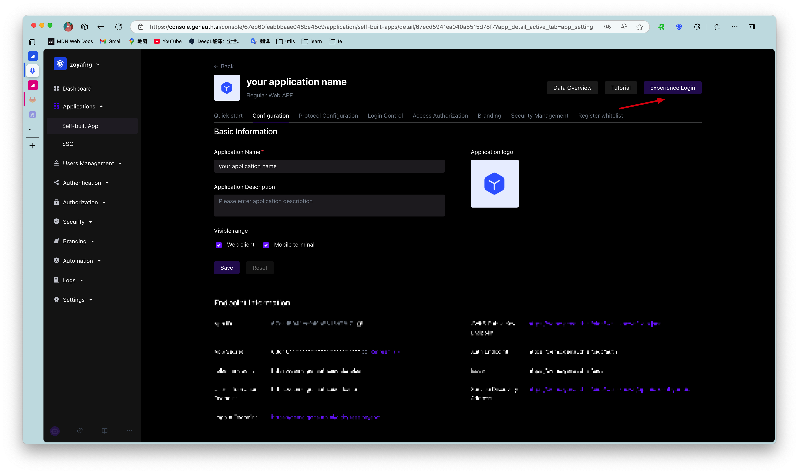

# Create an application

<LastUpdated/>

You can view all your applications on the **Application** page of the [console](https://console.genauth.ai):

Click the **Create Self-built Application** button and fill in the following information:

- Application name: your application name;
- Authentication address: select a second-level domain name, which must be a legal domain name format, such as `my-awesome-app`;
<!-- - Callback link: This link needs to fill in your business callback address. After the user logs in to this application, the browser will jump to this address, where you can exchange user information. Example: `https://myawesomeapp.com/login/callback`. -->

Click the **Create** button.

After creating the app, you can click the **Experience Login** button to access the online login form for the app:

Next, you can [configure the login and registration method](/guides/app-new/create-app/login-control.md) for this app.
