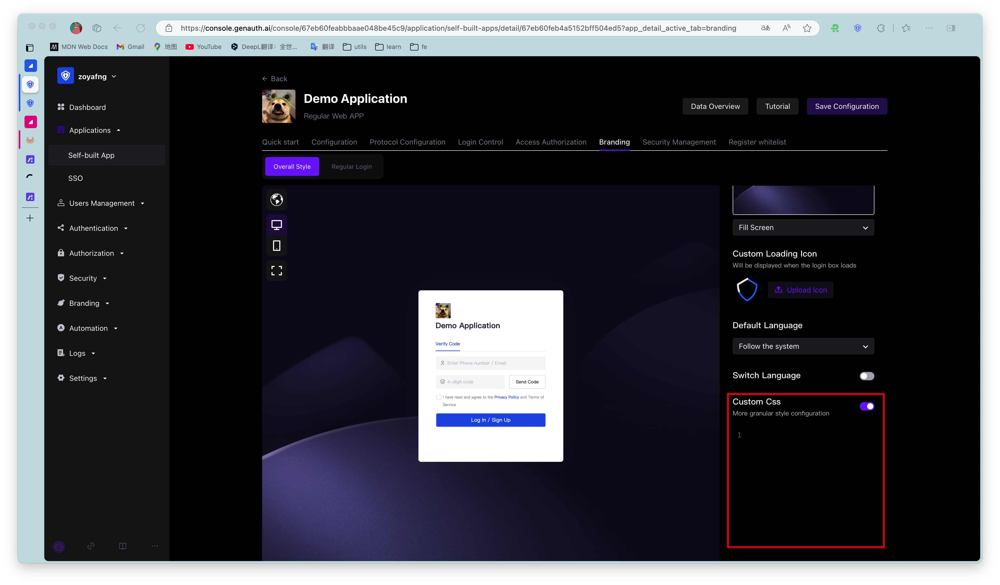
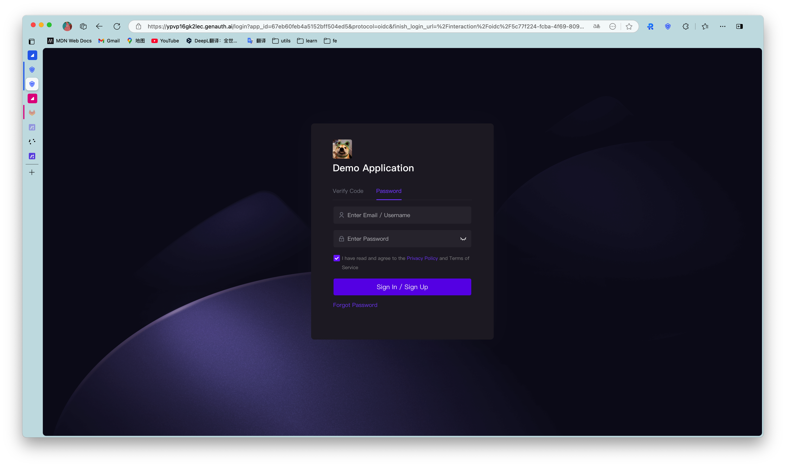
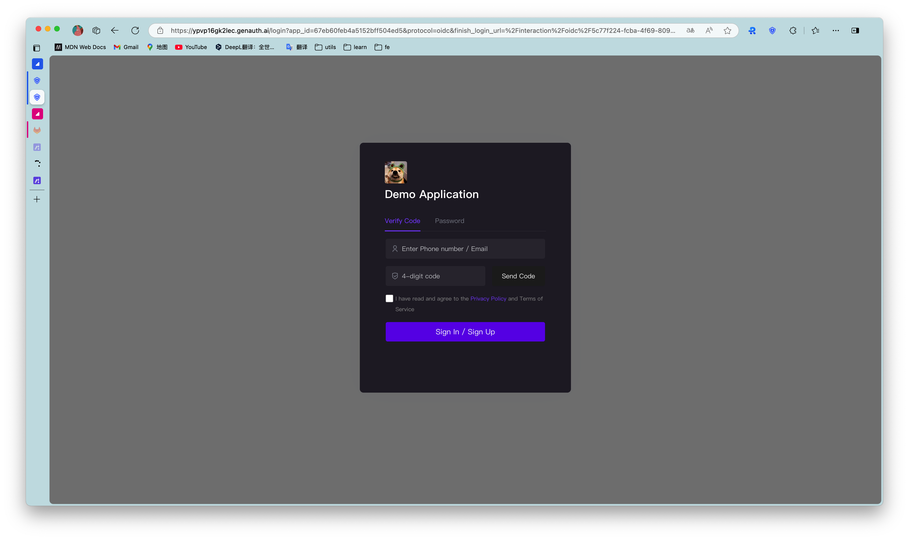
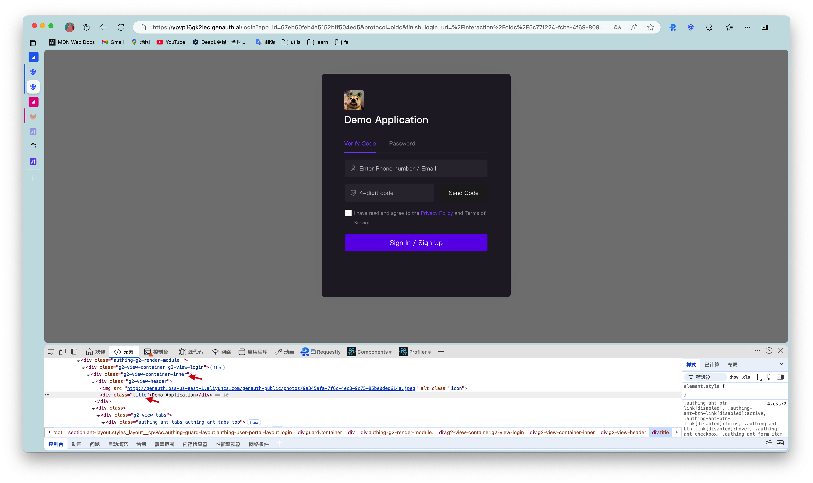

# Customize login box style

<LastUpdated/>

{{$localeConfig.brandName}}'s login box provides a very convenient custom style configuration, which you can configure in **Application Details**->**Registration and Login Configuration**:


## Configurable items

### Hide third-party identity provider login

After turning it on, all third-party identity provider buttons will not be displayed

### Hide social login button

After turning it on, all social login application buttons will not be displayed.

### Merge registration and login

After turning it on, if the user enters a non-existent account, an account will be automatically created for it and logged in, and there will be relevant prompt information.


### Hide the Forgot Password button

After turning it on, the "Forgot Password" button will be hidden.

### Custom CSS

Customize the login box with some advanced custom styles through custom CSS. For example, change the background color:

```css
.authing-guard-layout {
  background: gray;
}
```



::: hint-warning
Note: The specific CSS class name can be viewed in the Chrome console on the login interface of {{$localeConfig.brandName}}. The dom tags that need custom styles all provide fixed class names. Class names with hash cannot be used because they change frequently.
:::


