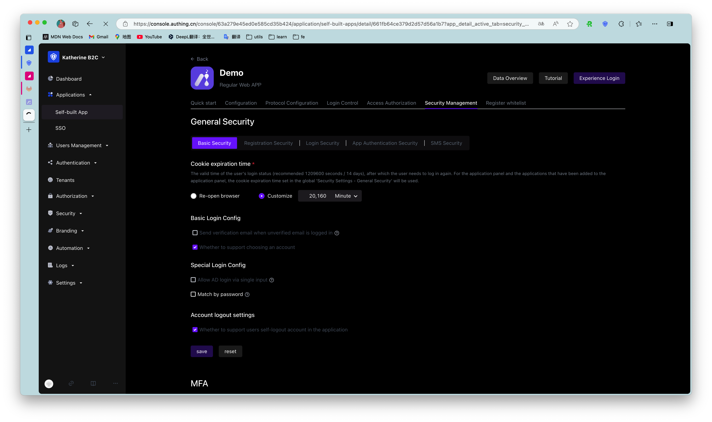

# Enable multi-factor authentication

<LastUpdated/>

Multi-factor authentication (MFA) is a very simple security practice that can add an extra layer of protection beyond username and password. After enabling MFA, users need to provide a second authentication in addition to their username and password when logging in. The combination of multi-factor authentication will provide higher security protection for your account and resources. You can learn about [What is multi-factor authentication](/concepts/mfa.md) here.

You can enable MFA for your application as shown below:

::: hint-info
* To configure application-level MFA, you must enable the **Customize security rules for this application** switch in **Applications->Self-built applications->Application details->Advanced configuration**, and the **Security management** tab will appear.
* Application-level MFA configuration takes precedence over global MFA.
:::

For more access procedures, see [Multi-factor authentication overview](/guides/security/mfa/).