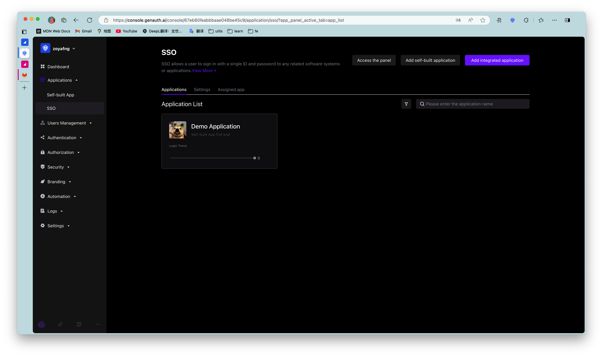
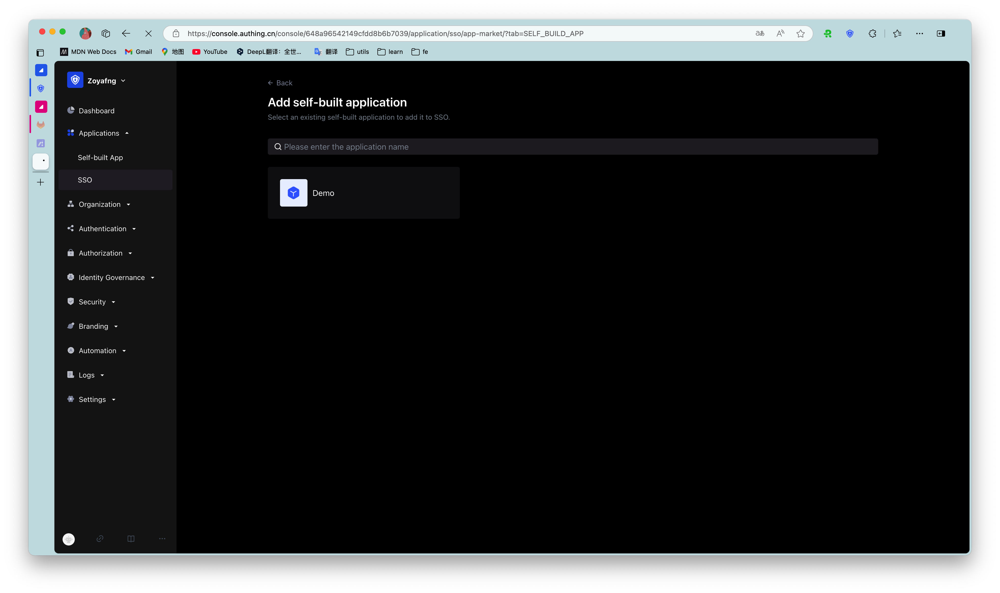
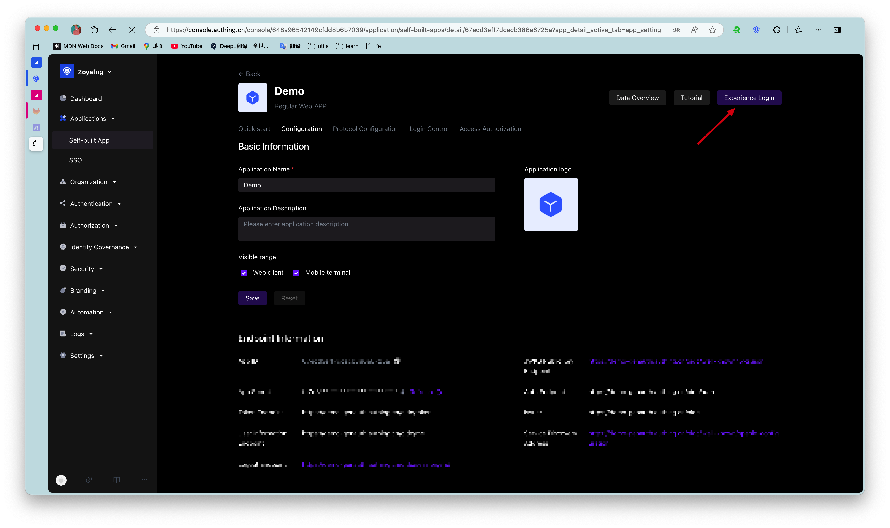
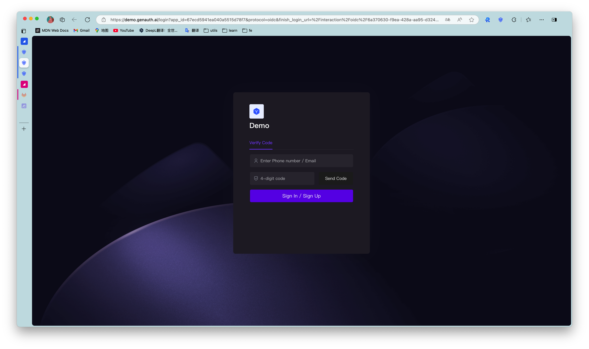
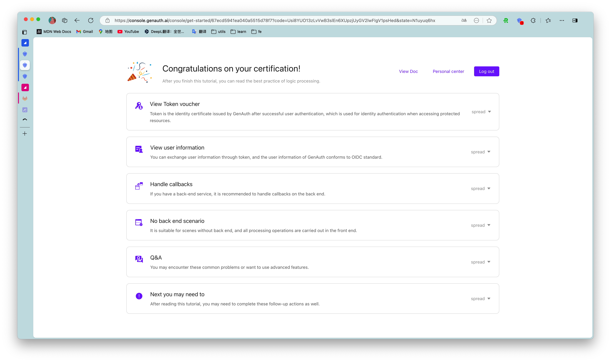

# Self-built application SSO solution

<LastUpdated/>

After enabling single sign-on between applications, the login status between different applications under the same user pool will be connected, and end users only need to log in once to travel between different applications.

## Create two applications

First, you can follow the [Guide](/guides/app-new/create-app/create-app.md) to create two applications.

## Configure single sign-on

Go to the menu **Application** > **Single sign-on SSO**, click **Add self-built application** in the upper right corner.

<!-- Go to the configuration page of the two applications respectively, select the **Login control** tab, and turn on the multi-domain single sign-on switch. -->

Find and add the created application in the list

## Experience application single sign-on

Enter the **Application List** tab of **Single Sign-On SSO**, select an application, and click **Experience Login**

Complete login on the login page:

After success, you will be redirected to the application callback address:

Next, we click the experience button of another application:

The user does not need to enter the password again, and directly enters the callback address of the application:

## Use SDK to access single sign-on

For detailed access process, please see [Single Sign-On SDK](https://docs.genauth.ai/v3/reference/sdk/web/) documentation.
