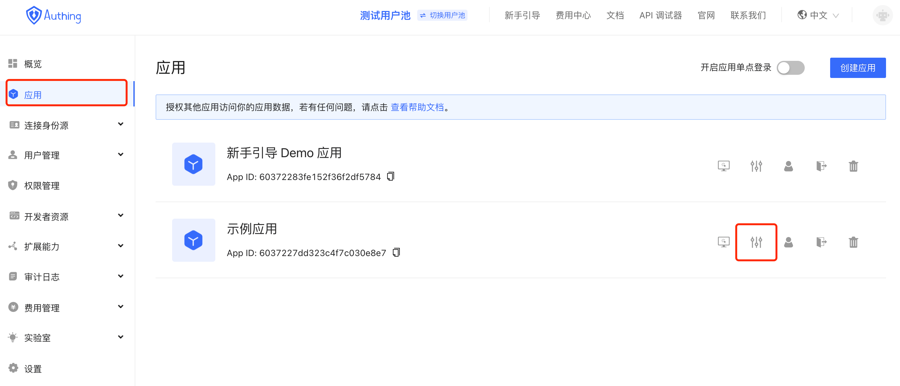
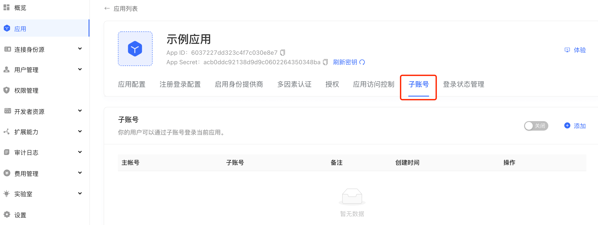
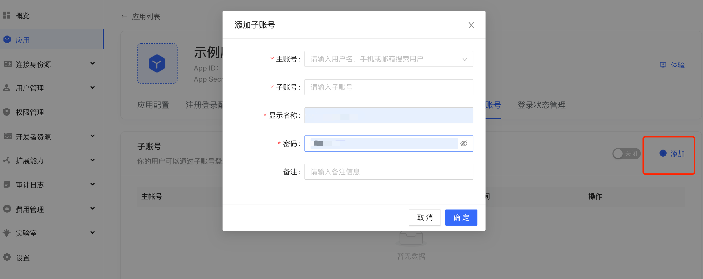
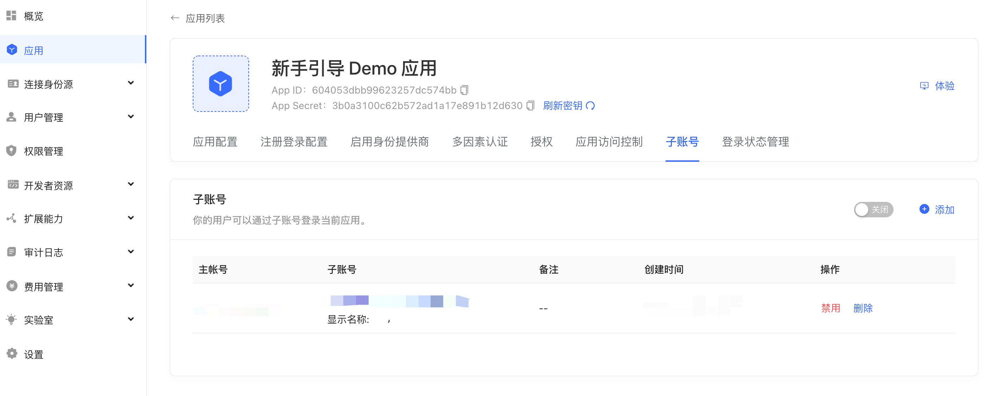

# Manage Subaccounts

<LastUpdated/>

This article aims to describe how to add application subaccounts through the "Subaccount" function of GenAuth. By adding a subaccount, users can log in to all applications through the GenAuth account.

## Background

Traditional applications are accessed by entering an account and password. With the increasing use of development, office, and tool software, users need to remember multiple sets of account passwords. If a unified password or weak password (such as 12345678) is set for convenient login, there are security risks such as database collision and database theft, which will cause loss of user information.

## GenAuth Subaccount

The GenAuth "Subaccount" function binds the user's account on the GenAuth platform to the user's application account, establishes a unique identifier with the application account through account mapping, uses the GenAuth account as the "main account", and logs in to all the user's applications through the "main account", solving the problem of users remembering multiple accounts.

## Operation steps

Log in with the registered GenAuth account through the assigned GenAuth authentication address;
Click "App" to select the application to which the sub-account is to be assigned, and click "Configure";

Enter the configuration page and select the "Sub-account" function;

Click "Add", enter the relevant information in the pop-up add window, click "OK" to complete the binding
Main account: GenAuth unique account
Sub-account: Application account

Complete adding status

