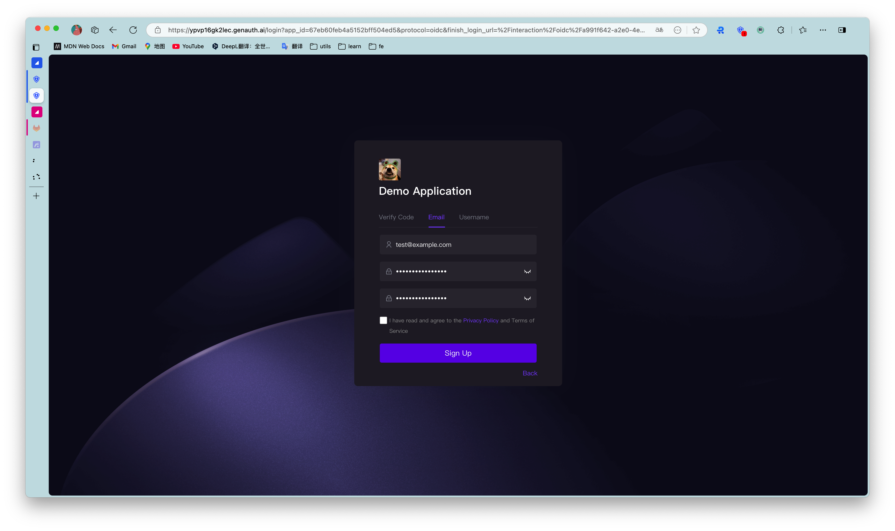
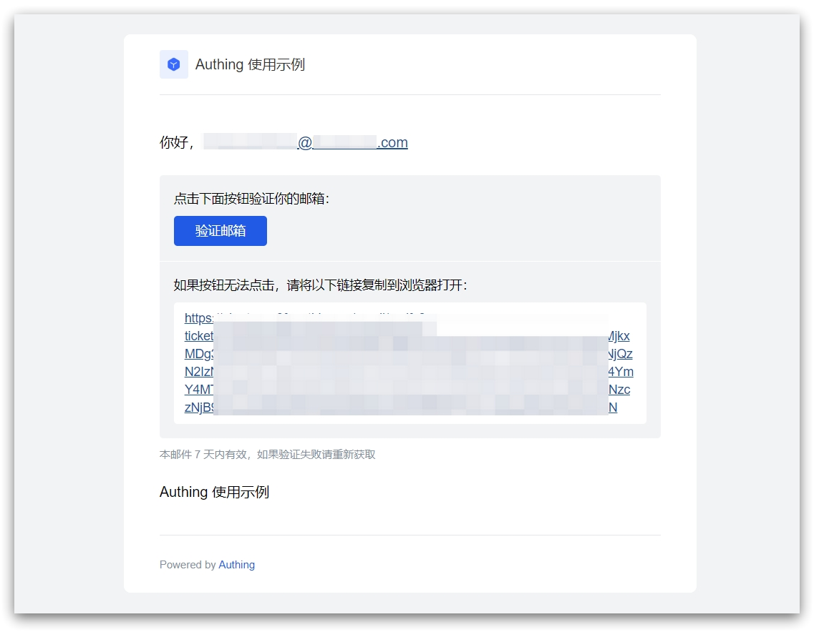
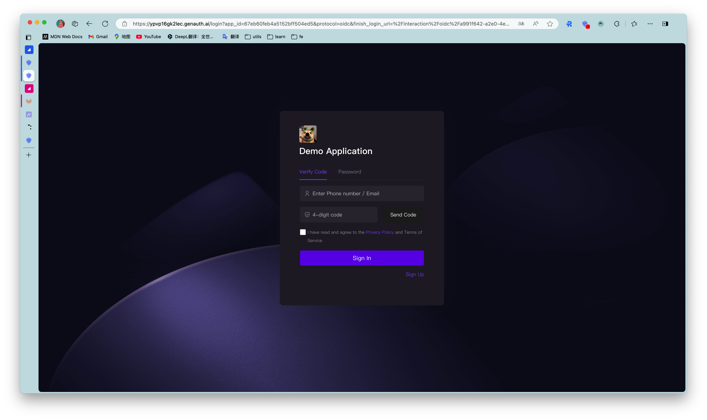
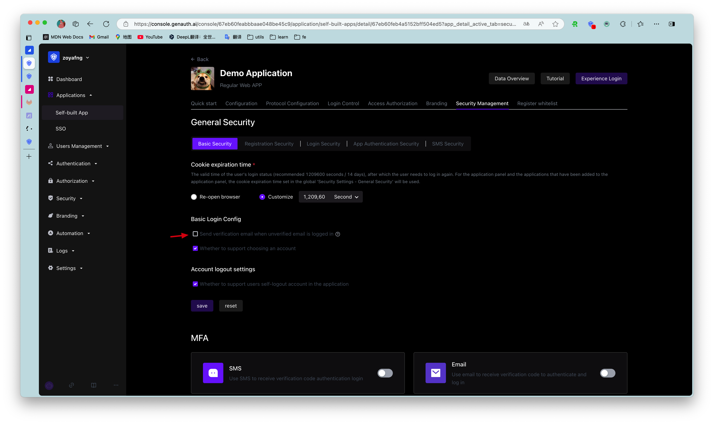
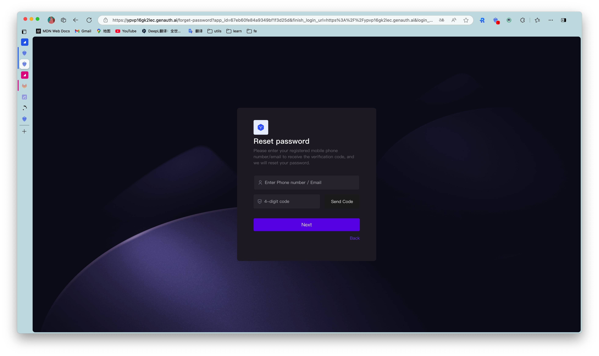
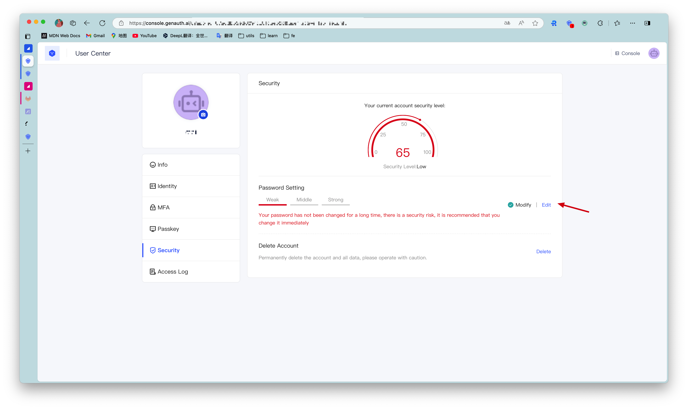

# Use account and password authentication

<LastUpdated/>

In {{$localeConfig.brandName}}, account and password are divided into the following three forms:

* Email + password login
* User name + password login
* Mobile phone number + password login

When providing users with account and password authentication methods, as an IT system administrator or developer, you also need to implement the following functions:

* Reset password: You can retrieve your password through the email verification code or mobile phone number verification code.
* Change password: You can reset your password through the existing password.

To use {{$localeConfig.brandName}} to implement these functions, we provide three different access methods:

1. [Use {{$localeConfig.brandName}} to host the login page](#Use hosted login page), without a single line of code, you can experience it through {{$themeConfig.sampleAppDomain}}.
2. [Use the embedded login component provided by {{$localeConfig.brandName}}](#Use the embedded login component), which can be integrated into your web and mobile projects. You don't need to implement the login form UI yourself.
3. [Use API & SDK](#Use-api-sdk), {{$localeConfig.brandName}} provides two forms of APIs in RESTFul and GraphQL, as well as SDKs in more than 10 languages ​​or frameworks, based on which you can customize the UI and authentication process.

## Use the hosted login page

### Registration

After the user successfully registers, the system will send a welcome email to the user's mailbox:

> You can also turn off the option to send a welcome email when registering in the console **Settings** - **Security Information** - **User Pool Security Configuration**, and you can also modify the default welcome email template in the console **Settings** - **Message Service**.

After the user successfully registers, {{$localeConfig.brandName}} will send a verification email to the user's email:

The user clicks the verification button to verify the email.

### Login

By default, accounts with unverified emails can log in. You can also modify this configuration in the application details:

After the user successfully logs in, the callback link you configured will be called back. You can get the user information here. For details, please see [Use {{$localeConfig.brandName}} Hosted Login Page to Complete Authentication](/guides/basics/authenticate-first-user/use-hosted-login-page.md).

### Reset Password

You can reset your password using the bound mobile phone number or email address.

### Change password

Users can change their passwords in the personal center:

## Use embedded login component

The embedded login component and the online hosted login page are basically the same in style and interaction. The difference is that the online hosted login page is fully managed and maintained by {{$localeConfig.brandName}} and is completely independent of your application, while the embedded login component can be embedded in your application.

For detailed usage, please see: [Use the embedded login component to complete authentication](/guides/basics/authenticate-first-user/use-embeded-login-component/) .

## Using the API & SDK

### Register

<StackSelector snippet="register-by-email-password" selectLabel="Select a language" :order="['java', 'javascript', 'python', 'csharp']"/>

### Login

<StackSelector snippet="login-by-email-password" selectLabel="Select a language" :order="['java', 'javascript', 'python', 'csharp']"/>

### Reset password

<StackSelector snippet="reset-password" selectLabel="Select a language" :order="['java', 'javascript', 'python', 'csharp']"/>

### Change password

<StackSelector snippet="update-password" selectLabel="Select a language" :order="['java', 'javascript', 'python', 'csharp']"/>
