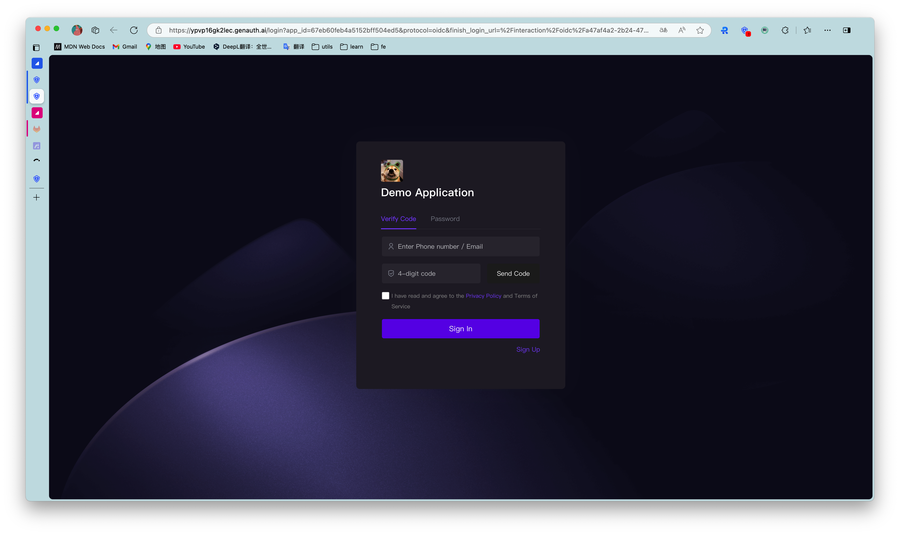
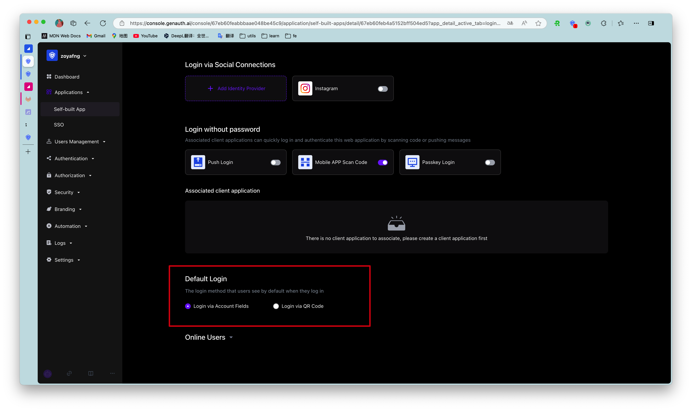

# Use SMS verification code authentication

<LastUpdated/>

Developers can use the standard login components and API & SDK provided by {{$localeConfig.brandName}} to quickly implement a user system based on mobile phone numbers. You can also configure a mobile phone number whitelist in the console's User Management - Registration Whitelist, so that only mobile phone numbers in the whitelist can register and log in.

The verification code SMS will use the unified SMS template of {{$localeConfig.brandName}} by default. If you want to customize the SMS template, you can configure a custom SMS template in the console's Settings - Message Service (currently supported SMS service providers are Chuanglan, Alibaba Cloud, and Tencent Cloud).

## Use the hosted login page

### Login

> Login with mobile phone number and password. If the user does not exist, an account will be automatically created.

By default, the default login method of the application is password login. You can change it in the application configuration:

### Register

## Use the embedded login component

The embedded login component and the online hosted login page are basically the same in style and interaction. The difference is that the online hosted login page is fully managed and maintained by {{$localeConfig.brandName}} and is completely independent of your application, while the embedded login component can be embedded in your application.
For detailed usage, please see: [Use the embedded login component to complete authentication](/guides/basics/authenticate-first-user/use-embeded-login-component/).

## Using API & SDK

### Send SMS verification code

<StackSelector snippet="send-sms-code" selectLabel="Select language" :order="['java', 'javascript', 'python', 'csharp']"/>

### Login

<StackSelector snippet="login-by-phone-code" selectLabel="Select language" :order="['java', 'javascript', 'python', 'csharp']"/>

### Register

<StackSelector snippet="register-by-phone-code" selectLabel="Select language" :order="['java', 'javascript', 'python', 'csharp']"/>
