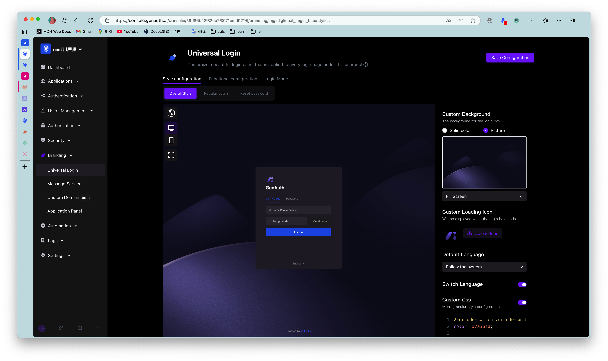
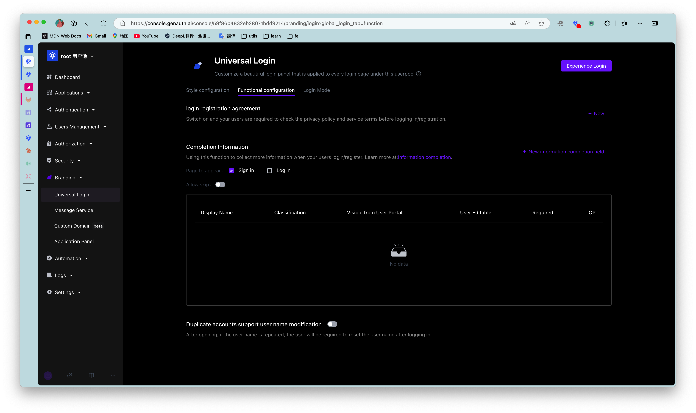
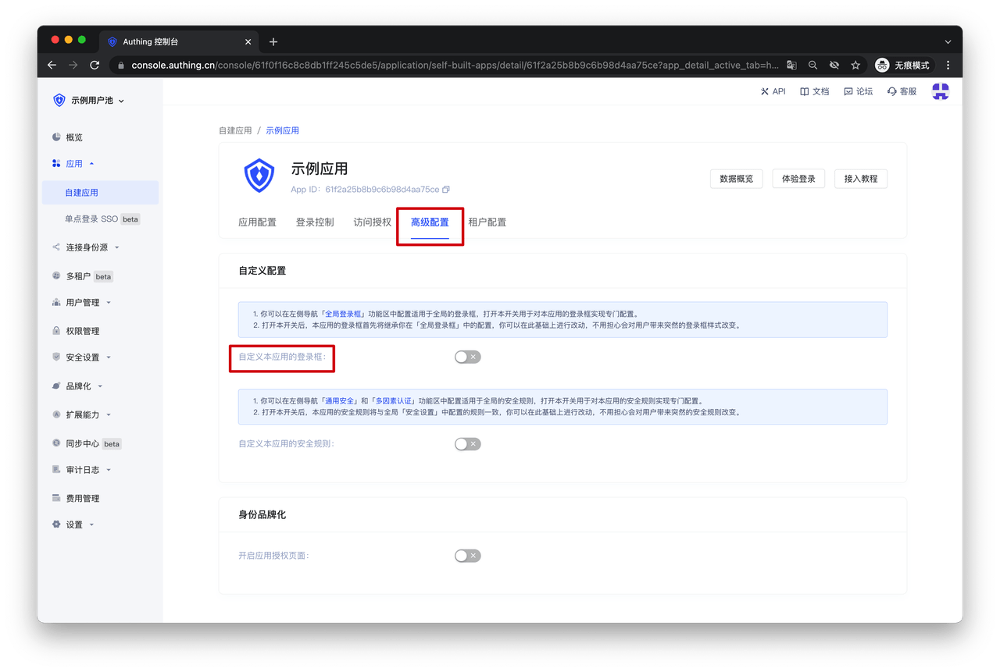
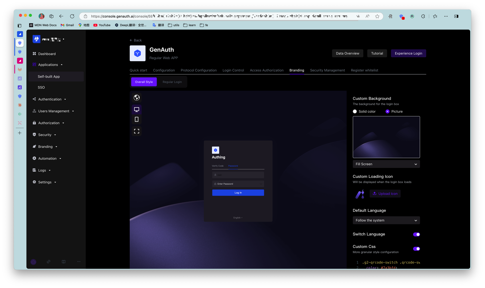

# Personalize the login box

<LastUpdated/>

You can personalize the login box for the entire user pool in the "Branding" section of the GenAuth console, including the "Single Sign-On SSO" login box and the login boxes of all self-built applications in the user pool.

In the "Global Login Box", you can perform relevant "Style Configuration" and "Function Configuration" as needed. Specific features include:

## Style configuration

- Login box version selection: [How to switch to the new version of Guard | GenAuth document](/reference/guard/console-migrate.md)
- Custom background: Change the background of the login box loading and display
- Custom loading icon: Change the icon when the login box is loading
- Hide corporate identity source login
- Hide social login
- Hide forgotten password
- Custom CSS
  

## Function configuration

- Login and registration merge: After turning it on, new users will complete the registration and login at once after entering relevant information; old users will complete the login normally.
- Login and registration agreement: After turning it on, users need to check the terms of service and privacy terms you configured when logging in/registering.
- Login and registration information completion: After turning it on, users will be asked to complete the information after logging in/registering. If you need to add more fields, please see: [Add custom user fields](/guides/users/user-defined-field/).
  

If you want to customize the login box of a self-built application independently of the global one, you can do this:

First, find the "Advanced Configuration" area and turn on the "Customize this application's login box" switch. After turning on this switch, the login box of this application will first inherit your configuration in the "Global Login Box". You can make changes based on this without worrying about causing sudden changes to the login box style for users.

<!--  -->

After turning on this switch, you can configure it independently in the "Branding" function area of ​​the self-built application.

