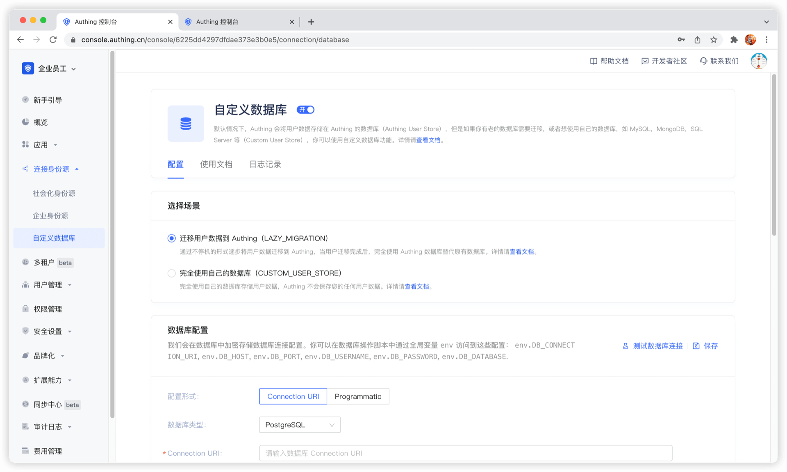

# Use a custom database to authenticate users

<LastUpdated/>

Using a custom database can meet the needs of the following scenarios:

- **Use your own database to save user data**: Use your own database to save user data. In this mode, {{$localeConfig.brandName}} will not store any of your user information.
- **Lazy migration of users to {{$localeConfig.brandName}}**: This mode of migrating users is called **lazy migration**. In simple terms, the principle is as follows: At the beginning, all the original user data is in your database. When the user tries to log in to GenAuth for the first time, GenAuth will search and verify the user in your database through the custom database script you configured. If successful, the user will be migrated to GenAuth; when the user logs in for the second time, it will be verified using the GenAuth database; when all users have logged in at least once, it means that the migration task is completed.

You can configure a custom database by going to the [GenAuth console](https://console.genauth.ai/console/userpool) **Connect Identity Source** - **Custom Database** page to enable a custom database connection. For details, see [Using a Custom Database](/guides/database-connection/overview.md).

