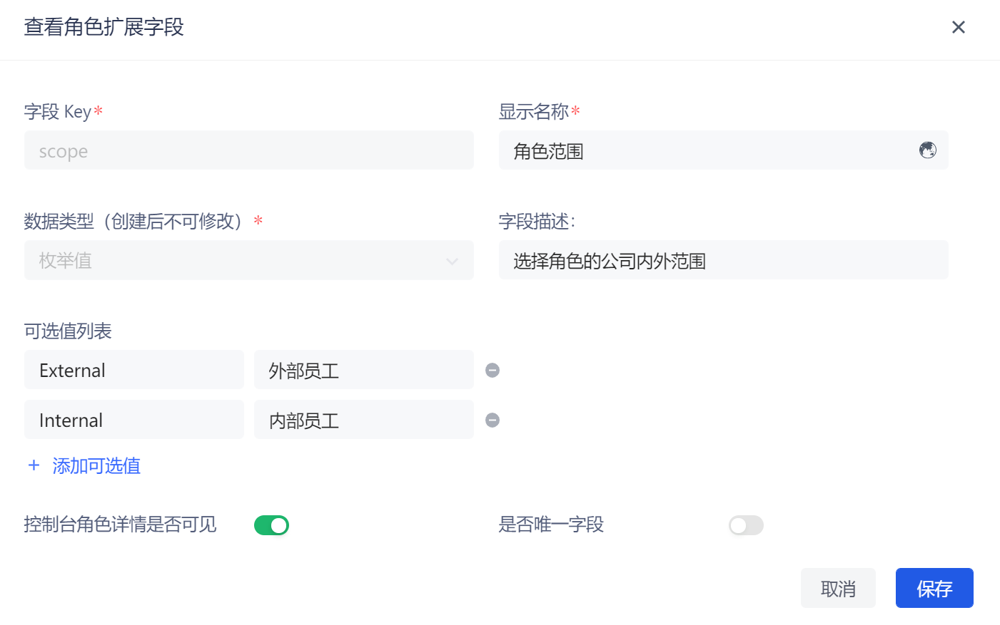

# Add role custom fields

Role custom fields are additional fields that can be added to roles in addition to basic role fields. Developers can store small amounts of business-related data by setting custom fields.

You can add, edit, search (search by **Key** and **Display Name**) and delete role extension fields in the **Settings->Field Management->Role Field Management** tab.

To add role extension fields, perform the following steps:

1. Click the **Add** button to add a role extension field.

2. Enter the **Field Key**, **Display Name**, select the **Data Type**, and enter the **Field Description**.

::: hint-info
You can define the following types of custom fields:

* String
* Number
* Boolean
* Enumeration
* Date
:::

3. Select whether to enable the **Console Role Details Visible** switch (enabled by default).

::: hint-info
If the **Is console role details visible** switch is turned on, when viewing the details of a role on the **Role Management** page under the console permission module, you can view and set the role custom fields on the **Extended Field** tab.
:::

4. For **String** / **Number** data types, you can choose whether to turn on **Is the unique field** (if turned on, it means to ensure that the extended field is unique in the user pool).

5. Click the **Save** button.