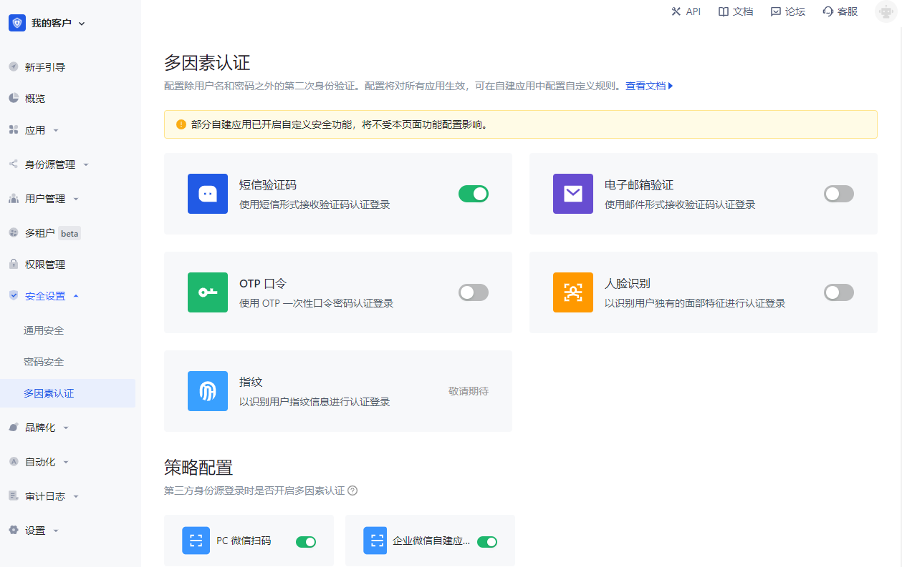

# MFA policy configuration

<LastUpdated/>

Path: **Security Settings->Multi-factor Authentication->Policy Configuration**

Role: Administrator

GenAuth supports configuring whether to enable MFA for different third-party identity sources at the user pool level.

::: hint-info

- The **Policy Configuration** module will display all identity sources configured under the **Identity Source Management** menu. Before configuring the MFA policy, make sure that the user pool has configured the target identity source.
- This configuration is effective globally and is not affected by the custom security function configuration of self-built applications.
- When no MFA authentication method is enabled globally, all third-party identity sources displayed in the policy configuration are disabled by default. ​
- When one or more MFA authentication methods are enabled globally, the default state of each identity source is switched to enabled.
- When the switch of a certain identity source connection is turned off globally, all MFA processes will be skipped when users log in to all applications of the user pool using the identity source connection method.
- When a certain identity source connection switch is turned on globally, users will need to perform secondary identity authentication when logging into all applications of the user pool using this identity source connection method.

:::
