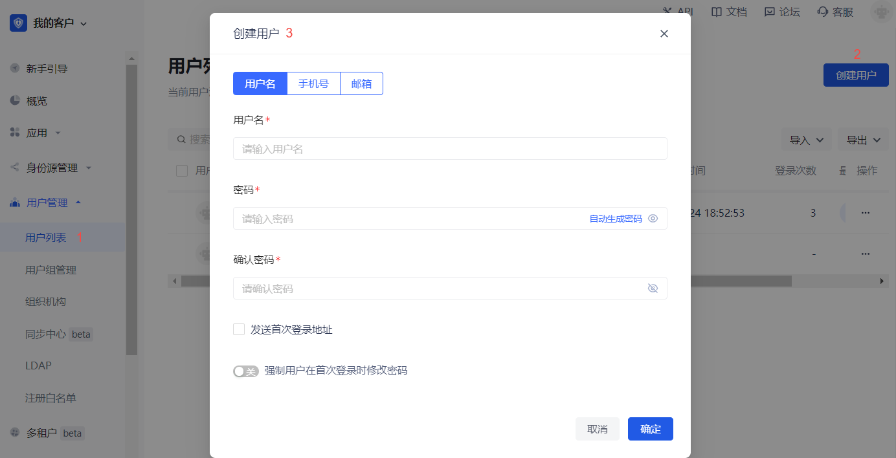
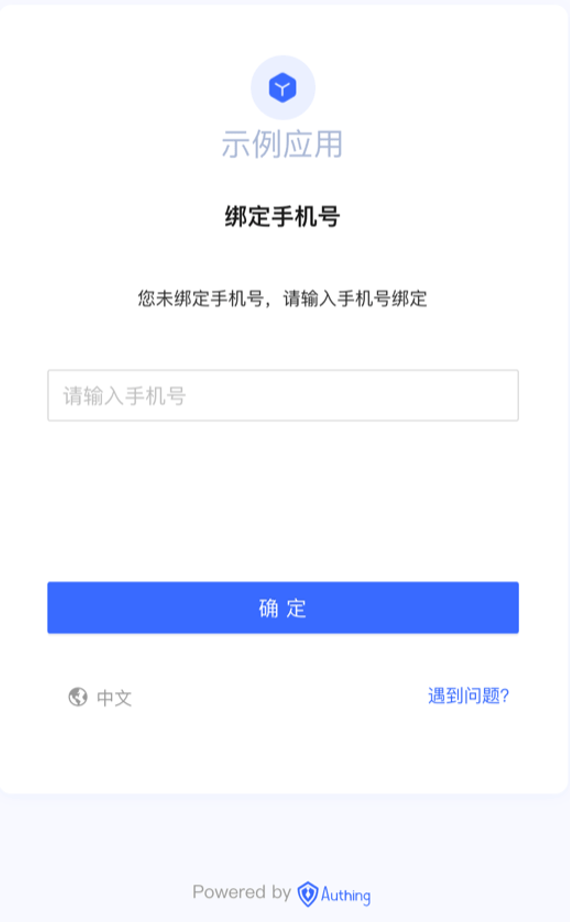

# MFA based on SMS verification code

<LastUpdated/>

## Overview

Multi-factor authentication (MFA) is a security system that performs secondary identity authentication to verify the legitimacy of an operation. For example, a bank's USB shield requires SMS verification for remote login. This article introduces a multi-factor authentication method based on SMS verification code.

## Preparation

Role: Administrator

Before enabling SMS verification code MFA, perform the following preparations:

1. <a :href="`${$themeConfig.consoleDomain}`">Register a {{$localeConfig.brandName}} account</a>.
2. [Create a user pool and application](/guides/basics/authenticate-first-user/use-hosted-login-page.md).

## Enable SMS verification code MFA

Role: Administrator

### Enable application-level SMS verification code MFA

::: hint-info
To configure application-level MFA, you must enable the **Customize security rules for this application** switch in **Application->Self-built application->Application details->Advanced configuration** before the **Security management** tab will appear.
:::

To enable application-level SMS verification code MFA, perform the following steps:

1. Select **Application->Self-built application** in the navigation menu on the left side of the console.

2. Select the application for which SMS verification code MFA needs to be enabled in the self-built application list.

3. Go to the application details page, select **Security management**, and enable the **SMS verification code** switch in the **Multi-factor authentication** module.

### Enable global SMS MFA

To enable global SMS verification code MFA, perform the following steps:

1. Select **Security settings->Multi-factor authentication** in the navigation menu on the left side of the console.

2. Enable the **SMS verification code** switch in the **Multi-factor authentication** module.

3. Select the applicable identity source in the **Policy Configuration** module and turn off the MFA switch of other irrelevant identity sources.

## Login using SMS verification code MFA

### Experience login

Role: Administrator

To experience SMS verification code MFA, the administrator needs to perform the following steps:

1. Select **User Management->User List** in the navigation menu on the left side of the console, click the **Create User** button to create a user for SMS verification code MFA login by **Username/Mobile Number/Email**.

::: hint-info

To enable SMS verification code MFA, you must bind a mobile phone number for the new user.

To bind a mobile phone number, click the drop-down hidden button in the **Personal Information** module on the user details page to fill in the mobile phone number.

:::

2. Select **Application->Self-built Application**, click the **Experience Login** button in the upper right corner of the target application details page, and log in with the account created above.

3. Enter your mobile phone number and the verification code sent to your mobile phone on the **Verification Code Login** page to complete the SMS verification code-based MFA verification process.

### User Login

Role: Ordinary User

To perform SMS verification code MFA when logging in, follow these steps:

1. Log in by username/mobile phone number/email account or scan code.

2. After one identity authentication, if the user has not yet bound a mobile phone number, the system pops up the **Bind Mobile Phone Number** window, and enter the mobile phone number at this time.

::: hint-info
If the mobile phone number has been bound, after one identity authentication, this step will be skipped and you will be asked to enter the SMS verification code directly.
:::

3. Enter the SMS verification code obtained by the mobile phone.

The prompt completes the authentication and the login is successful.

## Disable SMS MFA

Role: Administrator

To disable SMS verification code MFA, you can disable the function at the application level and globally:

* Disable application-level SMS verification code MFA: Go to the application details, select **Security Management**, and turn off the **SMS Verification Code** switch in the **Multi-Factor Authentication** module.

* Disable global SMS verification code MFA: Select **Security Settings->Multi-Factor Authentication**, and turn off the **SMS Verification Code** switch in the **Multi-Factor Authentication** module.

