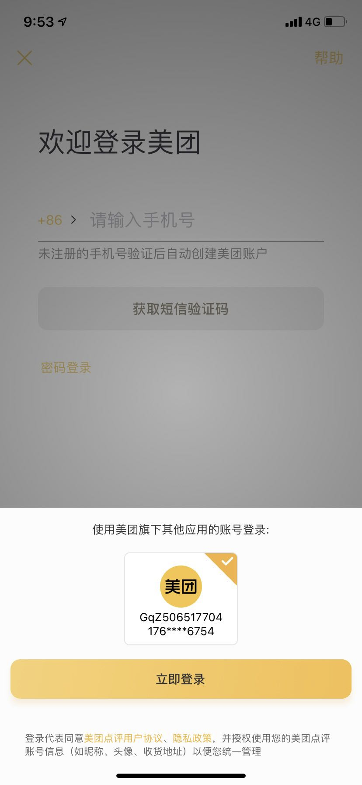

---
meta:
  - name: description
    content: Mobile Application SSO
---

# Implementing Single Sign-On on Mobile

<LastUpdated/>

Mobile Application Single Sign-On (Single Sign On) is similar to traditional [Web-side SSO](/guides/app-new/sso/README.md), which means that in multiple application systems, users only need to log in once to access all mutually trusted application systems.

GenAuth currently supports two forms of mobile terminal single sign-on:

1. Automatically detect the login status of associated applications on the same device
2. Invoke associated apps to exchange user information

## Automatic detection method

The automatic detection method, similar to the Meituan App, can detect the relevant user as long as one of all mutually trusted systems on the same device is in the login state, and prompt the user whether to use the account to log in, thereby achieving single sign-on.

As shown below:

You can view the demonstration in this video:

<video controls>
<source src="./Authing-App-SSO-Demo.mp4" type="video/mp4">
</video>

For specific access methods, please see: [Automatic detection and login on mobile terminals](./track-session.md).

## App-awakening method

App-awakening method refers to calling application B in application A, and the user agrees to authorize login in application B, and then jumps to application A, and application A obtains user information in some way. This mode is under development.
