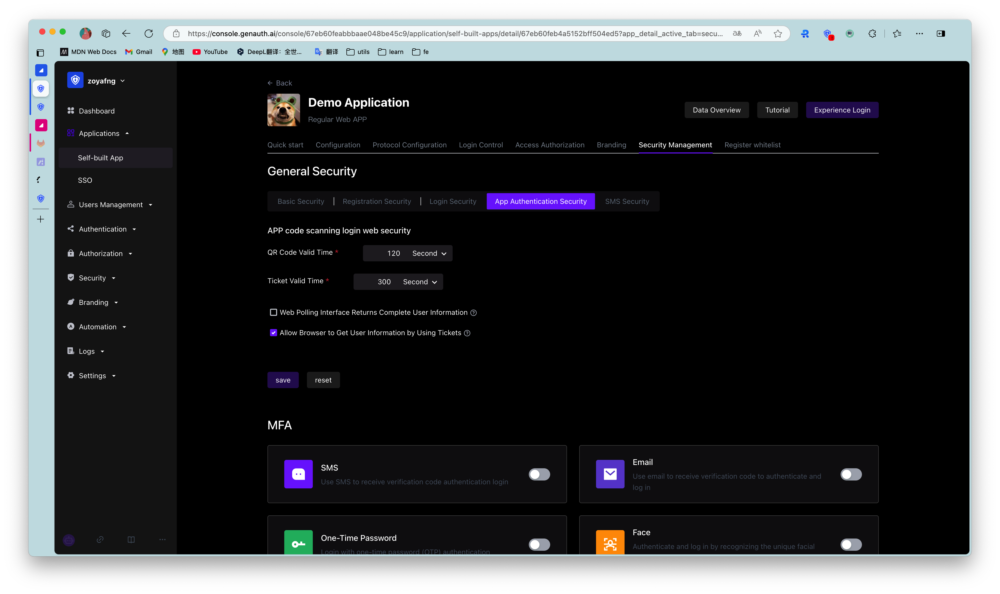

# Custom configuration items

<LastUpdated/>

{{$localeConfig.brandName}} has always been committed to providing developers with a highly customized development experience, so we provide the following custom configuration items. Developers can balance security and convenience according to their business needs. Developers can customize the configuration in the [{{$localeConfig.brandName}} console](https://console.genauth.ai/console/userpool) **Security Settings** -> **Basic Settings** -> **Login Settings** -> **App Scan Code Login Web Custom Configuration**.

## QR code validity period

Default 120 s.

## Whether to return complete user information in the QR code status query interface

Default is not returned. Since the QR code status query interface has no permission verification, it means that returning user information (including login credentials token) directly in this interface is a security risk, so we recommend that developers follow the best practice: the QR code status query interface only returns the user nickname and avatar, and uses the ticket to exchange for user information.

## Ticket validity period

The default is 300 seconds.

## Is it allowed to use the ticket to exchange for user information in the browser?

Not allowed by default, it needs to be called on the server side, that is, it needs to be initialized with the user pool key. [Click to learn how to initialize the backend SDK](/reference/sdk-for-node/README.md).

A typical usage scenario is: after the user scans the code to agree to the authorization, the developer gets the ticket and sends it to his own backend, uses the backend SDK to exchange for user information, and then redirects to the logged-in page, and writes the user information to localStorage.
