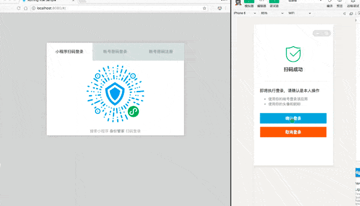

# Use Mini Program to scan QR code to log in to the website

<LastUpdated/>

The Mini Program to scan QR code to log in to the website is a groundbreaking design of {{$localeConfig.brandName}}. After enabling scanning QR code to log in in {{$localeConfig.brandName}}, you can obtain the official real-name user information of WeChat. Users can complete registration or login with their real number with one-click authorization, and establish an account system based on mobile phone numbers for developers.

- Application scenario: PC website;
- Overview: Display the Mini Program QR code in the PC website application, and then use WeChat to scan the QR code to log in to the application;
- Advantages: You can obtain the mobile phone number and real-name information of WeChat users;

You can [click here to experience the Mini Program scan code login](https://www.genauth.ai/developer/).

For the complete access process, please see: [Log in by scanning the QR code on the PC website using the mini program](/guides/connections/social/wechat-miniprogram-qrconnect/README.md).
