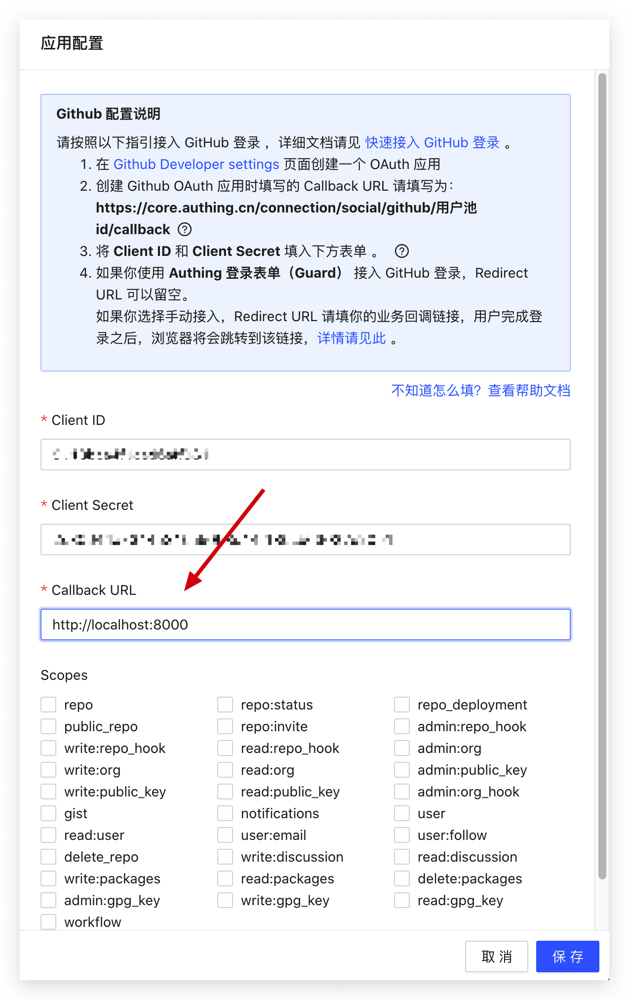

You need to set a callback URL on the configuration page of social login. After the user completes the login, they will be redirected to the callback URL:



### Guide users to jump to the social login authorization page

This method is only applicable to social login on the web. If you need to initiate social login in a mobile app, please read the documentation of the relevant social login service provider.

This operation should be completed in the browser. You can place a clickable button or logo link to the above link on the web page so that users can click to log in.

You need to concatenate the following format of the link, where YOUR_APP_ID is your application ID (note that it is not the user pool ID):

`https://core.genauth.ai/connection/social/<IDENTIFIER>?app_id=<YOUR_APP_ID>`

### Process {{$localeConfig.brandName}} callback request

After the user agrees to the authorization in the previous step, it will first jump to the {{$localeConfig.brandName}} server, and then {{$localeConfig.brandName}} will carry the user information to jump to the business callback link configured by the developer in the {{$localeConfig.brandName}} console, and attach the following Get request parameters:

| Parameter | Description                                                       | Disadvantages                          | Recommended     |
| --------- | ----------------------------------------------------------------- | -------------------------------------- | --------------- |
| code      | Error or success code, 200 for success, non-200 for failure       |                                        | Recommended     |
| message   | Success or error message                                          |                                        | Recommended use |
| data      | userInfo, if code is not 200, this parameter will not be returned | Cannot be embedded in your application | Recommended use |

Some browsers and Web Servers may display 404 when the URL is too long, such as ASP.NET. At this time, you need to modify the configuration. [For specific methods, please see this StackOverflow answer](https://stackoverflow.com/questions/28681366/in-asp-net-mvc-would-a-querystring-too-long-result-in-404-file-not-found-error/28681600).
The following is the code for getting user data from URL parameters using JavaScript

```javascript
// Get URL parameters
function getQueryString(name) {
  var reg = new RegExp("(^|&)" + name + "=([^&]*)(&|$)", "i");
  var r = window.location.search.substr(1).match(reg);
  if (r != null) {
    return unescape(r[2]);
  }
  return null;
}

// Convert Code to Int type for easy judgment
const code = parseInt(getQueryString("code"));

if (code !== 200) {
  // Error
  const errorMsg = getQueryString("message");
  // Display errorMsg to the user or perform other business ...
} else {
  const userInfo = getQueryString("data");

  // Store token in localStorage
  // It is recommended to attach the token in subsequent requests and have the backend verify the legitimacy of the token
  localStorage.setItem("token", userInfo.token);
}
```
