# M2M Authorization

<LastUpdated/>

M2M (Machine to Machine) authorization is **no user involvement** between applications. When you want to partially open your business API to others (such as your outsourcer), the outsourcer needs to first **M2M authorization** before they can access your business API. Suppose your company wants to develop a large-screen display of some data, and there are several outsourcers involved. You want to authorize the API access rights of some non-core data to the outsourcer, so that the outsourcer can complete this part of the non-core development. At this time, M2M authorization is required, because this process does not require user participation. We only need to determine which outsourcer the visitor is and which interfaces he has access to.

The following is the architecture diagram of this scenario. The outsourcer first obtains the Access Token from GenAuth, and then uses the Access Token to access the API interface of the company's service:


## Permission management and allocation

Create an application in GenAuth called "Big Screen Display".

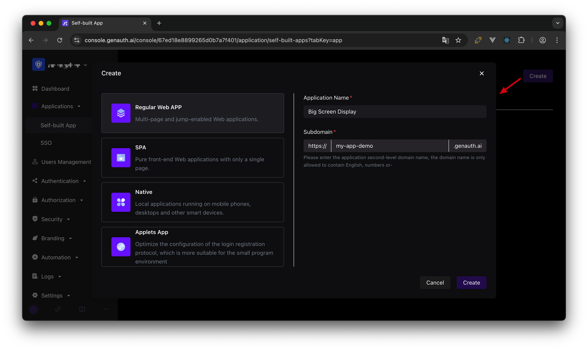

Define some resources under the "Big Screen Display" application (**Access Authorization->API Resources**), each of which corresponds to the actual resources in the "Big Screen Display" application. Here we add some resources, including user growth, customer, announcement, and revenue. The name of these resources is **API scope**.

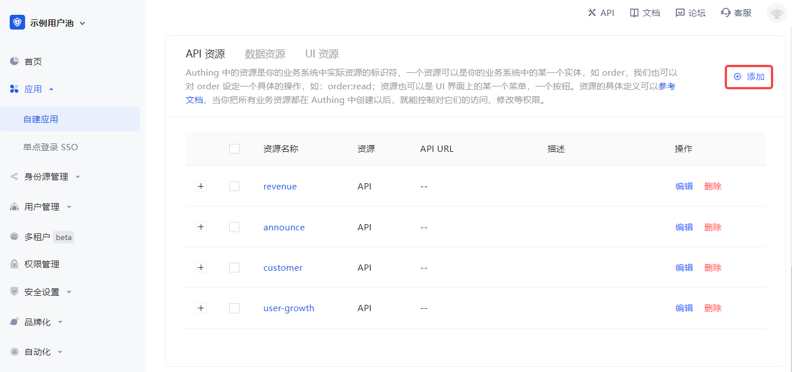

After defining the resources and operations, add a **programming access account** to the application. The **programming access account** is the **caller** of the current application API interface. **Programmatic access account** has a pair of **AK and SK**, which are used to give to outsourcers to call the "Large Screen Display" application interface. We can give AK and SK with different permissions to different outsourcers, so that they have different permissions and can access different APIs.

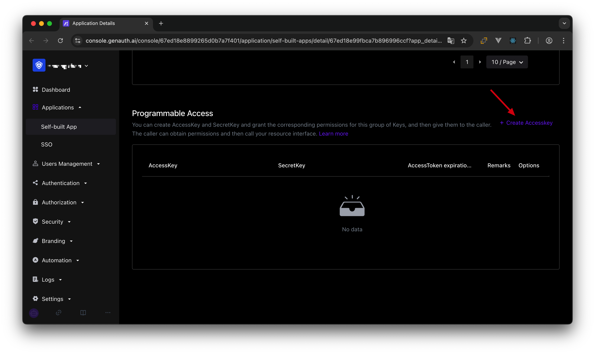

Create two programmatic access accounts, fill in the AccessToken expiration time and remarks, and click OK.

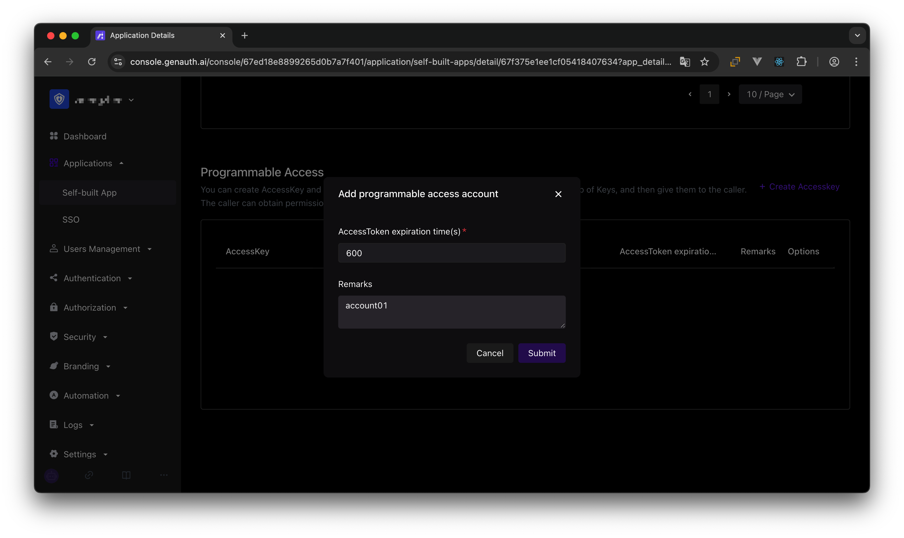


If the programmatic access account is deleted, the caller will lose the ability to obtain user authorization.

### AccessToken expiration time

When you create a programmatic access account, you need to specify the AccessToken expiration time. GenAuth uses the RS256 signature algorithm to sign when issuing AccessToken to ensure that AccessToken cannot be tampered with.

> Token signature is part of JWT. For more information, please refer to [JWT Explanation and Use](/concepts/jwt-token.md).

RS256 is an asymmetric signature algorithm. GenAuth holds the private key to sign the token, and the consumer of JWT uses the public key to verify the signature. The RS256 signature algorithm has the following benefits:

1. Anyone can verify the signature using the application public key, and the signer must be GenAuth.
2. No risk of private key leakage. If you use HS256 but leak the application key, you need to refresh the key and redeploy all APIs.

For more information about signature issues, please refer to [Verify Token](/guides/faqs/how-to-validate-user-token.md).

We have just created two programmatic access accounts, which will need to be handed over to outsourcers in the future.

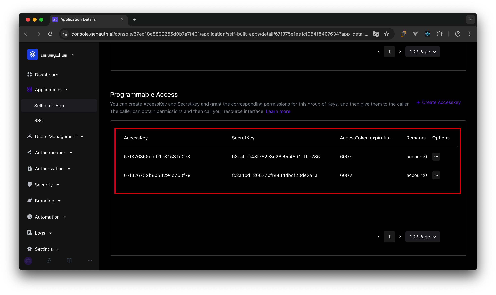

Next, we need to grant them resource permissions. In the Resource Authorization tab, click Add.

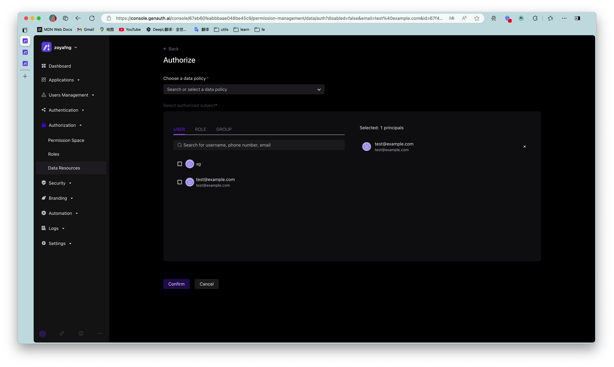

Select **Programming access account** as the authorized subject type, and then select the programming access account of outsourcing company A.

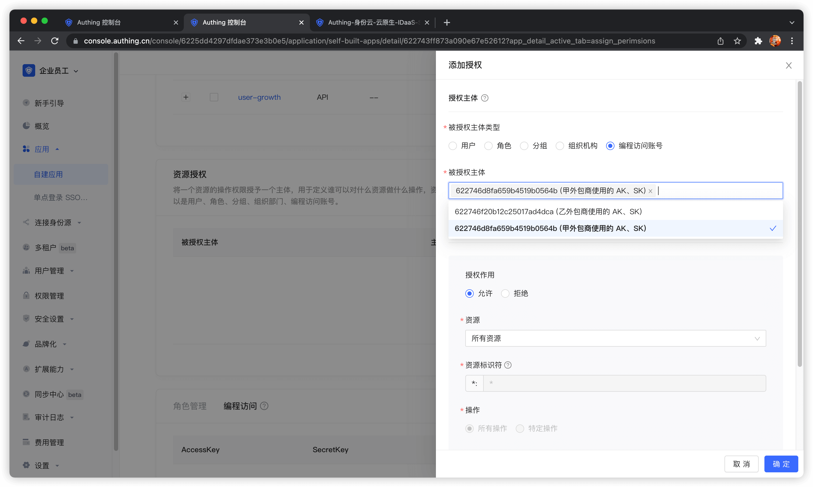

In the authorization rule, select Announcement Information for **Resource Type**, fill in `*` for **Resource Identifier** to authorize **all announcement resources**, select **specific operation** for operation, and then select announce:read operation. Finally, click OK. The purpose of this rule is to authorize Outsourcing Company A to read **all** announcement information resources.

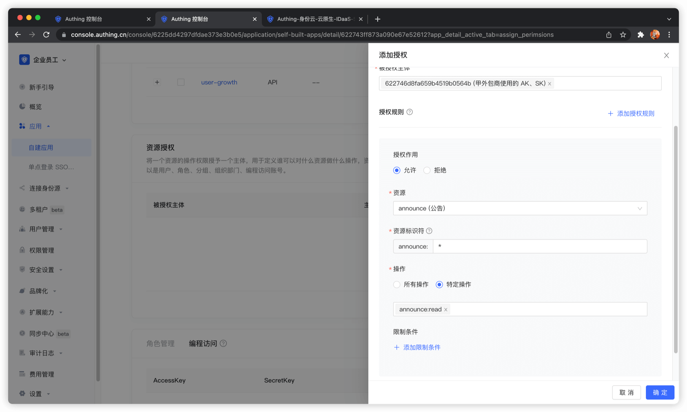

Next, we add authorization for Outsourcing Company B. First, select Outsourcing Company B's programming access account.

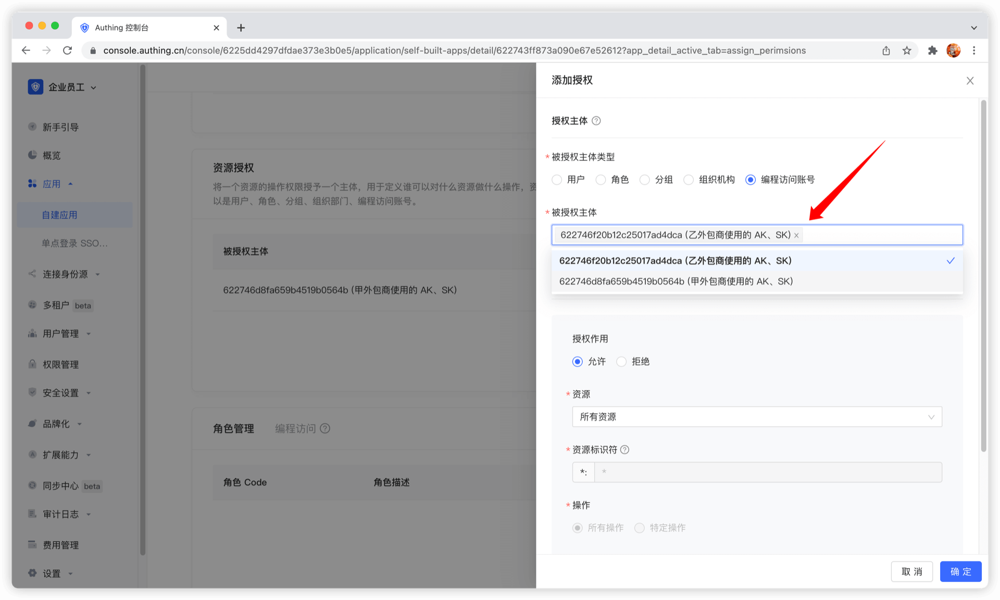

Next, we need to add three rules:

1. Authorize Outsourcing Company B to have all operation permissions for user growth data in 2019. Click Add Authorization Rule in the upper right corner to add multiple rules.

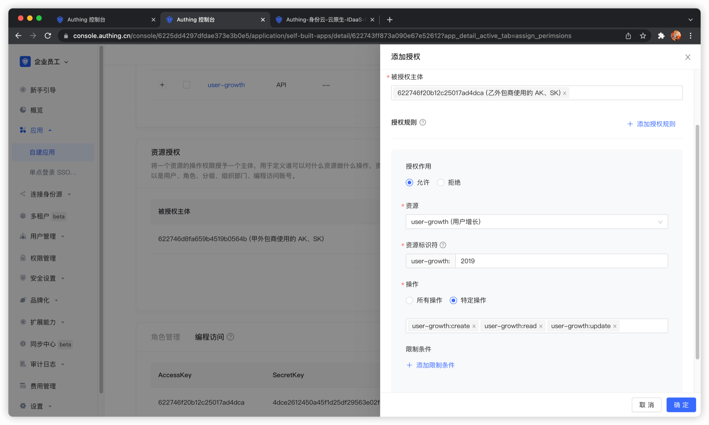

2. Authorize Outsourcing Company B to create, read, and modify all revenue records.

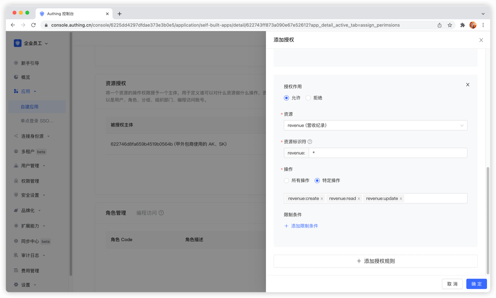

3. Authorize Outsourcer B to read all customer records.

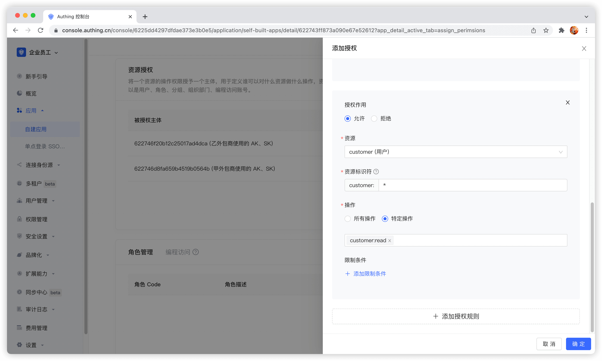

The administrator's permission management operation is now complete. Next, we will conduct M2M authorization best practices from the perspectives of the **caller** and **resource party**.

## Get an AccessToken with permissions

The **OIDC authorization framework** provides many authorization modes. In this scenario, obtaining user growth information belongs to **M2M** (machine-to-machine) authorization. There is no user participation. The caller accesses the API interface of the resource server as its own identity. Here, the **OIDC ClientCredentials mode** is required.

Through the OIDC ClientCredentials authorization mode, the caller needs to provide GenAuth with his ClientCredentials (that is, the Key and Secret of the **programmatic access account**) and the permission scope to be requested (that is, the **resource identifier**) to directly obtain an AccessToken with the API permission.

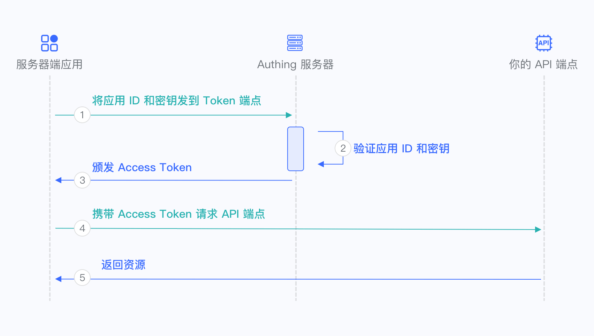

1. The caller sends the Key and Secret of the **programmatic access account** and the **scope** of the permission project to be requested to GenAuth.
2. GenAuth verifies the **programmatic access account** Key and Secret.
3. GenAuth verifies the scope permission project according to the permission rules configured by the administrator and issues an AccessToken with **access resource permission**. The denied permission scope **will not** appear in the AccessToken.
4. The caller accesses the resource server with the AccessToken.
5. The resource server returns the protected resource.

In order to access the protected API interface, the caller must first **obtain an AccessToken with permission**. To do this, the caller needs to send a POST request to the following address.

Request address: `https://{application domain name}.genauth.ai/oidc/token`

Parameter description:

| Parameter name | Description                                                                                                                |
| -------------- | -------------------------------------------------------------------------------------------------------------------------- |
| grant_type     | Fill in client_credentials.                                                                                                |
| client_id      | Programmatic access account Key.                                                                                           |
| client_secret  | Programmatic access account Secret.                                                                                        |
| scope          | Requested permission items. Each permission item is in the format of `resource identifier: operation` separated by spaces. |

Response result:

```json
{
  "access_token": "eyJhbGciOiJSUzI1NiIsInR5cCI6IkpXVCIsImtpZCI6IjF6aXlIVG15M184MDRDOU1jUENHVERmYWJCNThBNEN lZG9Wa3VweXdVeU0ifQ.eyJqdGkiOiJ2S1ZGV3FKemltTm5MSTlYZy0zam0iLCJpYXQiOjE2MTI1MDA2OTgsImV4 cCI6MTYxMjUwNDI5OCwic2NvcGUiOiJib29rIiwiaXNzIjoiaHR0cHM6Ly9zdGVhbS10YWxrLmF1dGhpbmcuY24v b2lkYyIsImF1ZCI6IjYwMWJmMzVhY2E1ZDM4NzVjNDY3NDgyYyIsImF6cCI6IjYwMTkzYzYxMGY5MTE3ZTdjYjA0O TE1OSJ9.DS0l6zdlr_bGLqmDQRxvHUL4fmyLS5je6bqUCSSo06OIWSfcDZMZAqH5aYXP7Hzm4SiT6sfOCP_IiPSO xJPgFPYAmQTPSvJ5e6zs9jNeZyep_O6NWjlOGbDirskZE1pSZO_16ceiFr3jprSp13ff6O6Fa9YkY-8b_L3ouDqK htb_4051pWZif-VzgXSkmvflTmqauJul9b5PzaeGWL-PKOrHrUiHjJwf9wqtR-3C8voFmi9pmxrUJYGSJoxwcxxS EceUY3d9oJU3v7e6FOnT_EMxfQCrAgzXR21bOitsAutOVXg1N9H0QJiNBESorCcj6yi1fVePTeDI5nY6xj9oDw",
  "expires_in": 3600,
  "token_type": "Bearer",
  "scope": "book",
  "rejected_scope": "message table"
}
```

Sample code:

```js
const axios = require("axios").default;
const options = {
  method: "POST",
  url: "https://{application domain name}.genauth.ai/oidc/token",
  headers: { "content-type": "application/x-www-form-urlencoded" },
  data: {
    grant_type: "client_credentials",
    client_id: "{programming access account Key}",
    client_secret: "{programming access account Secret}",
    scope: "{authorization items, space separated}",
  },
};

axios
  .request(options)
  .then(function (response) {
    console.log(response.data);
  })
  .catch(function (error) {
    console.error(error);
  });
```

We only grant the read permission of announcement information to outsourcing company A. If outsourcing company A requests authorization with other scopes, for example: `announce:read announce:update revenue:read customer user-growth:read`. GenAuth will reject all permissions except `announce:read`. The following is the result returned when outsourcing company A requests authorization. The rejected permissions are in `rejected_scope`.


The information in AccessToken contains the scope of permissions:


Let's look at the authorization of outsourcer B. If outsourcer B wants to request the following scopes: `user-growth:2020:read` `user-growth:2019:*` `user-growth:2019:read` `revenue:create` `revenue:*:read` `customer:read`

The return result of GenAuth is as follows:


It should be noted that the administrator only authorized all permissions for the 2019 user growth data to outsourcer B, so when requesting the scope of the 2020 user growth data, it was rejected.

### Scope permission item specification

GenAuth scope permission items are separated by **spaces**, and the format of each item is `resource identifier:resource operation`.

The following are all scope formats supported by GenAuth:

`book:1:read` means read permission for book resource numbered 1

`book:*:read` means read permission for all book resources

`book:read` means read permission for all book resources

`book:*:*` means all operation permissions for all book resources

`book:*` means all operation permissions for all book resources

`book` means all operation permissions for all book resources

`*:*:*` means all operation permissions for all resources

`*:*` means all operation permissions for all resources

`*` means all operation permissions for all resources

## Add API authentication interceptor

After defining the API in GenAuth, you need to add an API authentication interceptor to your actual business API interface. For protected resources, only visitors with a valid AccessToken and the required permissions are allowed.
The code example is as follows:

```javascript
var express = require("express");
var app = express();
var jwt = require("express-jwt");
var jwks = require("jwks-rsa");
var port = process.env.PORT || 8080;
var jwtCheck = jwt({
  secret: jwks.expressJwtSecret({
    cache: true,
    rateLimit: true,
    jwksRequestsPerMinute: 5,
    jwksUri: "https://{app domain name}.genauth.ai/oidc/.well-known/jwks.json",
  }),
  audience: "{programming access account ID}",
  issuer: "https://{app domain name}.genauth.ai/oidc",
  algorithms: ["RS256"],
});
// Check the legitimacy of AccessToken
app.use(jwtCheck);

app.post("/article", function (req, res) {
  // Check if AccessToken has the required permissions
  if (!req.user.scope.split(" ").incldues("write:article")) {
    return res.status(401).json({ code: 401, message: "Unauthorized" });
  }
  res.send("Secured Resource");
});

app.listen(port);
```

For more information about Token verification, please refer to [Verify Token](/guides/faqs/how-to-validate-user-token.md).
