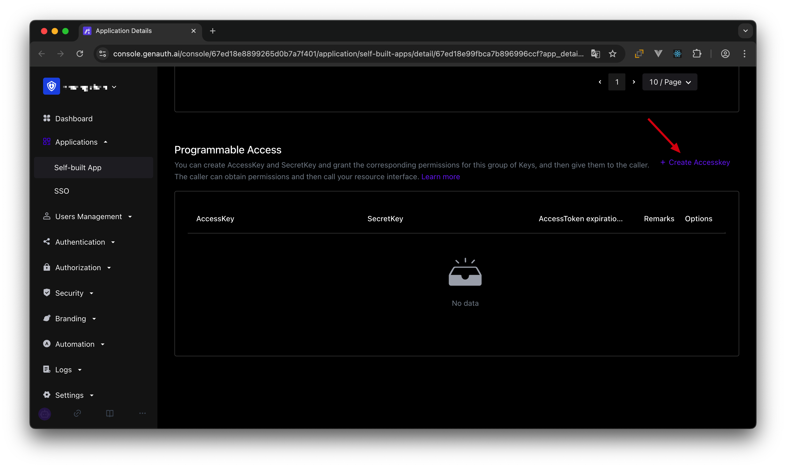
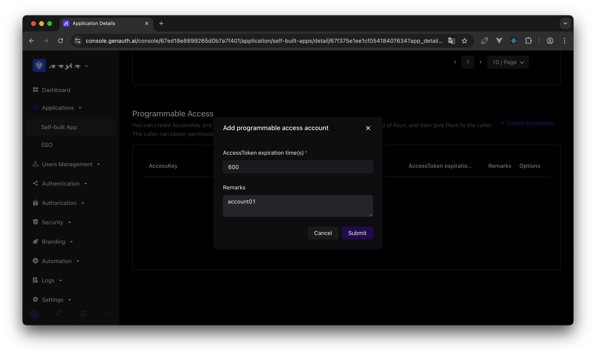

# User-permitted resource authorization

<LastUpdated/>

Suppose your company is a social communication company. Now there is another company that wants to develop a chat record sorting and exporting tool by calling your business API and has signed a cooperation agreement with your company. Now you want to safely authorize user information to this company. You expect:

1. API calls are only open to partner companies.
2. Different partners have different access rights and can access different business APIs.
3. Before the partner company obtains its own company's user data from the business API, it must first obtain the user's consent.
4. If the cooperation is terminated in the future or changes occur, it is hoped that the permissions for certain data can be revoked or completely disabled.

## Permission management and allocation

First, create two users in GenAuth. They are user1@123.com and user2@123.com.

Create an application in GenAuth. Assuming that our social software is called "Steam Chat", the application name is called "Steam Chat".


In the application details, click the Access Authorization tab, switch to the Data Resources tab, and then click Add.

> There is no essential difference between API resources, data resources, and UI resources. The types are only used to distinguish them at the management level. Creating a good resource classification can help administrators quickly focus on different resources.


We create a chat data resource, define several operations such as add, delete, modify, and query, and finally click Save.

Then add authorization rules in **Resource Authorization**.


**Authorized Subject** Select user1@123.com and user2@123.com, **Resource Type** Select Chat Data, and then click OK.

<!--  -->

At this point, the administrator's permission management operations are all completed.

Then we create a **programmatic access account**, which will be handed over to the caller in the future.





If the programmatic access account is deleted, the caller will lose the ability to obtain user authorization.

### AccessToken expiration time

When you create a programmatic access account, you need to specify the AccessToken expiration time. GenAuth uses the RS256 signature algorithm to sign when issuing AccessToken to ensure that AccessToken cannot be tampered with.

> Token signature is part of JWT. For more information, please refer to [JWT Interpretation and Use](/concepts/jwt-token.md).

RS256 is an asymmetric signature algorithm. GenAuth holds the private key to sign the token, and the consumer of JWT uses the public key to verify the signature. The RS256 signature algorithm has the following benefits:

1. Anyone can verify the signature using the application public key, and the signer must be GenAuth.
2. There is no risk of private key leakage. If you use HS256 but leak the application key, you need to refresh the key and redeploy all APIs.
   For more information about signature issues, please refer to [Verify Token](/guides/faqs/how-to-validate-user-token.md).

## Get an AccessToken with permissions

The caller needs to obtain resource authorization from the resource party through **OIDC authorization code mode**. The user of the resource party will participate in the authorization process. After the user's authorization, GenAuth will issue an AccessToken with permission scope and the subject is the resource holder.
First, you need to splice the **authorization link**:

```http
https://{application domain name}.genauth.ai/oidc/auth?client_id={application ID}&response_type=code&scope=openid email message&redirect_uri={caller business address}&state={random string}
```

The scope parameter can be filled with the **resource** and **corresponding operation** defined in the above steps. The specific format is as follows.

### Scope permission item specification

GenAuth scope permission items are separated by **spaces**, and the format of each item is `resource identifier: resource operation`.

The following are all scope formats supported by GenAuth:

`book:1:read` means the read permission for the book resource numbered 1

`book:*:read` means the read permission for all book resources

`book:read` means the read permission for all book resources

`book:*:*` means all operation permissions for all book resources

`book:*` means all operation permissions for all book resources

`book` means all operation permissions for all book resources

`*:*:*` means all operation permissions for all resources

`*:*` means all operation permissions for all resources

`*` means all operation permissions for all resources

For example, the `message` resource and the `create` operation of the `message` resource are defined above, and the `message:create` content can be filled in the scope here.

The caller should guide the user to click this link. After the user clicks, he will jump to the authentication page.


After the user completes the login, the user will be redirected to the caller's business address. The URL carries the **authorization code** parameter.


Next, you need to use the authorization code code and the Key and Secret of the programmatic access account to exchange for the user's AccessToken and IdToken. For more information about the OIDC authorization code mode, please see the [document](/authentication/oidc/oidc-authorization.md#Use the authorization code mode-authorization-code-flow).


You can see that the user's AccessToken has the message permission scope. The **audience** (aud) of the token is the **programmatic access account Key**. The meaning of AccessToken is: **the caller** aud has the scope **permission** of **resource owner** sub, and the **issuer** iss. The resource party can perform permission verification based on the information in the AccessToken.


## Add API authentication interceptor

After defining the API in GenAuth, you need to add an **API authentication interceptor** to your actual business API interface. For protected resources, only visitors with a valid AccessToken and the required permissions are allowed.
The code example is as follows:

```javascript
var express = require("express");
var app = express();
var jwt = require("express-jwt");
var jwks = require("jwks-rsa");
var port = process.env.PORT || 8080;
var jwtCheck = jwt({
  secret: jwks.expressJwtSecret({
    cache: true,
    rateLimit: true,
    jwksRequestsPerMinute: 5,
    jwksUri: "https://{app domain name}.genauth.ai/oidc/.well-known/jwks.json",
  }),
  audience: "{programming access account ID}",
  issuer: "https://{app domain name}.genauth.ai/oidc",
  algorithms: ["RS256"],
});
// Check the legitimacy of AccessToken
app.use(jwtCheck);

app.post("/article", function (req, res) {
  // Check if AccessToken has the required permissions
  if (!req.user.scope.split(" ").incldues("write:article")) {
    return res.status(401).json({ code: 401, message: "Unauthorized" });
  }
  res.send("Secured Resource");
});

app.listen(port);
```

For more information about Token verification, please refer to [Verify Token](/guides/faqs/how-to-validate-user-token.md).

## Frequently Asked Questions

### What does it mean if the user refuses authorization?

If you open the authorization page and the user clicks "Reject" on the authorization page. Then the initiator of the authentication authorization request (in this case, your partner company) cannot obtain any user information and Token of the user.

### What should I do after the user refuses authorization?

If you are an application developer, you should guide users to click "Allow" and inform them that their data and permissions will not be abused. If the user clicks "Reject", GenAuth will redirect the browser to the application's **business callback address** (the same as the success address), carrying error and error_description parameters in the URL query. If your backend receives the error parameter, you can show the user a friendly login failure page and guide the user to re-initiate authentication and authorization.

The sample code for handling user refusal of authorization is as follows:

```js
app.get("/oidc/callback", async (req, res) => {
  if (req.query.error) {
    // You can record logs
    console.log("User cancels authorization, login failed");
    // You can render the failure page, tell the user to click the Allow Authorization button, and guide the user to re-initiate login
    res.render("login-error", {
      error: req.query.error,
      error_description: req.query.error_description,
    });
  } else {
    // ...Normal login logic...
  }
});
```

If you are an identity provider and are responsible for managing user data, you don't need to do anything when the user refuses authorization.
