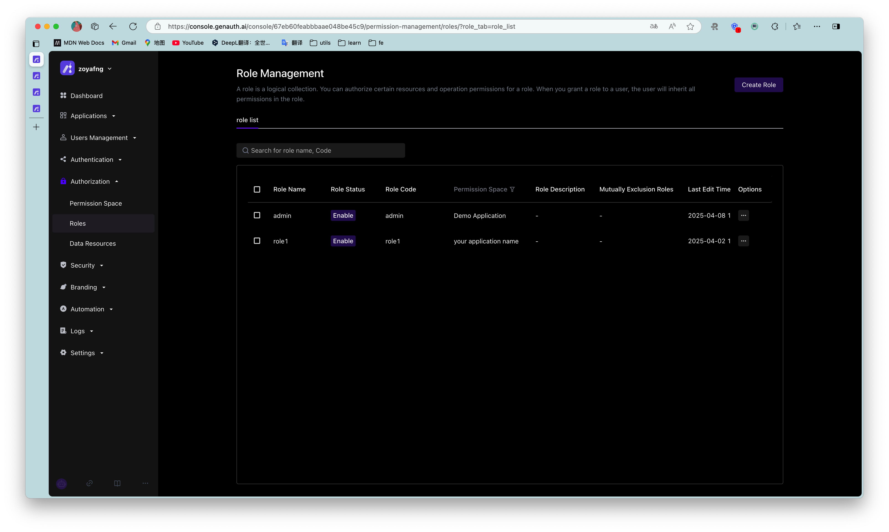
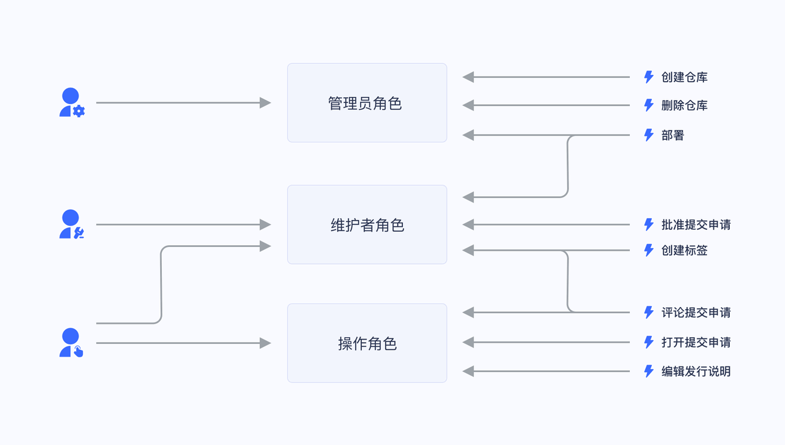
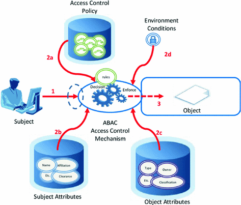
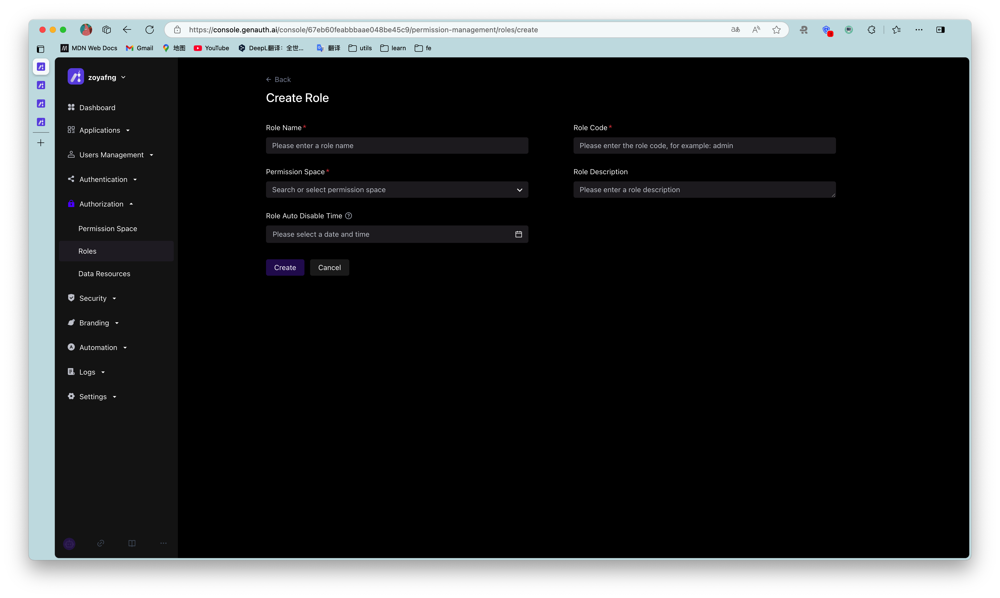
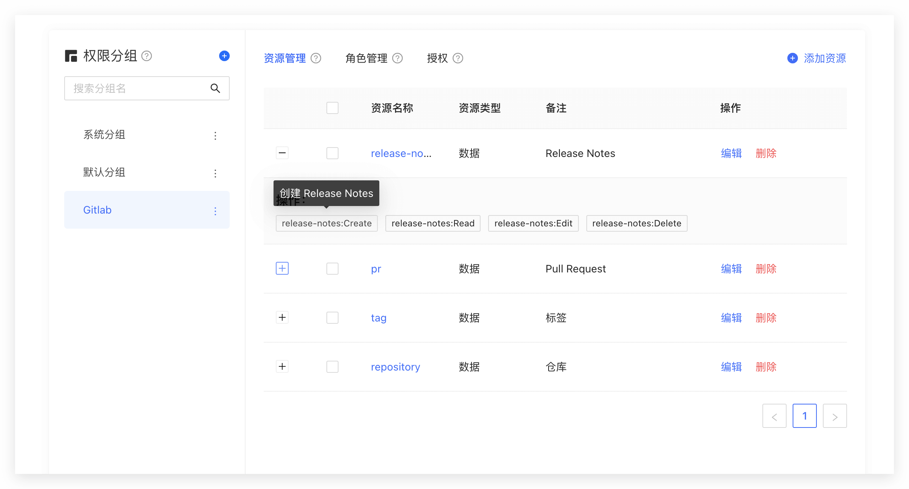
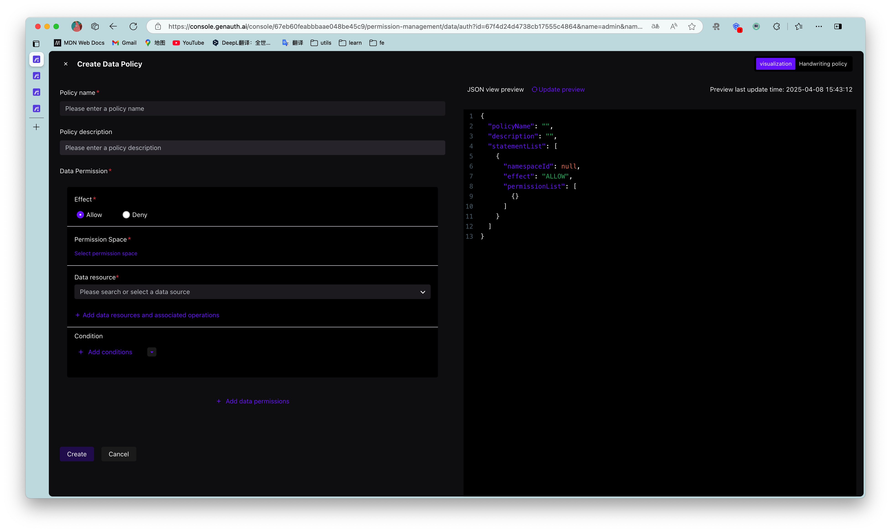

# Manage user permissions

<LastUpdated/>

When you have built a user system, at some point your API needs to determine whether the current user can access the current resource. At this time, you need to build your own permission system. A very important concept in the permission system is authorization. Authorization refers to the process of determining what permissions a user has, which is completely different from authentication (for the concepts and associations of authentication and authorization, please refer to [Authentication and Authorization](/concepts/authentication-vs-authorization.md)).

Currently, the two widely used permission models are role-based access control (RBAC) and attribute-based access control (ABAC). Each has its own advantages and disadvantages: the RBAC model is simpler to build, but its disadvantage is that it cannot authorize resources in a fine-grained manner (it authorizes a certain type of resource rather than a specific resource); the ABAC model is relatively complex to build, and the learning cost is relatively high. Its advantages are fine-grained and dynamic execution based on context.

In the permission system of {{$localeConfig.brandName}}, we implement the role permission inheritance of the RBAC model through the two objects of user and role. On top of this, we can also dynamically and fine-grainedly authorize around attributes, thus realizing the ABAC permission model. At the same time, in order to meet the design requirements of complex organizational structures in large systems, we combine resource, role, and permission authorization into a permission group:



You can quickly build a permission model suitable for your business scenario based on the powerful and flexible permission system of {{$localeConfig.brandName}}. Let's take a simple scenario in reality as an example.

## Permission model introduction

### What is role-based access control (RBAC)

Role-based access control (RBAC for short) refers to authorizing relevant permissions through the user's role (Role). In short, this is more flexible, efficient, and scalable than directly granting user permissions.


When using RBAC, by analyzing the actual situation of system users, different roles are granted to them based on common responsibilities and needs. You can grant one or more roles to a user, and each role has one or more permissions. This relationship between user-role and role-permission allows us to no longer manage individual users separately. Users inherit the required permissions from the granted roles.

Take a simple scenario (Gitlab's permission system) as an example. There are three roles in the user system: Admin, Maintainer, and Operator. These three roles have different permissions. For example, only Admin has the permission to create and delete code repositories, while other roles do not have them.



We grant a user the role of "Admin", and he has the two permissions of "Create code repository" and "Delete code repository".

Not directly granting user authorization policies is for future scalability considerations. For example, if there are multiple users with the same permissions, we need to assign the same permissions to these users separately when assigning them, and modify the permissions of these users one by one when modifying them. After we have roles, we only need to define permissions for the role, assign different roles to different users, and then we only need to modify the permissions of the role to automatically modify the permissions of all users in the role.

### What is Attribute-Based Access Control (ABAC)

Attribute-Based Access Control (ABAC) is a flexible authorization model that controls whether there is permission to operate an object through one or a group of attributes.
ABAC attributes are generally divided into four categories: user attributes (such as user age), environment attributes (such as current time), operation attributes (such as reading) and object attributes (such as an article, also known as resource attributes), so in theory, very flexible permission control can be achieved:


Under the ABAC permission model, you can easily implement the following permission control logic:

1. Authorize editing of a specific book by A;
2. When the department to which a document belongs is the same as the department of the user, the user can access the document;
3. When the user is the owner of a document and the status of the document is a draft, the user can edit the document;
4. People in the A department are prohibited from accessing the B system before 9 am;
5. It is prohibited to access the A system as an administrator in places other than Shanghai;

There are several common points in the above logic:

1. Specific to a certain resource rather than a certain type;
2. Specific to a certain operation;
3. It can dynamically execute policies based on the context of the request (such as time, geographic location, resource tag);

If it is condensed into one sentence, **You can authorize a specific permission for a resource in a fine-grained manner under what circumstances. **

## Authorization mode introduction

{{$localeConfig.brandName}} supports two authorization modes:

1. Through the [Authorization Code Mode](/concepts/oidc/choose-flow#Authorization Code Mode) based on the OAuth 2.0 process.
2. Authorize users through the permission API.

## Implement the permission model with {{$localeConfig.brandName}}

Below, we take the mode of calling the permission API as an example.

### Create a role

You can use the {{$localeConfig.brandName}} console to create a role: In Permission Management - Role Management, click the Add Role button:

- Role code: The unique identifier of the role, which can only contain English letters, numbers, underscores \_, and dashes -. Here we fill in admin.
- Role description: Description of the role. Here we fill in administrator.

Create three roles:



You can also use API & SDK to create roles. For details, see [Role Management SDK](/reference/sdk-for-node/management/RolesManagementClient.md).

### Authorize user roles

On the role details page, you can authorize this role to users. You can search for users by username, phone number, email address, or nickname:


After selecting a user, click Confirm. You can view a list of users authorized with this role.

You can also use API & SDK to grant roles to users. For details, see [Role Management SDK](/reference/sdk-for-node/management/RolesManagementClient.md).

### Control permissions by user roles in the backend

After the user successfully authenticates and obtains the token, you can parse the current user's ID. Next, you can use the API & SDK we provide to obtain the roles granted to the user in the backend. Here we take Node.js as an example:

First, get a list of all roles granted to the user:

```javascript
import { ManagementClient } from "authing-js-sdk";

const managementClient = new ManagementClient({
  userPoolId: "YOUR_USERPOOL_ID",
  secret: "YOUR_USERPOOL_SECRET",
});
const { totalCount, list } = await managementClient.users.listRoles("USER_ID");
```

After obtaining all the roles of the user, we can determine whether the user has the devops role:

```javascript
if (!list.map((role) => role.code).includes("devops")) {
  throw new Error("No permission to operate!");
}
```

### Create resources

In the previous step, we controlled permissions by whether the user has a certain role. This permission control is still relatively coarse-grained because it only determines whether the user has a certain role, but not whether he has a specific permission. {{$localeConfig.brandName}} Based on the role-based access control model (RBAC), more fine-grained authorization can be performed around resources.

You can abstract some objects of the system into resources, and define some operations on these resources. For example, in the scenario of this article, Repository, Tag, PR, and Release Notes are all resources, and these resources have corresponding operations:

- Repository: create, delete, etc.
- PR: open, comment, merge, etc.
- Tag: create, delete, etc.
- Release Notes: create, read, edit, delete, etc.

We create these resources in {{$localeConfig.brandName}}:



### Authorize roles to operate resources

And {{$localeConfig.brandName}} also supports authorization to users and roles. If a user is in a certain role, he will also inherit the permissions authorized by this role. Therefore, {{$localeConfig.brandName}} can not only implement the standard RBAC permission model, but also perform more fine-grained and dynamic permission control on this basis.
For example, in the following example, we grant the admin role the Create and Delete permissions for the repository resource:



### Determine whether the user has permissions on the backend

In the previous step, we authorized a user (role) to have specific operation permissions for a specific resource through resource authorization. When we perform interface authentication on the backend, we can make more fine-grained judgments:

First, initialize the Management SDK:

> Here we take the Node SDK as an example. We also support SDKs in Python, Java, C#, PHP, etc. For details, please click here.

```javascript
import { ManagementClient } from "authing-js-sdk";

const managementClient = new ManagementClient({
  userPoolId: "YOUR_USERPOOL_ID",
  secret: "YOUR_USERPOOL_SECRET",
});
```

Call the `managementClient.acl.isAllowed` method with the following parameters:

- userId: user ID. Users can be directly authorized to operate specific resources or inherit the permissions authorized by the role.
- resource: resource identifier, such as `repository:123` represents the code repository with ID 123, and `repository:\*` represents the code repository resource.
- action: specific operation, such as `repository:Delete` represents the operation of deleting the code repository.
- options: other options, optional
  - options.namespace, resource permission group code

```javascript
const { totalCount, list } = await managementClient.acl.isAllowed(
  "USER_ID",
  "repository:123",
  "repository:Delete"
);
```

{{$localeConfig.brandName}} The policy engine will dynamically execute the policy according to the permission policy you configured, and finally return `true` or `false`. You only need to judge whether the user has the operation permission based on the return value.

## Summary

This article starts with the simplest RBAC permission model, and then implements how to implement a more fine-grained and dynamic ABAC permission model on top of it. The whole process is gradual. You can gradually migrate to the ABAC permission model as the complexity of your business continues to increase.
